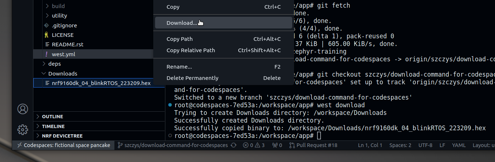

:::note

The normal workflow when using a development environment installed locally is to
use `west flash` to program the board. We are using a different approach here
because the Codespaces container doesn't have access to your local USB port.

:::

* In the VS Code terminal, run `west download` to package the compiled code and
  make it available for download

* Unfold the Download folder in VS Codes file explorer. Right-click on the
  `<devicename>_<appfolder>_<hhmmss>.hex` firmware file you just build and
  select "Download..." to download it to your local machine.

  
Show me how to download from Codespaces

Because Codespaces is a virtual machine running in the cloud, we cannot directly
program the device connected to your local machine. Instead, we will download
the binary so that your local machine can program that file to the device in the
next step.

When we ran the `west download` command it renamed the binary using the
filename, device name, folder name of the app you built, and a timestamp. It
moved the file to the `/zephyr-training/Downloads` folder. You can view your
files in the VS Code file explorer, filenames should be similar to:
`nrf9160dk_04_blinkRTOS_223209.hex`.

The image above shows the file explorer in the left sidebar menu of VS Code.
(The file explorer may be opened using Ctrl-Shift-e).

Right-click on the filename you want to download and select "Download..." from
the resulting menu.

