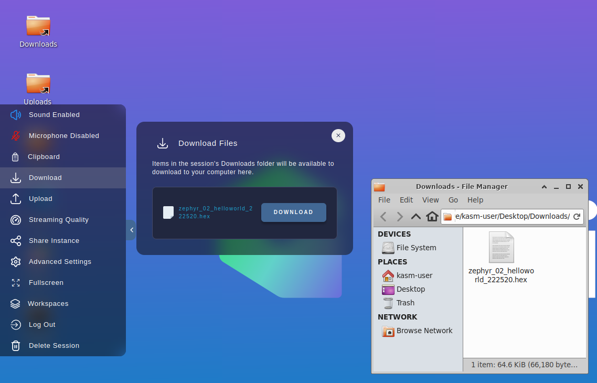

 

Show me how to download from Kasm

Because Kasm is a virtual machine running in the cloud, we can not directly program the MagTag connected to your local machine. Instead, we will download the binary so that your local machine can program that file to the MagTag in the next step.

The filename includes the folder name of the app you built, along with a
timestamp. So your download will look something like this:
`merged_golioth-demo_213729.bin`.

The image above shows the left sidebar menu of Kasm with the Download widget selected. Click the "DOWNLOAD" button next to the `merged_<appfolder>_<hhmmss>.bin` file to download your recently compiled code.

