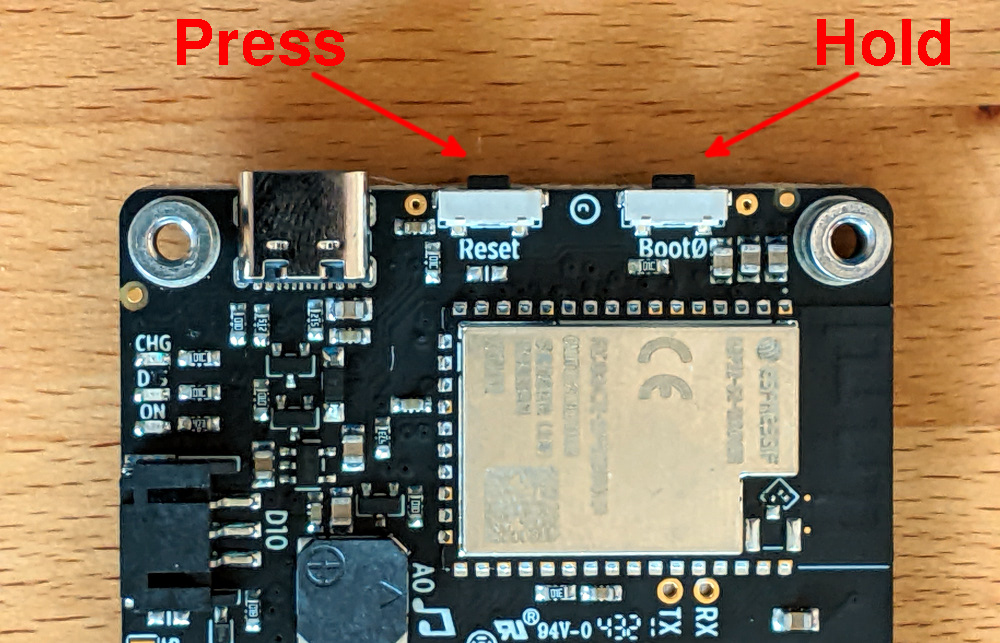

1. Use the USB cable to plug the MagTag into your local computer. Ensure the
   power switch is in the 'On' position.
2. Put the MagTag into DFU bootloader mode
    1. Hold down the Boot0 button
    2. Press and release the Reset button

      

import Tabs from '@theme/Tabs';
import TabItem from '@theme/TabItem';

2. Run the flash command on your local machine:

  <Tabs
  groupId="os"
  defaultValue="linux"
  values={[
  {label: 'Linux/MacOS', value: 'linux'},
  {label: 'Windows', value: 'windows'},
  ]}>

  <TabItem value="linux">

  ```
  cd ~/Downloads
  esptool.py --chip esp32s2 --port /dev/ttyACM0 write_flash 0x0 merged.bin
  ```

  </TabItem>
  <TabItem value="windows">

  ```
  cd %HOMEPATH%/Downloads
  python -m esptool --chip esp32s2 --port com3 write_flash 0x0 merged.bin
  ```

  </TabItem>
  </Tabs>

4. Press the MagTag **Reset** button to start the new firmware

<br />

:::note
If the flash is successful, **you will receive an error message** telling you that you must manually reset the device. Remember to press the reset button to run the newly flashed program. [Learn more about this](/docs/zephyr-intro/zephyr-tips#you-must-press-the-reset-button-after-flashing-firmware).

On some machines you will only have a few seconds to run the `esptool.py` command after entering bootloader mode. [Learn more about this](/docs/zephyr-intro/zephyr-tips.md#errors-with-west-build-zephyr-tree-and-esp32-environmental-variables).
:::
