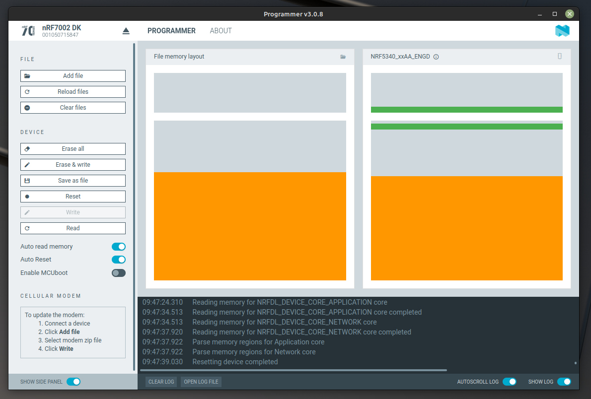

  1. In the nRF Connect for Desktop Programmer app, choose your device from the
     upper left `SELECT DEVICE` dialog.
  2. Click `Add file`&rarr;`Browse` and choose `name_of_your_hexfile.hex` you
     previously downloaded
  3. Click the "Erase & write" button

  

    
Click to reveal image of a successful firmware programming process

  |  |
  |:--:|
  | Nordic nRF7002dk programmed using the ***nRF Connect for Desktop*** programmer app |

  **Note:** The colored blocks representing firmware binary size will vary
  depending on the application you are building/programming.
  

