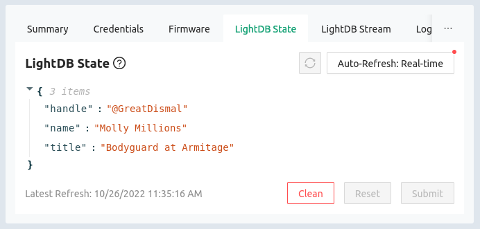
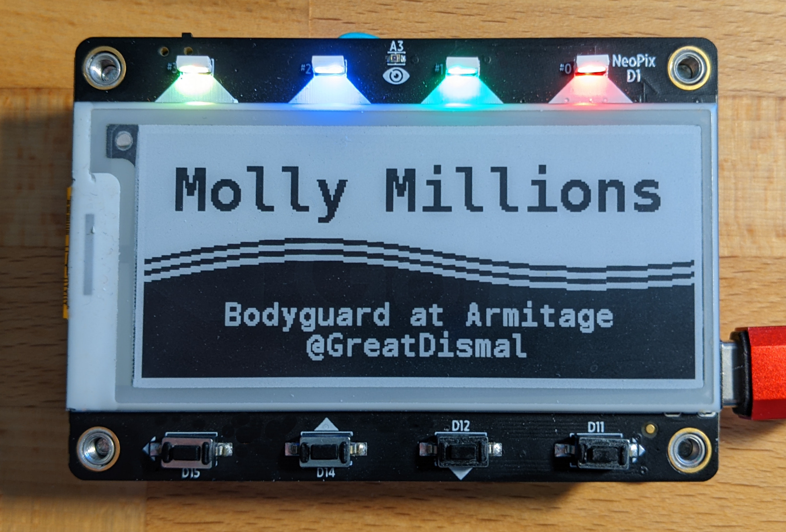

import CreateCredentials from '/docs/\_partials/create-credentials.md';
import HowToDownload from '/docs/\_partials/download-from-kasm.md'
import HowToFlash from '/docs/\_partials/flash-the-example-kasm.md'

# Exercise: MagTag as a name tag

The great thing about ePaper is that it continues to display content after power
is removed from the board. This makes the MagTag a great name tag to wear at
conferences and other live events.

In this exercise you'll turn your MagTag into a name tag by pulling in name,
company, and social media handle via Golioth. Optionally, you'll learn how to
generate your own images for the display, and place text on them.

## Learning Objectives

  1. Include image data in a build using header files
  2. Manipulate on-screen text

### Desired Outcome

* By the end of this section you will have an ePaper name tag to wear at live
  events

### Time Estimate

* 15-20 minutes

## Workflow

### Build in the Kasm container

1. In the Kasm container, go to your local copy of [the magtag-demo repository](https://github.com/golioth/magtag-demo).

    ```bash
    cd ~/Desktop/magtag-training/app
    ```
2. Create a file for WiFi and Golioth credentials

  <CreateCredentials/>

3. Build the example, including the credentials file you just created

    ```bash
    west build -b esp32s2_saola nametag -p
    ```

4. Download the binary

    * Run `west kasm download` to package the compiled code and make it
      available for download
    * Use the Download option in Kasm's left sidebar to download
      `merged_yymmdd_hhmmss.bin` to your local machine.

  <HowToDownload/>

### Update MagTag firmware from your local machine

<HowToFlash/>

## Setup the LightDB State endpoints

1. Go to the Golioth Console and choose Management&rarr;Devices from the sidebar
   menu
2. Click on the name of your device to enter the device view, then click the
   LightDB State icon which opens the LightDB State tab
3. Hover your mouse over the empty JSON object and click the green plus sign
   that is revealed
    * If the JSON object is not empty (e.g. data from previous examples are
      shown), use the "Clean" button to delete all items
4. Type in `name` as the key name (no quotes) and press enter
5. Hover over `NULL` and click the green pencil icon to edit the value, replace
   `NULL` with your name and click the green check mark to save it.
6. Repeat steps 4 and 5 for "title" and "handle" endpoints.
7. **Important**: Click the "Submit" button at the bottom right of this dialog
to save your changes.

  


## Expected Results



At power up, you will be asked if you want to update your the badge information
from Golioth. When you choose "YES", the MagTag will attempt to connect to a
WiFi network and request data from Golioth. When successful, the epaper screen
will automatically refresh with the new name/title/handle. Pressing any of the
four buttons will cycle through different display layouts.

If you choose "NO" at boot time, the name tag will enter into display mode using
stored information, and once again the layout may be chosen with the buttons.

:::note Persistent storage coming soon

At this time, name information downloaded from Golioth will be lost between
power cycles. However, it is possible to store persistent settings using the
Zephyr Settings subsystem. This feature will be available soon.

**Pro-level challenge:** Add persistent storage and submit a pull request!

:::

## Challenge: Use a custom background

Design your own background and layout for the MagTag! To accomplish this:

1. Create a 296x128 image file in the XBM format
2. Upload the header to Kasm, include it in your code
3. Use the helper script to convert from XBM to a c header file
4. Show the header and write text over the top of it.

### Design your own background

We recommend using [GNU Image Manipulation Program
(GIMP)](https://www.gimp.org/) or any other graphics program that can save files
as XBM (X BitMap).

Size and crop your image to 296x128 pixels. You can use color images and Gimp
will do its best to convert to black and white when saving as XBM.

:::tip Saving a file as XBM in Gimp

To save as an XBM in Gimp, use CTRL-SHIFT-E (export). Change the filename in the
subsequent window so that it ends in `.xbm` and Gimp will automatically perform
the conversion.

:::

### Upload and convert to a header file

Use the left sidebar menu on the Kasm desktop to upload your XBM file. From the
`nametag` directory, use the helper script to convert this to a c header file.

```bash
cd ~/Desktop/magtag-training/nametag
python ../utility/xbm_to_header.py ~/Desktop/Uploads/my_magtag_background.xbm
```

### Show the header file and write your tex

The previous step should result in a header file with the same filename as the
input (`my_magtag_background.h`) that includes an array of the same name
containing the background image data. Let's include that file and show how to
use it.

```c
#include "../my_magtag_background.h"

/**
 * @brief Unused function awaiting workshop user customization
 */
void nametag_training_challenge(void) {
	if (k_mutex_lock(&epaper_mutex, K_SECONDS(1))!=0) {
		/* ePaper already in use, abort */
		return;
	}

	/* Perform a full-refresh on the display */
	epaper_FullClear();

	/* Use a partial write to draw the background */
	/* Change frame3 to the name of your array */
	epaper_ShowFullFrame(frame3);

	/* Write text on top of the background */
	epaper_Write(_myname, strlen(_myname), 2, CENTER, 4);
	epaper_WriteInverted(_title, strlen(_title), 11, CENTER, 2);
	epaper_WriteInverted(_handle, strlen(_handle), 13, CENTER, 2);

	k_mutex_unlock(&epaper_mutex);
}
```

The `epaper_Write()/epaper_WriteInverted()` functions allow you place your own
text on the display. Supply parameters as follows:

```c
epaper_Write(_myname,           /* String to display          */
             strlen(_myname),   /* length of string           */
             2,                 /* row; 0=top, 15=bottom      */
             CENTER,  /* column; 295=left, 0=right            */
             4);      /* Column height of letters (1,2, or 4) */
```

The column value also has special values. `FULL_WIDTH` uses the full screen
width, left justified and `CENTER` centers the text on screen.

The final step is to call your custom function. Find the part of the main.c file
where button presses are used to update the display and replace on with your
`nametag_training_challenge()` function call.

<details><summary>Show me where to call this function</summary>

Search for the following code in the `nametag/src/main.c` file.

```c
/* Update the ePaper frame */
switch(i) {
    case 1:
        nametag_green();
        break;
    case 2:
        nametag_blue();
        break;
    case 3:
        nametag_yellow();
        break;
    case 4:
        nametag_rainbow();
        break;
    default:
        nametag_red();
}
```

Replace any of the nametag function calls with your custom functions. Just note
that the `nametag_rainbow()` function is what is used to connect to Golioth to
download name/title/handle updates at boot time.

</details>

### Build and flash your changes

With your custom image and text layout in place, follow the directions on the
top of this page to compile and flash the new code.
