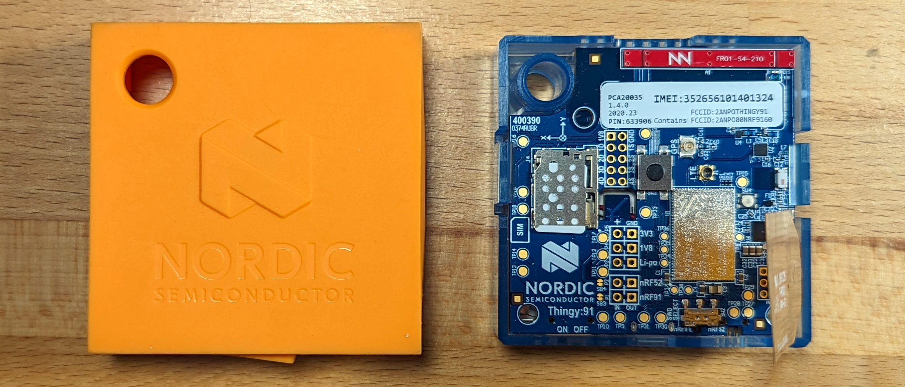
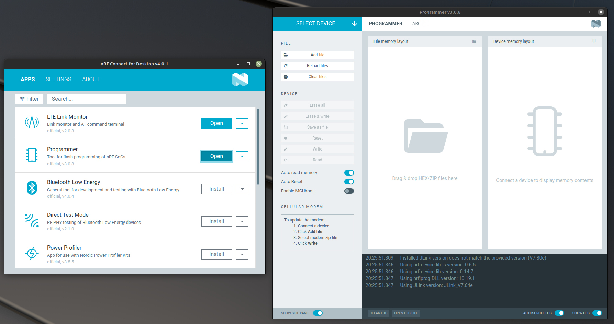
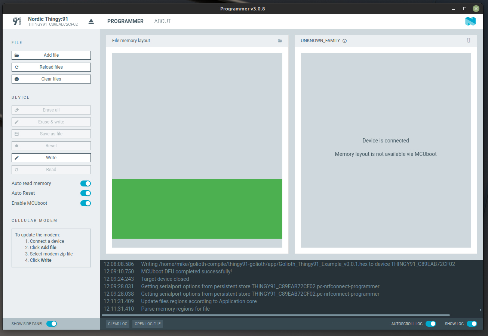
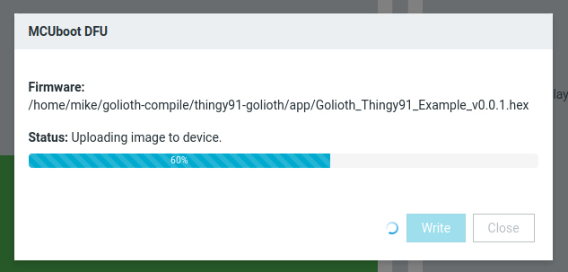
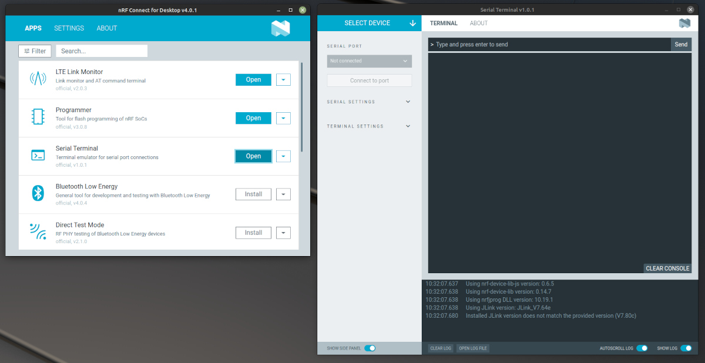
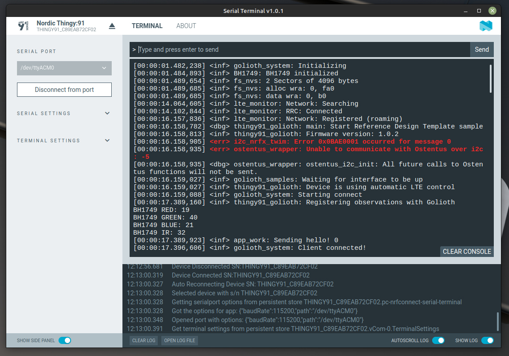

# Connect Hardware to Golioth

You can use a Nordic Thingy:91 to test sending data back to Golioth, and
controlling the device remotely. We recommend downloading the latest binary from
the releases section of [our Golioth Thingy91 Example
Program](https://github.com/golioth/thingy91-golioth).

## Nordic Thingy:91

The
[Thingy:91](https://www.nordicsemi.com/Products/Development-hardware/Nordic-Thingy-91)
is a multi-sensor cellular IoT prototyping platform from Nordic Semiconductor.
It includes a USB bootloader for easy programming.



### Programming the Binary

1. [Download the latest Release .hex
   files](https://github.com/golioth/thingy91-golioth/releases) from our Golioth
   Thiny91 Example repository.

2. Download Nordic's [nRF Connect for
   Desktop](https://www.nordicsemi.com/Products/Development-tools/nRF-Connect-for-desktop)
   software.

3. Launch nRF Connect for Desktop. From that application, install and open the
   Programmer.

    

4. Flash the precompiled binary to the Thingy:91

    1. Remove the orange rubber case from your Thingy:91
    2. Plug a USB cable into your computer and into the Thingy:91
    3. **Put the Thingy:91 in bootloader mode:** With the Thingy:91 power switch
       in the off postition, hold the black button in the middle of the board
       and turn the power switch on
    4. In the nRF Connect Desktop Programmer, choose `Nordic Thingy:91` from the
       upper left `SELECT DEVICE` dialog.
    5. Click `Add file` and choose `Thingy91_Golioth_Example_vX.X.X.hex` you
       previously downloaded
    6. Click the `Write` button

    

    During successful programming you should see a progress screen like the
    following:

    

### Adding Device Credentials

Golioth Device Credentials must be added to the device for it to connect
properly. This is accomplished over USB using the Shell built into Zephyr.

1. Launch nRF Connect for Desktop. From that application, install and open the
   Serial Terminal.

    

2. Connect the Serial Terminal to your device

    1. Plug a USB cable into your computer and your Thingy:91
    2. Place the Thingy:91 power switch in the `On` position
    3. Choose `Nordic Thingy:91` from the upper left `SELECT DEVICE` dialog
    4. Select the second of two available serial ports
    5. Click `Connect to Port`

    You can now turn the Tingy:91 power switch off and back on to see the serial
    output as it runs. We expect that the device will not be able to connect as
    it does not yet have credentials.

    

3. Use the serial connection to assign Golioth Device Credentials

    :::info
    Golioth Device Credentials were created during the [Console Signup and
    Exploration](./signup.md) step. You can return to the [Golioth
    Console](https://console.golioth.io/) to retrieve the PSK-ID/PSK.
    :::

    Use the following command syntax to assign your credentials. Type each line
    one at a time into the serial terminal, replacing the placeholder
    credentials with your own.

    ```
    uart:~$ settings set golioth/psk-id <my-psk-id@my-project>
    uart:~$ settings set golioth/psk <my-psk>
    uart:~$ kernel reboot cold
    ```

4. Observe the device connecting to Golioth

    After the Thingy:91 reboots, the serial terminal will remain connected. You
    should see the device connect to LTE, then Golioth, and begin streaming
    data:

    ```
    [00:00:01.483,825] <inf> golioth_system: Initializing
    [00:00:01.486,450] <inf> BH1749: BH1749 initialized
    [00:00:01.491,546] <inf> fs_nvs: 2 Sectors of 4096 bytes
    [00:00:01.491,546] <inf> fs_nvs: alloc wra: 0, fa0
    [00:00:01.491,577] <inf> fs_nvs: data wra: 0, b0
    [00:00:01.493,041] <dbg> thingy91_golioth: main: Start Reference Design Template sample
    [00:00:01.493,072] <inf> thingy91_golioth: Firmware version: 0.0.0+0
    [00:00:01.493,164] <err> i2c_nrfx_twim: Error 0x0BAE0001 occurred for message 0
    [00:00:01.493,255] <inf> golioth_samples: Waiting for interface to be up
    [00:00:01.493,286] <inf> thingy91_golioth: Connecting to LTE network. This may take a few minutes...
    [00:00:01.548,065] <dbg> app_work: buzzer_thread: golioth
    [00:00:01.548,126] <err> BH1749: No valid data to fetch.
    [00:00:01.548,126] <err> app_work: sensor_sample_fetch failed err -5
    [00:00:15.824,218] <inf> thingy91_golioth: Connected to LTE network
    [00:00:15.824,371] <inf> golioth_system: Starting connect
    [00:00:17.927,947] <inf> thingy91_golioth: Registering observations with Golioth
    [00:00:17.931,030] <dbg> app_settings: app_led_pwm_init: turning on pwm leds
    [00:00:17.931,060] <inf> golioth_system: Client connected!
    ```
