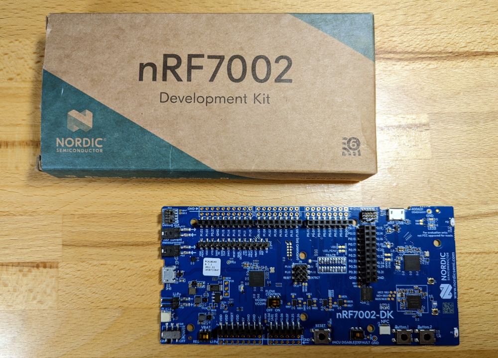
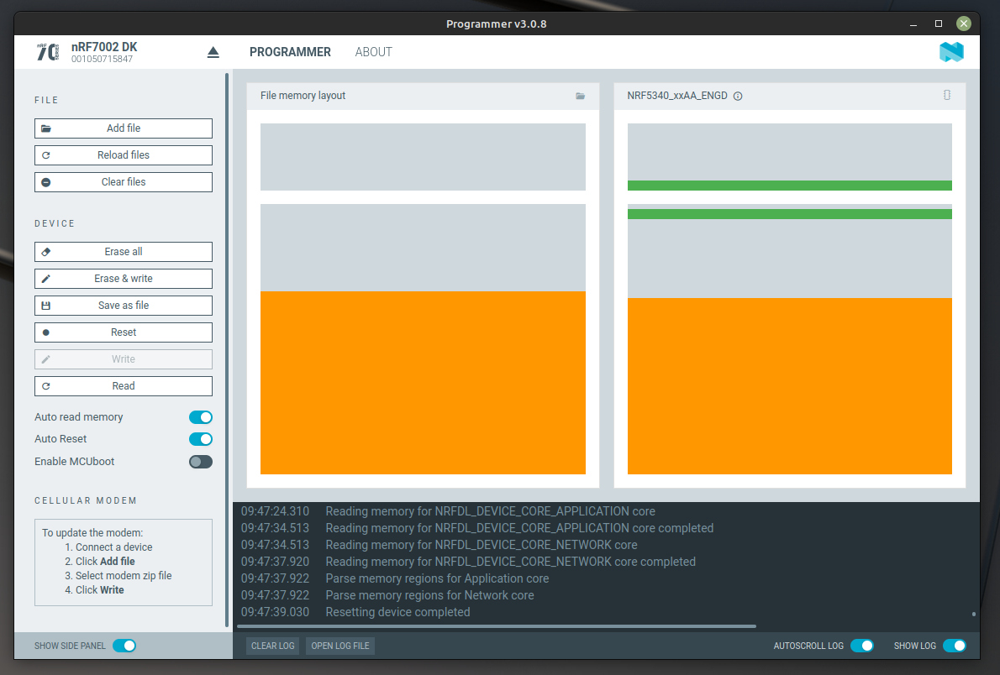
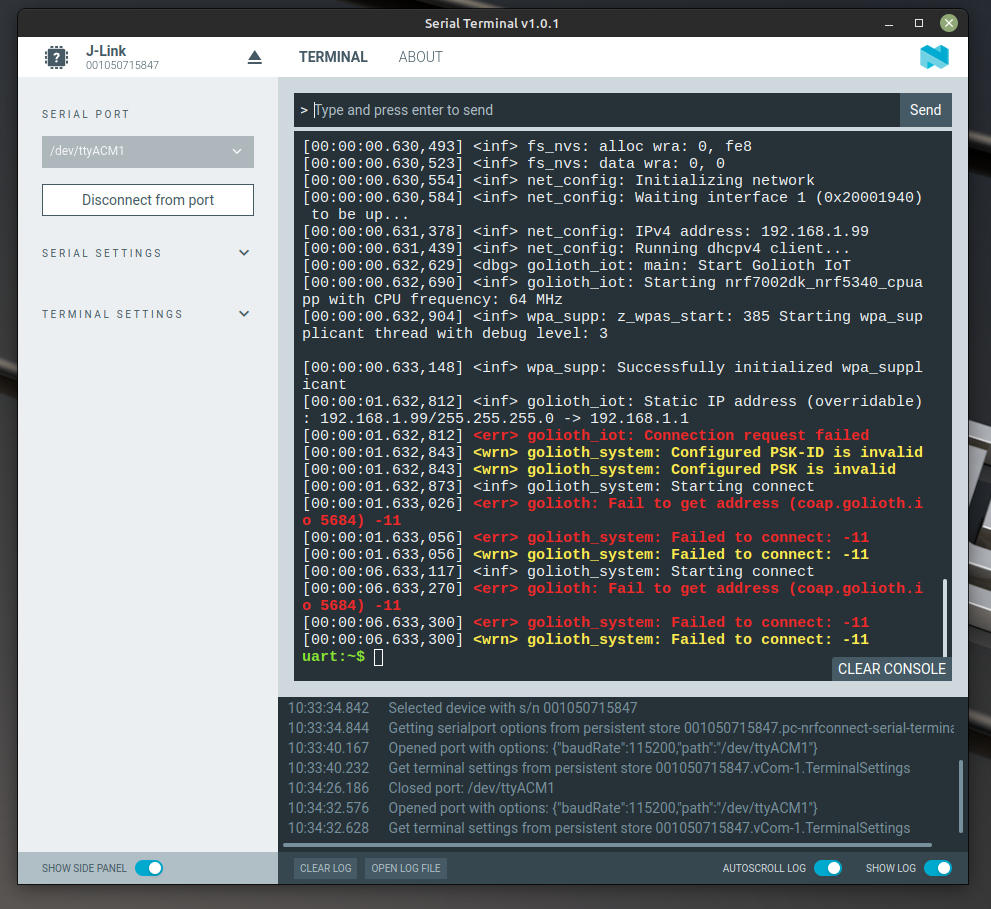

# Connect Hardware to Golioth

## Optional Hardware

While hardware is not required for this training, it is nice to have a real
device sending data back to Golioth to see how everything works. With that in
mind, we recommend downloading the latest binary from the releases section of
[our Zephyr Training nRF7002dk
repository](https://github.com/golioth/zephyr-training-nrf7002dk).

## Nordic nRF7002 Development Kit

The [nRF7002
DK](https://www.nordicsemi.com/Products/Development-hardware/nRF7002-DK) is a
WiFi-based development board from Nordic Semiconductor. It includes an onboard
programmer/debugger via a USB connection.



### Programming the Binary

1. [Download the latest Release](https://github.com/golioth/zephyr-training-nrf7002dk/releases/latest) from our Zephyr Training nRF7002dk
   repository.

2. Download Nordic's [nRF Connect for
   Desktop](https://www.nordicsemi.com/Products/Development-tools/nRF-Connect-for-desktop)
   software.

3. Launch nRF Connect for Desktop. From that application, install and open the
   Programmer.

    

4. Flash the precompiled binary to the nRF7002-DK

    1. In the nRF Connect Desktop Programmer, choose nRF7002 from the upper left
       `SELECT DEVICE` dialog.
    2. Click `Add file` and choose `Golioth_nRF7002_kitchen_sink_vX.X.X.hex` you
       previously downloaded
    3. Click the "Erase & write" button

    

### Adding WiFi and Device Credentials

WiFi and Golioth Device Credentials must be added to the device for it to
connect properly. This is accomplished over USB using the Shell built into
Zephyr.

1. Launch nRF Connect for Desktop. From that application, install and open the
   Serial Terminal.

    

2. Connect the Serial Terminal to your device

    1. Choose nRF7002 from the upper left `SELECT DEVICE` dialog
    2. Select the second of two available serial ports
    3. Click `Connect to Port`

    You can now press the reset button on the nRF7002-DK to see the serial
    output as it runs. We expect that the device will not be able to connect as
    it does not yet have credentials.

    

3. Use the serial connection to assign WiFi and Golioth Device Credentials

    :::info
    Golioth Device Credentials were created during the [Console Signup and
    Exploration](./02-signup.md) step. You can return to the [Golioth
    Console](https://console.golioth.io/) to retrieve the PSK-ID/PSK.

    WiFi credentials come from your home or business WiFi. It is also possible
    to use your phone as a WiFi hotspot.

    The precompiled binary is only
    able to connect to hotspots using WPA2 authentication (which is very
    common). This limitation can be changed if you compile your own firmware.
    :::

    Use the following command syntax to assign your credentials.

    ```
    uart:~$ settings set wifi/ssid <my-wifi-ap-ssid>
    uart:~$ settings set wifi/psk <my-wifi-ap-password>
    uart:~$ settings set golioth/psk-id <my-psk-id@my-project>
    uart:~$ settings set golioth/psk <my-psk>
    uart:~$ kernel reboot cold
    ```

4. Observe the device connecting to Golioth

    After the nRF7002-DK reboots, the serial terminal will remain connected. You
    should see the device connect to WiFi, then Golioth, and begin streaming
    simulated temperature data:

    ```
    [00:00:07.398,437] <inf> net_dhcpv4: Received: 192.168.1.127
    [00:00:07.398,559] <inf> net_config: IPv4 address: 192.168.1.127
    [00:00:07.398,559] <inf> net_config: Lease time: 43200 seconds
    [00:00:07.398,590] <inf> net_config: Subnet: 255.255.255.0
    [00:00:07.398,651] <inf> net_config: Router: 192.168.1.1
    [00:00:07.399,414] <inf> golioth_iot: DHCP IP address: 192.168.1.127
    [00:00:11.973,388] <inf> golioth_system: Starting connect
    [00:00:12.249,023] <inf> golioth_iot: Sending hello! 0
    [00:00:12.250,213] <inf> golioth_iot: Streaming Temperature to Golioth: 26.450000
    [00:00:12.252,105] <inf> golioth_system: Client connected!
    [00:00:12.317,108] <dbg> golioth_iot: on_setting: Received setting: key = LOOP_DELAY_S, type = 4
    [00:00:12.317,138] <inf> golioth_iot: Set loop delay to 5 seconds
    [00:00:12.317,169] <inf> golioth_iot: Sending hello! 1
    [00:00:12.318,328] <inf> golioth_iot: Streaming Temperature to Golioth: 26.450000
    [00:00:12.318,572] <dbg> golioth_iot: on_setting: Received setting: key = BLINK_DELAY_MS, type = 4
    [00:00:12.318,603] <inf> golioth_iot: Set blink delay to 200 milliseconds
    [00:00:17.319,122] <inf> golioth_iot: Sending hello! 2
    [00:00:17.321,685] <inf> golioth_iot: Streaming Temperature to Golioth: 26.840000
    [00:00:22.321,929] <inf> golioth_iot: Sending hello! 3
    [00:00:22.338,562] <inf> golioth_iot: Streaming Temperature to Golioth: 26.940000
    [00:00:27.338,806] <inf> golioth_iot: Sending hello! 4
    [00:00:27.355,560] <inf> golioth_iot: Streaming Temperature to Golioth: 27.140000
    ```
