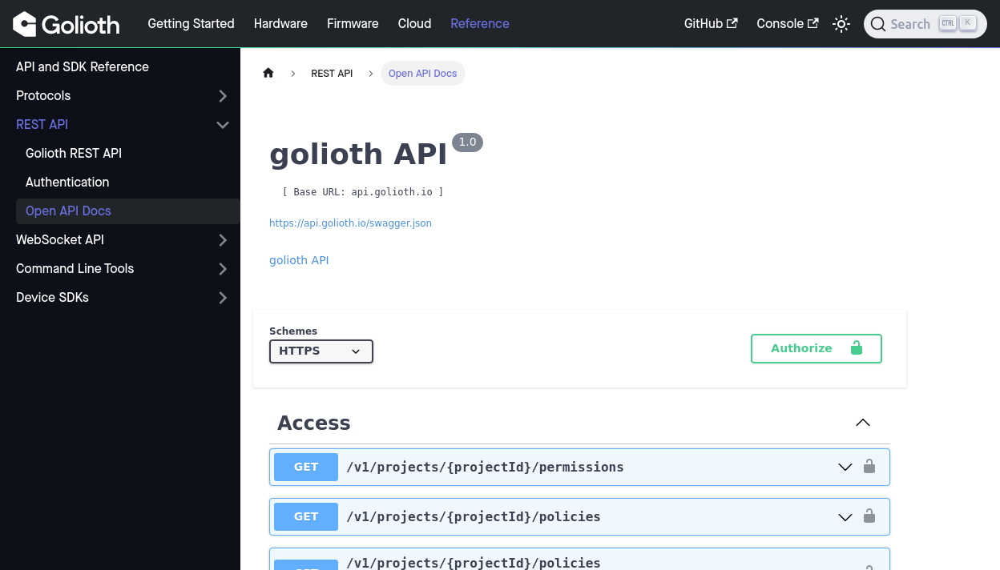
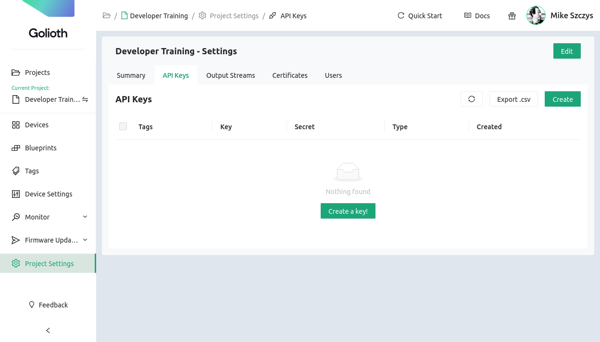
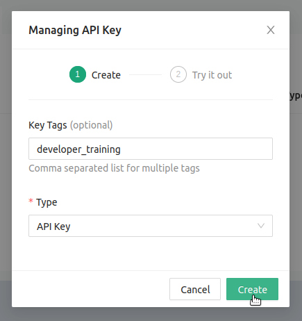
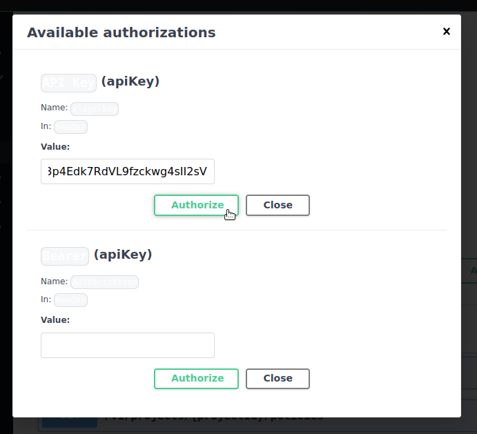

# Golioth OpenAPI Docs and Authenticating your Project

## Learning Objectives

In this section you'll learn what the Golioth OpenAPI docs are, as well as how
to create an API key for your project and use it to authenticate.

* **Desired outcome(s)**
  1. Authenticate the OpenAPI Docs page so you may use it in the rest of the
     pages of this module.
  2. Understand the process of testing API calls using the OpenAPI Docs
* **Time Estimate:** 5 minutes

## What are the Golioth OpenAPI Docs?

Golioth offers a wide-ranging REST API for working with your IoT fleet. Our
documentation site includes an interactive tool that is automatically generated
from our REST API endpoints using the OpenAPI standard.

Not only will page always be up-to-date with the newest Golioth features, it's a
great way to test out REST API calls.

1. In your web browser, navigate to the [Golioth OpenAPI
   docs](https://docs.golioth.io/reference/rest-api/openapi)
2. The page is much easier to use in "Lightmode". Use the Sun/Moon icon in the
   upper right to ensure the background of the page is light and not dark.

### Generate an API key for your Golioth Project

Golioth REST APIs require authentication to access the data and devices of your
Golioth Project. Let's create a key to use for authentication.

1. Open the [Golioth Web Console](https://console.golioth.io)
2. Navigate to `Project Settings` in the left sidebar and then select [the `API
   Keys` tab](https://console.golioth.io/project-settings/api-keys)

    

3. Click `Create`. In the resulting window, enter a tag for this key (optional)
   and click `Create`

    

4. Click the `Close` button to go back to the `API Keys` tab and click the
   `Copy` icon to copy your new key to the clipboard.

### Authorize the OpenAPI Docs page

Navigate back to the OpenAPI Docs page and use your key to authenticate.

1. Click the `Authorize` button
2. Paste your key into the `Value:` section on the upper half of the `Available
   authorizations` window.

    

3. Click `Authorize`, then click `Close`

## Expected Results

The OpenAPI Docs page is not authorized to interact with data and devices from
your IoT fleet.

:::note Authorization is fleeting

This OpenAPI Docs page will not retain your authorization if it is closed or
refreshed. This is a feature, as API access to your Golioth Project must be
safeguarded.

:::

