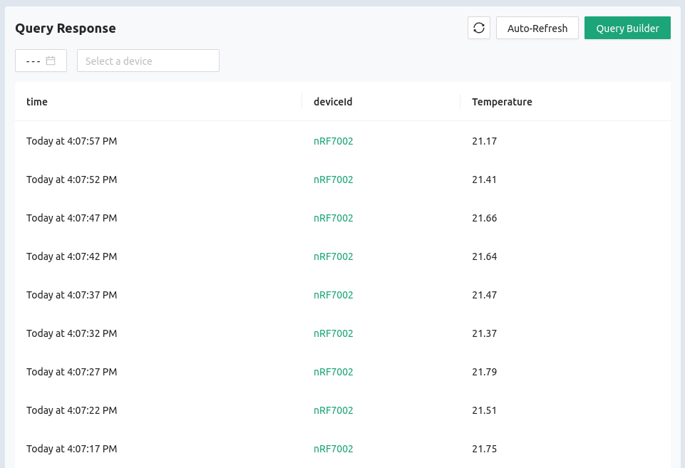
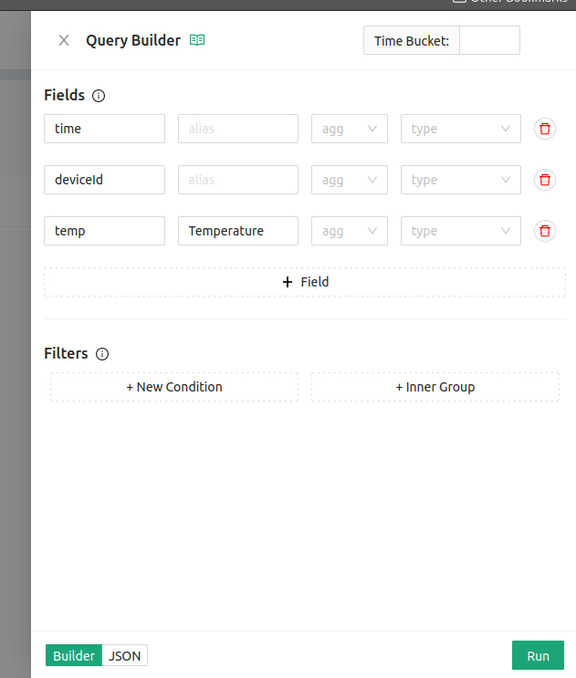

# LightDB Stream (Time-series)

The Golioth LightDB Stream is purpose built for collecting time-based data from
devices in the field. Every time data is received, the server records it along
with a timestamp. This is perfect for collecting sensor data as it creates a
historic record of all readings.

To view the LightDB Stream data for a device:

1. Click the `Devices` option in the left sidebar of [the Golioth
   Console](https://console.golioth.io)
2. Click on the device `Name` in the resulting list
3. Click on the `LightDB Stream` tab

## LightDB Stream page overview

On this page you can view the following information:

* `timestamp`: Time/Date at which the data was received (timestamps can also be
  set by adding them as [a member of the
  dataset](https://docs.golioth.io/cloud/services/lightdb-stream/sending-data#sending-data-with-a-timestamp))
* `data`: The data received, displayed in JSON format. This will be "folded" by
  default
* Time selector: historic data can be access by choosing time/date from the time
  selection box
* Refresh tools: both manual and automatic refresh buttons are available for
  updating the data being displayed

## Viewing LightDB Stream data from your fleet

The approach above shows data from a single device, but it is also possible to
view data from your entire fleet:

1. Click the `Monitor` option in the left sidebar and select `LightDB Stream`
   from the list that unfolds

Notice that in this view the `deviceId` column has been added, and there is now
an additional selector box to filter by device(s).

:::tip Use the Query Builder for Viewing Specific Data
The data displayed above looks a bit different from your live-view. We have used
the `Query Builder` to display the `temp` endpoint with a nice column name.

:::

## Additional Exercises

* Click on the `Query Builder` button and the `path` and `alias` values as shown
  above
* Restore the view in the monitor windows by using `*` as the path value
* Return to the  `LightDB Stream` tab in the `Devices` view. Use the
  `Auto-Refresh` selector to choose `Real-time`
