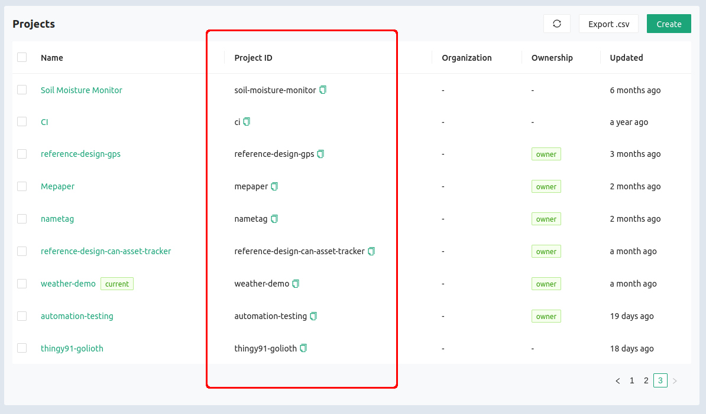
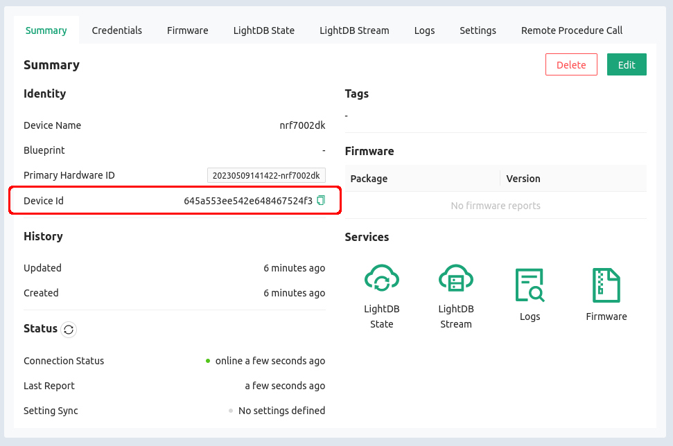
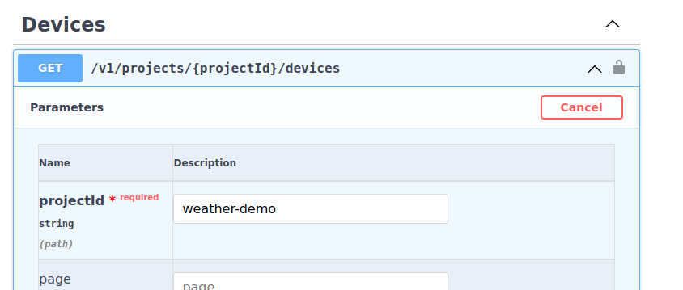
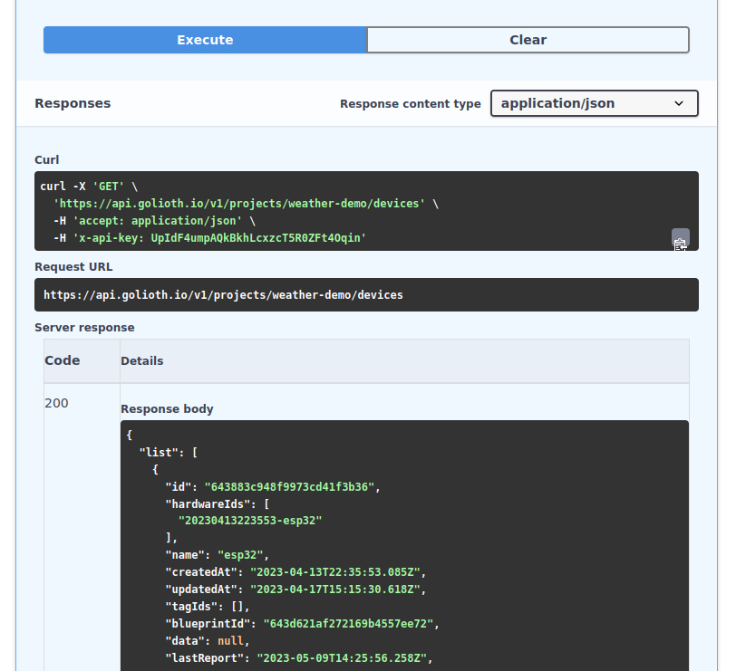

# Query a list of Devices

## Learning Objectives

In the previous step we authenticated the OpenAPI Docs. Let's use them now to
return a list of the devices from this project.

* **Desired outcome(s)**
  1. Know where to find the `projectId` and `deviceId` needed for most REST API
     queries
  2. Understand the process of testing API calls using the OpenAPI Docs
* **Time Estimate:** 10 minutes

## Query the `Devices` endpoint

### Find your `projectId` and `deviceId`

For the vast majority of REST API calls you will need to supply a `projectId`, and many of them
need a `deviceId`. While it is possible to run queries for these values, let's
take a moment to locate these values in the Golioth Web Console

#### Project ID

1. Open the [Golioth Web Console](https://console.golioth.io)
2. Select `Projects` from the left sidebar
3. The `projectId` is available as a column in this view

    

#### Device ID

:::tip Device ID from Console or Query

In just a moment, we will query all the devices on this project. The returned
data will include the Device ID, but it's also handy to know how to find
that value in our Web Console.

:::

1. Open the [Golioth Web Console](https://console.golioth.io)
2. Select `Devices` from the left sidebar and click on the name of your desired
   device.
3. The `projectId` is available as a column in this view

    

### Execute the query

1. Scroll down the OpenAPI docs page to find `Devices`
2. Use the chevron button to unfold this endpoint
3. Click the `Try it out` button to enable the query
4. Paste your `projectId` into the box

    

5. Scroll down and click the blue `Execute` button

## Expected Results

If all went well, you will receive a `Code 200` to indicate success.



1. Scroll down to the bottom of your returned data to find "total", which
   indicates the total number of devices returned in this query
2. Note that status data available on the Web Console device status page is
   returned with this query, including timestamps for connection and reporting
   events.
3. OpenAPI Docs queries will also return `curl` syntax which is useful in
   understanding how the query is being built

```json
{
  "list": [
    {
      "id": "643883c948f9973cd41f3b36",
      "hardwareIds": [
        "20230413223553-esp32"
      ],
      "name": "esp32",
      "createdAt": "2023-04-13T22:35:53.085Z",
      "updatedAt": "2023-04-17T15:15:30.618Z",
      "tagIds": [],
      "blueprintId": "643d621af272169b4557ee72",
      "data": null,
      "lastReport": "2023-05-09T14:25:56.258Z",
      "status": "-",
      "metadata": {
        "update": {},
        "status": "-",
        "lastReport": "2023-05-09T14:25:56.258Z",
        "lastSeenOnline": "2023-05-09T14:13:29.795Z",
        "lastSeenOffline": "2023-05-08T21:58:25.505Z",
        "lastSettingsStatus": null
      },
      "enabled": true
    },
    {
      "id": "6439b719f272169b4557ee4a",
      "hardwareIds": [
        "20230414202705-nxp1060"
      ],
      "name": "nxp1060",
      "createdAt": "2023-04-14T20:27:05.493Z",
      "updatedAt": "2023-04-17T15:15:46.722Z",
      "tagIds": [],
      "blueprintId": "643d6276f272169b4557ee74",
      "data": null,
      "lastReport": "2023-05-08T16:48:22.660Z",
      "status": "-",
      "metadata": {
        "update": {},
        "status": "-",
        "lastReport": "2023-05-08T16:48:22.660Z",
        "lastSeenOnline": "2023-05-08T16:45:02.432Z",
        "lastSeenOffline": "2023-05-08T17:48:25.322Z",
        "lastSettingsStatus": null
      },
      "enabled": true
    },
    {
      "id": "6439b7f6f272169b4557ee4c",
      "hardwareIds": [
        "20230414203046-nrf9160"
      ],
      "name": "nrf9160",
      "createdAt": "2023-04-14T20:30:46.929Z",
      "updatedAt": "2023-04-17T15:16:26.486Z",
      "tagIds": [],
      "blueprintId": "643d61f4f272169b4557ee71",
      "data": null,
      "lastReport": "2023-05-08T19:19:20.363Z",
      "status": "-",
      "metadata": {
        "update": {},
        "status": "-",
        "lastReport": "2023-05-08T19:19:20.363Z",
        "lastSeenOnline": "2023-05-08T19:15:28.197Z",
        "lastSeenOffline": "2023-05-08T20:19:23.747Z",
        "lastSettingsStatus": null
      },
      "enabled": true
    },
    {
      "id": "64592869c9444e3259516d9f",
      "hardwareIds": [
        "20230508165049-nxp1024"
      ],
      "name": "nxp1024",
      "createdAt": "2023-05-08T16:50:49.094Z",
      "updatedAt": "2023-05-08T16:50:49.094Z",
      "tagIds": [],
      "data": null,
      "lastReport": "2023-05-09T14:16:31.529Z",
      "status": "-",
      "metadata": {
        "update": {},
        "status": "-",
        "lastReport": "2023-05-09T14:16:31.529Z",
        "lastSeenOnline": "2023-05-09T14:14:06.431Z",
        "lastSeenOffline": "2023-05-09T14:16:36.478Z",
        "lastSettingsStatus": null
      },
      "enabled": true
    },
    {
      "id": "645a553ee542e648467524f3",
      "hardwareIds": [
        "20230509141422-nrf7002dk"
      ],
      "name": "nrf7002dk",
      "createdAt": "2023-05-09T14:14:22.319Z",
      "updatedAt": "2023-05-09T14:14:22.319Z",
      "tagIds": [],
      "data": null,
      "lastReport": "2023-05-09T14:25:57.011Z",
      "status": "-",
      "metadata": {
        "update": {},
        "status": "-",
        "lastReport": "2023-05-09T14:25:57.011Z",
        "lastSeenOnline": "2023-05-09T14:19:35.881Z",
        "lastSeenOffline": null,
        "lastSettingsStatus": null
      },
      "enabled": true
    }
  ],
  "page": 0,
  "perPage": 100,
  "total": 5
}
```

## Challenge: Use a device Tag in your query

1. In the [Golioth Web Console](https://console.golioth.io), create a new Tag
2. Create an new device and add the Tag you just created
3. Run the OpenAPI Devices query again, but this time use your new Tag as a
   parameter
