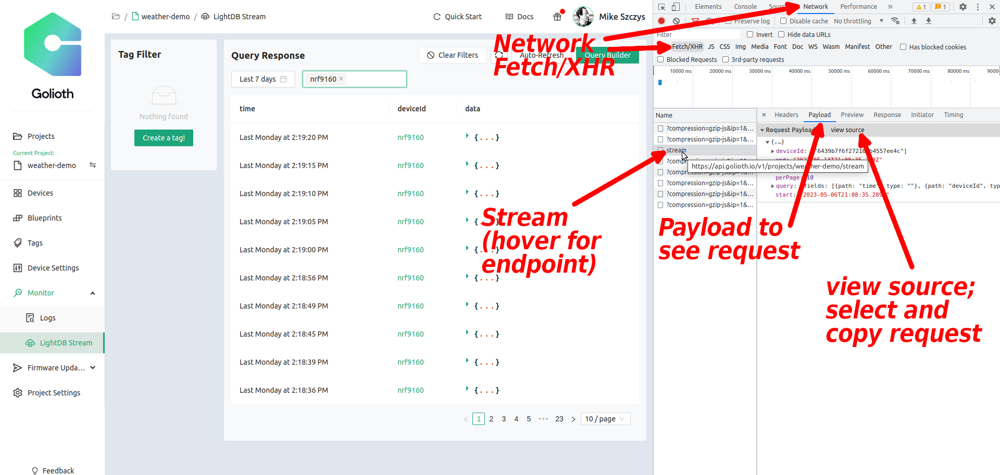
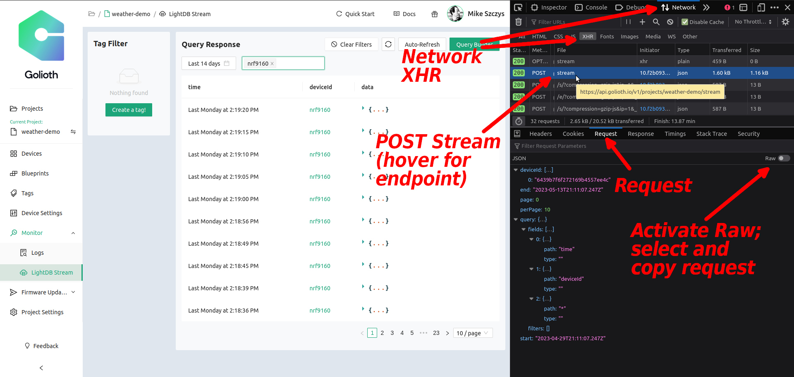

# Learn from the Queries of the Golioth Console

## Learning Objectives

Everything you see on the Golioth Web Console uses REST API calls that are
available to you. Viewing the endpoints and requests used is quite handy in
better understanding how to use the Golioth REST API. In this section, we'll
walk through how to view that information using your web browser.

:::tip Firefox or Chrome

Both Firefox and Google Chrome will be demonstrated. Use the tabs below to chose
your preferred browser.

:::

### Desired outcome(s)

* Understand how to view the REST API calls made by the Golioth Web Console

### Time Estimate

* 5 minutes

## Inspect the Golioth Web Console for REST API Queries

import Tabs from '@theme/Tabs';
import TabItem from '@theme/TabItem';

<Tabs>
<TabItem value="chrome" label="Google Chrome">

#### I. Open Golioth Console and Chrome Inspection Tools

1. Open the [Golioth Web Console](https://console.golioth.io) in Google Chrome
2. Navigate to the [LightDB Stream
   Monitor](https://console.golioth.io/lightdb-stream) (`Monitor` &rarr;
   `LightDB Stream`)
3. Choose `Last 14 days` from the time selector in the upper left
4. Choose a device from the time selector in the upper left
5. Open `Web Developer Tools`: Use `CTRL`+`Shift`+`I` or use the hamburger menu
   to select `More tools` &rarr; `Developer tools`

#### II. View the query in the Developer Tools

Use the steps below the accompanying image to walk through the process.

|  |
|:--:|
| **Inspecting REST API queries in Firefox** |

1. Click `Network`
2. Select `Fetch/XHR`
3. Click the circular-arrow icon from the Golioth `Query Response` window to
   execute the query.
4. Select the new entry `Stream` that appears in the Network:XHR list
5. Choose `Payload` from the new pane that appears
6. Click on `View source` to copy the request
7. The API endpoint can be viewed by hovering over the `Stream` line you
   previously selected

</TabItem>
<TabItem value="firefox" label="Firefox" default>

#### I. Open Golioth Console and Firefox Inspection Tools

1. Open the [Golioth Web Console](https://console.golioth.io) in Firefox
2. Navigate to the [LightDB Stream
   Monitor](https://console.golioth.io/lightdb-stream) (`Monitor` &rarr;
   `LightDB Stream`)
3. Choose `Last 14 days` from the time selector in the upper left
4. Choose a device from the time selector in the upper left
5. Open `Web Developer Tools`: Use `CTRL`+`Shift`+`I` or use the hamburger menu
   to select `More tools` &rarr; `Web Developer Tools`

#### II. View the query in the Developer Tools

Use the steps below the accompanying image to walk through the process.

|  |
|:--:|
| **Inspecting REST API queries in Firefox** |

1. Click `Network`
2. Select `XHR`
3. Click the circular-arrow icon from the Golioth `Query Response` window to
   execute the query.
4. Select the new entry `POST Stream` that appears in the Network:XHR list
5. Choose `Request` from the new pane that appears
6. There is a `Raw` toggle that makes it easier to copy the request
7. The API endpoint can be viewed by hovering over the `POST Stream` line
   you previously selected

</TabItem>
</Tabs>

## Expected Results

### The Request

After copying the request and running it through a JSON Validator to convert it
from a single line, it should look similar to this:

```json
{
  "query": {
    "fields": [
      {
        "path": "time",
        "type": ""
      },
      {
        "path": "deviceId",
        "type": ""
      },
      {
        "path": "*",
        "type": ""
      }
    ],
    "filters": []
  },
  "page": 0,
  "perPage": 10,
  "deviceId": [
    "63e18ef19e01be122cdcc1f7"
  ],
  "start": "2023-05-01T04:28:15.156Z",
  "end": "2023-05-15T04:28:15.156Z"
}
```

### The Endpoint

All of the options we have previously used are present, and there are a few
interesting additions:

* A list of devices under the `deviceId` key was applied when you selected your
  device
* The `*` wildcard is used to return all of the LightDB Stream data endpoints.
  (Our demo hardware is only writing to one endpoint. But when there are more,
  this is how they can be viewed.)

Hovering over the `Stream` entry reveals the endpoint used:

```
https://api.golioth.io/v1/projects/weather-demo/stream
```

:::tip

If you right-click on the XHR list item there are additional options for copying various
parts of the REST API query.

:::

## Challenge: View Other Queries

1. Use these techniques to view the query sent when changing the `Settings`
   values for this fleet/device.
2. View the queries used then creating a new device, generating new credentials,
   or editing an existing device.
