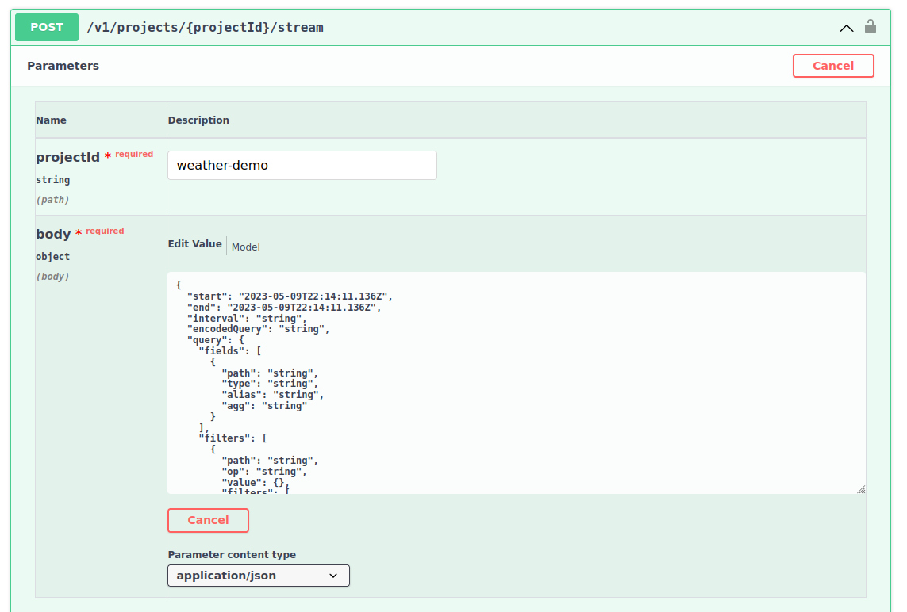
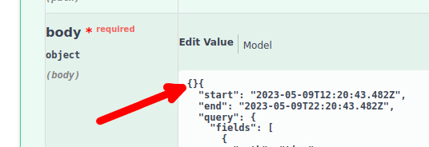
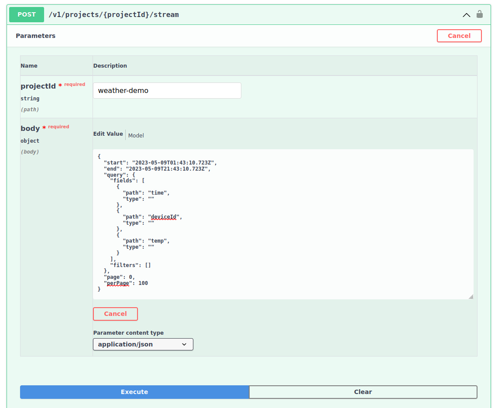

# Querying LightDB Stream Data

## Learning Objectives

Retrieving LightDB Stream data involves a more complex query that specifies
parameters like the start and ends times. We'll walk through the process by
quering the temperature data that is currently stream from your device to
Golioth.

* **Desired outcome(s)**
  1. Successfully retrieve historic sensor data from Golioth
  2. Understand how to look up the parameters the Golioth REST API needs for
     more complex calls
* **Time Estimate:** 10 minutes

## Query the LightDB Stream endpoint

### Enable the Light DB Stream endpoint

1. Scroll down the OpenAPI docs page to find `Light DB Stream`
2. Use the chevron button next to `POST /v1/projects/{projectID}/stream` to
   unfold this endpoint
3. Click the `Try it out` button to enable the query
4. Paste your `projectId` into the box

    

### Enter your query as the `body` value

To query Stream data, we must pass the desired keys we want to be returned. We
will also pass a time window in which to search for data. Notice the default
body in the OpenAPI docs will include all possible keys/types that may be
passed. We need to narrow this down to our target values.

:::tip Use a JSON Validator

The body value **must** be valid JSON for you to receive data back from Golioth.
Please use [a JSON
validator](https://duckduckgo.com/?t=lm&q=json+validator&ia=answer) to confirm
your payload before executing queries on this page.

:::

1. Copy the default body into your favorite code editor
2. The `start`/`end` times will be set to the current time, subtract a few hours
   from the `start` time so that we query a resonable period of time
3. In the `query`:`fields` section, make three nodes, setting the `type` to `""`
   and the `path` to the following values (`alias` and `agg` keys are not
   needed):

    * `time`
    * `deviceId`
    * `temp`

4. Set the `perPage` to 100

Make sure to run your body object through a validator. It should look like this:

``` json
{
  "start": "2023-05-09T12:20:43.482Z",
  "end": "2023-05-09T22:20:43.482Z",
  "query": {
    "fields": [
      {
        "path": "time",
        "type": ""
      },
      {
        "path": "deviceId",
        "type": ""
      },
      {
        "path": "temp",
        "type": ""
      }
    ],
    "filters": []
  },
  "page": 0,
  "perPage": 100
}
```

:::caution Beware automatic curly brackets

When pasting your JSON object into the `body` field, the OpenAPI Docs interface
sometimes adds an extra pair of cruly brackets to the beginning.



If you are having issues, check for this as it will break your query.

:::

<details>
    <summary>Click for screenshot of valid request `body`</summary>



</details>

## Expected Results

Click the `Execute` button. If all went well, you will receive a `Code 200` to
indicate success.

1. Scroll through your returned data. Notice that each entry contains the data
   we requested (`temp` is the temperature reading from the device)

    ```json
    {
      "deviceId": "645a553ee542e648467524f3",
      "temp": 37.23,
      "time": "2023-05-09T18:55:36.637407+00:00"
    },
    {
      "deviceId": "643883c948f9973cd41f3b36",
      "temp": 25.41,
      "time": "2023-05-09T18:55:34.840327+00:00"
    },
    ```
2. At the bottom of the object, the total number of records will be listed. Here
   you can see I've asked for 100 entries per page, so to view the next 100 I
   can run the same query but with `"page": 1,`.

    ```json
    "page": 0,
    "perPage": 100,
    "total": 6714
    ```
4. OpenAPI Docs queries will also return `curl` syntax which is useful in
   understanding how the query is being built

    <details>
        <summary>Click to show the `curl` command</summary>

    ```shell
    curl -X 'POST' \
      'https://api.golioth.io/v1/projects/weather-demo/stream' \
      -H 'accept: application/json' \
      -H 'x-api-key: UpIdF4umpAQkBkhLcxzcT5R0ZFt4Oqin' \
      -H 'Content-Type: application/json' \
      -d '{
      "start": "2023-05-09T12:20:43.482Z",
      "end": "2023-05-09T22:20:43.482Z",
      "query": {
        "fields": [
          {
            "path": "time",
            "type": ""
          },
          {
            "path": "deviceId",
            "type": ""
          },
          {
            "path": "temp",
            "type": ""
          }
        ],
        "filters": [
          {
            "path": "temp",
            "op": ">=",
            "value": 32
          }
        ]
      },
      "page": 0,
      "perPage": 100
    }'
    ```
    </details>

### Example output

<details>
    <summary>Click to reveal an example of returned data</summary>

```json
{
  "list": [
    {
      "id": "643883c948f9973cd41f3b36",
      "hardwareIds": [
        "20230413223553-esp32"
      ],
      "name": "esp32",
      "createdAt": "2023-04-13T22:35:53.085Z",
      "updatedAt": "2023-04-17T15:15:30.618Z",
      "tagIds": [],
      "blueprintId": "643d621af272169b4557ee72",
      "data": null,
      "lastReport": "2023-05-09T14:25:56.258Z",
      "status": "-",
      "metadata": {
        "update": {},
        "status": "-",
        "lastReport": "2023-05-09T14:25:56.258Z",
        "lastSeenOnline": "2023-05-09T14:13:29.795Z",
        "lastSeenOffline": "2023-05-08T21:58:25.505Z",
        "lastSettingsStatus": null
      },
      "enabled": true
    },
    {
      "id": "6439b719f272169b4557ee4a",
      "hardwareIds": [
        "20230414202705-nxp1060"
      ],
      "name": "nxp1060",
      "createdAt": "2023-04-14T20:27:05.493Z",
      "updatedAt": "2023-04-17T15:15:46.722Z",
      "tagIds": [],
      "blueprintId": "643d6276f272169b4557ee74",
      "data": null,
      "lastReport": "2023-05-08T16:48:22.660Z",
      "status": "-",
      "metadata": {
        "update": {},
        "status": "-",
        "lastReport": "2023-05-08T16:48:22.660Z",
        "lastSeenOnline": "2023-05-08T16:45:02.432Z",
        "lastSeenOffline": "2023-05-08T17:48:25.322Z",
        "lastSettingsStatus": null
      },
      "enabled": true
    },
    {
      "id": "6439b7f6f272169b4557ee4c",
      "hardwareIds": [
        "20230414203046-nrf9160"
      ],
      "name": "nrf9160",
      "createdAt": "2023-04-14T20:30:46.929Z",
      "updatedAt": "2023-04-17T15:16:26.486Z",
      "tagIds": [],
      "blueprintId": "643d61f4f272169b4557ee71",
      "data": null,
      "lastReport": "2023-05-08T19:19:20.363Z",
      "status": "-",
      "metadata": {
        "update": {},
        "status": "-",
        "lastReport": "2023-05-08T19:19:20.363Z",
        "lastSeenOnline": "2023-05-08T19:15:28.197Z",
        "lastSeenOffline": "2023-05-08T20:19:23.747Z",
        "lastSettingsStatus": null
      },
      "enabled": true
    },
    {
      "id": "64592869c9444e3259516d9f",
      "hardwareIds": [
        "20230508165049-nxp1024"
      ],
      "name": "nxp1024",
      "createdAt": "2023-05-08T16:50:49.094Z",
      "updatedAt": "2023-05-08T16:50:49.094Z",
      "tagIds": [],
      "data": null,
      "lastReport": "2023-05-09T14:16:31.529Z",
      "status": "-",
      "metadata": {
        "update": {},
        "status": "-",
        "lastReport": "2023-05-09T14:16:31.529Z",
        "lastSeenOnline": "2023-05-09T14:14:06.431Z",
        "lastSeenOffline": "2023-05-09T14:16:36.478Z",
        "lastSettingsStatus": null
      },
      "enabled": true
    },
    {
      "id": "645a553ee542e648467524f3",
      "hardwareIds": [
        "20230509141422-nrf7002dk"
      ],
      "name": "nrf7002dk",
      "createdAt": "2023-05-09T14:14:22.319Z",
      "updatedAt": "2023-05-09T14:14:22.319Z",
      "tagIds": [],
      "data": null,
      "lastReport": "2023-05-09T14:25:57.011Z",
      "status": "-",
      "metadata": {
        "update": {},
        "status": "-",
        "lastReport": "2023-05-09T14:25:57.011Z",
        "lastSeenOnline": "2023-05-09T14:19:35.881Z",
        "lastSeenOffline": null,
        "lastSettingsStatus": null
      },
      "enabled": true
    }
  ],
  "page": 0,
  "perPage": 100,
  "total": 5
}
```
</details>

## Challenge: Query for Temperature above a certain value

1. Look through the data you received and choose a temperature value somewhere
   between the maximum and minimum returned values
2. Add parameters to the `filter` property of your query to filter for
   temperatures above your chosed value. The [Golioth Cloud Docs for LightDB
   Stream](https://docs.golioth.io/cloud/services/lightdb-stream/querying-data)
   are a helpful reference for this process.
3. Run the OpenAPI LightDB Stream query again to observe the returned values
   based on your added filter.

<details>
    <summary>Click to reveal the solution to this challenge</summary>

```json
    "filters": [
      {
        "path": "temp",
        "op": ">=",
        "value": 32
      }
    ]
```
</details>
