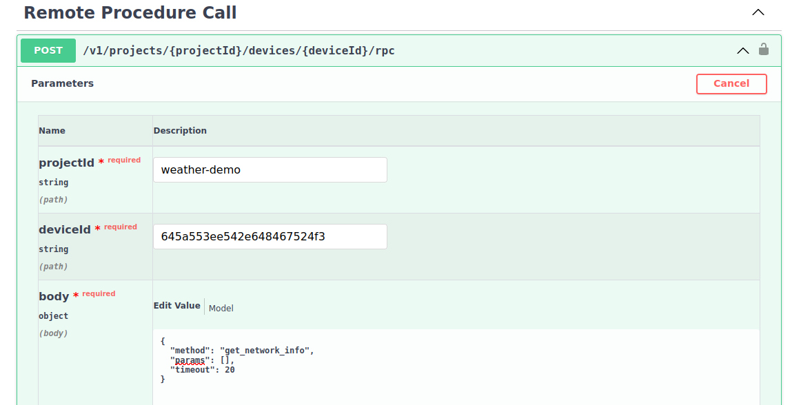

# Issue a Remote Procedure Call

## Learning Objectives

Remote management of devices is possible using the Golioth REST API. To
illustrate this, we will submit a Remote Procedure Call (RPC) and receive a
response from the device.

* **Desired outcome(s)**
  1. Run a function on the remote device and receive data back from it
* **Time Estimate:** 5 minutes

## Execute the `get_network_info` Remote Procedure Call (RPC)

### Enable the Remote Procedure Call endpoint

1. Scroll down the OpenAPI docs page to find `Remote Procedure Call`
2. Use the chevron button next to `POST /v1/projects/{projectId}/devices/{deviceId}/rpc` to
   unfold this endpoint
3. Click the `Try it out` button to enable the query
4. Paste your `projectId` into the box
5. Paste your `deviceId` into the box

    

### Enter your query as the `body` value

The RPC request takes three arguments:

1. Enter `get_network_info` for the `method`
2. This RPC doesn't accept parameters so the `params` set may be left empty
3. We must supply a `timeout` after which it we conclude the device is
   unavailable.

```json
{
  "method": "get_network_info",
  "params": [],
  "timeout": 20
}
```

## Expected Results

Click the `Execute` button. If all went well, you will receive a `Code 200` to
indicate success. The data returned will vary depending on the network
connection type of the board you using. Here is an example of the output when
using a Nordic nrf7002dk:

```json
{
  "statusCode": 0,
  "detail": {
    "BSSID": "C6:FF:D4:A8:FA:10",
    "Band": "2.4GHz",
    "Channel": 6,
    "Interface Mode": "STATION",
    "Link Mode": "WIFI 4 (802.11n/HT)",
    "MFP": "Optional",
    "RSSI": -34,
    "SSID": "YourWiFiSSID",
    "Security": "WPA2-PSK",
    "State": "COMPLETED"
  }
}
```

## Challenge: Try the `multiply` RPC

Now try submitting the `multiply` RPC which takes two integers as parameters.

:::tip Don't forget the previous lesson

If you need guidance on formatting the `params`, use the skills you learned in
the previous section to see how the Golioth Web Console formats this RPC.

:::

<details><summary>Click to reveal the solution to this challenge</summary>

Here is the formatting for the body of the query:

```json
{
  "method": "multiply",
  "params": [3,14],
  "timeout": 20
}
```

And this is the expected response:

```json
{
  "statusCode": 0,
  "detail": {
    "value": 42
  }
}
```
</details>
