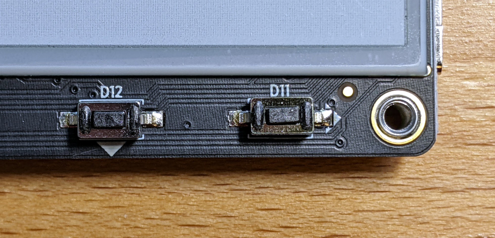

import Tabs from '@theme/Tabs';
import TabItem from '@theme/TabItem';

# Add Button Input

|  |
|:--:|
| Make button D11 work! |

The Zephyr button example demonstrates interrupt-based button input. But you need to have a `sw0` (switch zero) defined in the devicetree to test it out. This exercise will build upon our progress from blinking the LED

## Copy the Zephyr Button example

Make a copy of the Zephyr Button example to work from

<Tabs
groupId="os"
defaultValue="linux"
values={[
{label: 'Linux/MacOS', value: 'linux'},
{label: 'Windows', value: 'windows'},
]}>

<TabItem value="linux">

```shell
cd ~/golioth-zephyr-workspace/modules/lib/golioth/samples
cp -r ~/golioth-zephyr-workspace/zephyr/samples/basic/button button-training
cd button-training
```

</TabItem>
<TabItem value="windows">

```shell
cd C:\golioth-zephyr-workspace\modules\lib\golioth\samples
Xcopy C:\golioth-zephyr-workspace\zephyr\samples\basic\button button-training\ /E
cd button-training
```

</TabItem>
</Tabs>

1. Create a `boards` directory in your `button-training` folder
2. Copy the `esp32s2_saola.overlay` from your LED example to the new `boards` directory

## Exercise: Add `sw0` to your existing overlay file

We can reuse the `led0` configuration in the overlay file, but we need to add an alias and binding for `sw0`

Last time we used a DTS file from the WROVER kit as reference, but that board doesn't have any buttons on it. What we're after is the basic structure of the overlay file, so it doesn't really matter what we use as a reference. This time, let's use the Freedom K64 dev board DTS file as an example:

* Study [the DTS file for the frdm_k64f board](https://github.com/zephyrproject-rtos/zephyr/blob/main/boards/arm/frdm_k64f/frdm_k64f.dts) and use the parts we need for our MagTag:
* open `golioth-zephyr-workspace/zephyr/boards/arm/frdm_k64f/frdm_k64f.dts`

Add the following to your overlay file:

* One new child node inside your root node: `gpio_keys`
* The gpio_keys child node needs one subnode that declares the button
* The aliases child node needs a new subnode that associates the `sw0` alias with the new button subnode

|  |
|:--:|
| From [the MagTag schematic](https://learn.adafruit.com/assets/96946) |

You will need to update the pin assignment inside of your button subnode. There are gotchas to watch out for:

1. Pay close attention to the gpio port that is declared and notice that you need to alter what was used with the Freedom K64f reference DTS file to match the ESP32-style that we used when adding the LED to the overlay file.
2. The schematic shows pull-resistors but they are marked `DNP` (Do Not Populate). We will need to use the internal pull-up resistor of the ESP32s2. Can you figure out how to add the `GPIO_PULL_UP` flag to this pin assignment?
3. To clarify the pin naming/numbering: the MagTag has `D11` printed next to the button because it is connected to GPIO11. On the schematic this is labelled as `BUTTOND`.

Once you have updated your overlay file, compare it with the example below.

<details><summary>Click to reveal the expected esp32s2_saola.overlay file</summary>

```js esp32s2_saola.overlay
/ {
    aliases {
        led0 = &red_led;
        sw0 = &user_button_d11;
    };
    leds {
        compatible = "gpio-leds";
        red_led: red_led {
            gpios =  <&gpio0 13 GPIO_ACTIVE_HIGH>;
            label = "Red - LED2";
        };
    };
    gpio_keys {
        compatible = "gpio-keys";
        user_button_d11: button_0 {
            label = "User D11";
            gpios = <&gpio0 11 (GPIO_ACTIVE_LOW | GPIO_PULL_UP)>;
        };
    };
};
```

Of note:

* The `compatible` property tells Zephyr the type of binding we are using
* The Freedom board DTS file used `&gpioc` but the ESP32s2 needed `&gpio0`
* The pull-up resistor has been enabled using the OR operator to make a bitmask: `(GPIO_ACTIVE_LOW | GPIO_PULL_UP)`

</details>

## Build and flash the example

Now that we set up our LED in the overlay file, let's build and run the app to make sure it blinks:

```shell
west build -b esp32s2_saola . -p
west flash
```

The red led on the underside of the MagTag will illuminate when the button is pressed and go out when it is released. This is done with polling, but if you are able to look at the serial output of the MagTag, the messages displayed there are interrupt-driven.

## C code walkthrough

```c
#define SW0_NODE DT_ALIAS(sw0)
static const struct gpio_dt_spec button = GPIO_DT_SPEC_GET_OR(SW0_NODE, gpios, {0});
static struct gpio_callback button_cb_data;
gpio_pin_configure_dt(&button, GPIO_INPUT);
gpio_pin_interrupt_configure_dt(&button, GPIO_INT_EDGE_TO_ACTIVE);
gpio_init_callback(&button_cb_data, button_pressed, BIT(button.pin));
gpio_add_callback(button.port, &button_cb_data);
```

Here is the button-related code the from `main.c` file of the button example. Let's walk through what is happening:

1. A macro is used to look at the devicetree and get the node information from the `sw0` alias
2. Create a struct instance called `button` that contains the relevant pin information for sw0
3. Create a struct instance to pass information to the interrupt callback
4. The pin is configured. This function automatically pulls in any flags specified in the devicetree
5. The pin interrupt is configured
6. The callback is initialized
7. The callback is added

Notice that the macros and functions used all contain `dt` to indicate these operate on a devicetree node. There are equivalent functions/macros that operate directly, but we recommend always using the devicetree.

For more information on the Zephyr GPIO system, consult [the GPIO driver API reference](https://docs.zephyrproject.org/apidoc/latest/group__gpio__interface.html).
