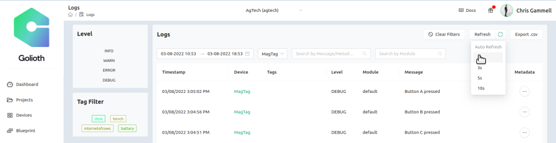
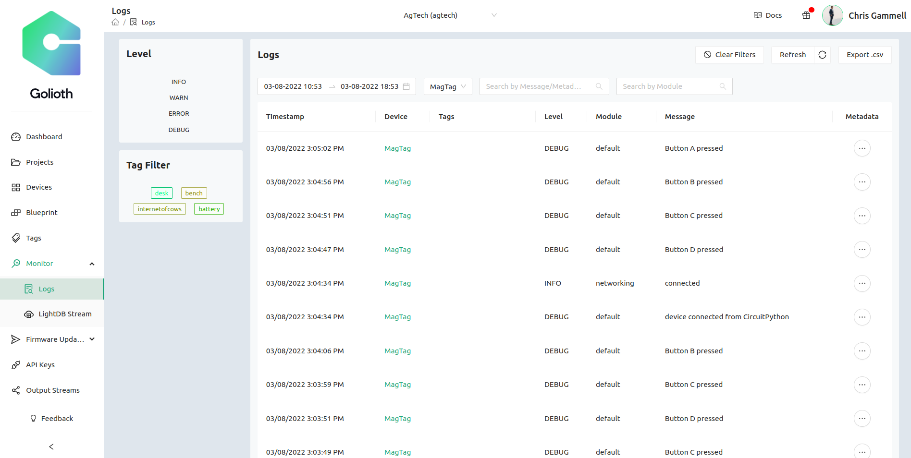
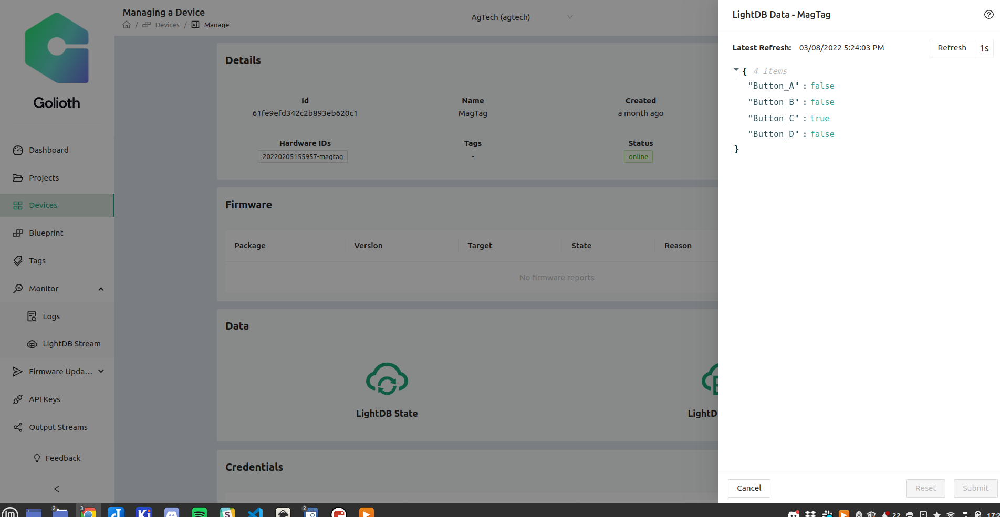
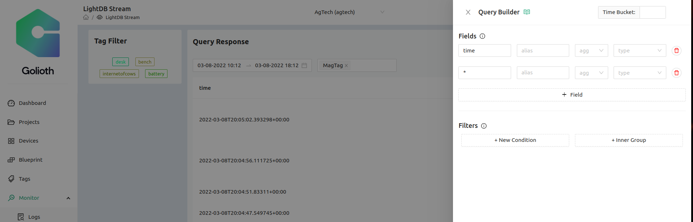
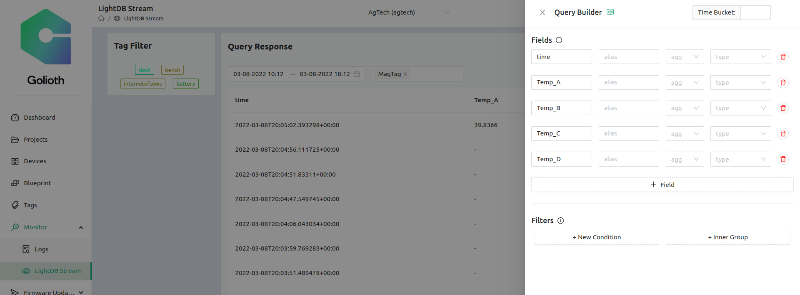
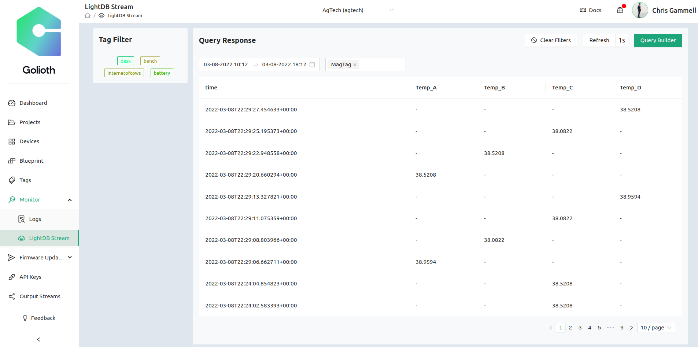

# Exploring Golioth using the MagTag

## One button, 3 outputs

The light and sound aren't the only things happening when you press (and hold) a button on the MagTag. There are three things we're looking at when you press a button:

* Logging message
* LightDB State Change
* LightDB Stream Event

## Logging Message

1. Check the logging messages on your device page. Is it connecting?
2. Set up recurring checks of the logs by clicking the green circle next to the "refresh" button and select the "1 s" refresh rate.
  * 
3. Continue to press buttons on the device to see new logging messages come through. 

### Expected outcome

Click to reveal expected outcome for Logging

* On successful boot, you should see a message like "	INFO	networking	connected"
* Every time you press the button on the MagTag, you should see DEBUG messages like "Button A pressed"
* 

## LightDB State

1. Navigate to your device page
2. Click on the "LightDB State" button to open the drawer
3. Turn on "Refresh" every second, same as in the logging section
### Expected outcome

Click to reveal expected outcome for LightDB State

* Watching the variables, you should see them normally set to 'false'
* When the button is pressed, the variable should be set to 'true' while it's pressed
* 

## LightDB Stream

1. Navigate to the LightDB stream page
    * If you reach it on the sidebar, you might need to filter for the data you want
    * Navigate to the device page first and click on "LightDB Stream" to have it prefiltered for the device you're looking at\
2. Look at the output, including the format
    * Notice how the data is formatted
    * Click to expand each piece of data
    * Why do you think it's set up like that?
3. Set up Query Builder
    * The data you saw in step 2 has the default query builder settings
  
    * We want to have a better way to visualize the time series data that is coming through
  
    * How does it look different now?

### Expected outcome

Click to reveal expected outcome for LightDB Stream

* After setting up the Query Builder, you should see data in columns, tagged for when the button press happens
* 

## Discussion around the difference between these 3 data types

As a discussion among Developers, what are some of the differences you see in how this data is being processed. How might it be useful for your projects?