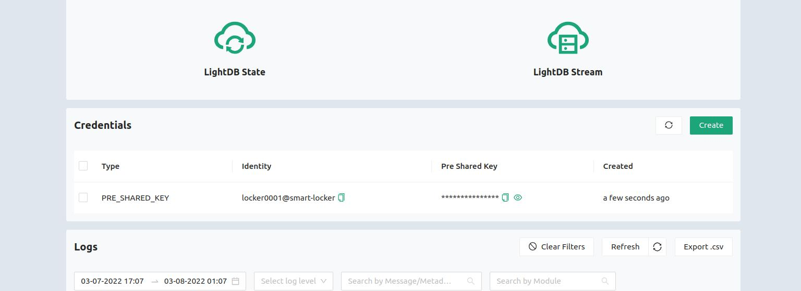
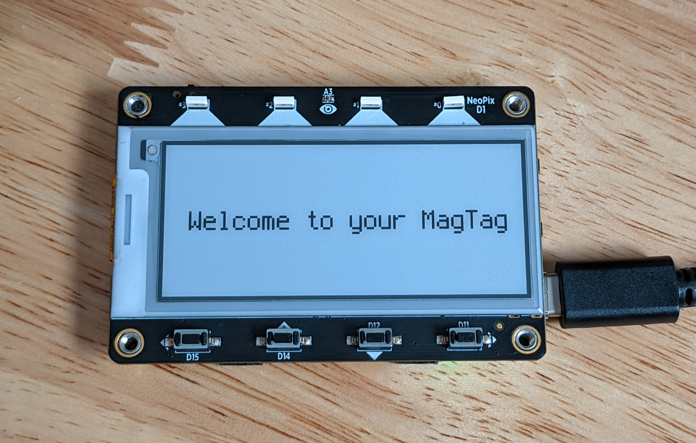

# CircuitPython Setup

While there are very few things that are required for this demo to run, the main focus is on the "drag and drop" nature of this experience. Below you will install an interpreter, load a library, load code onto your device, and add credentials in about as many steps. 

## Install CircuitPython on top of UF2 Bootloader

Download the latest image of CircuitPython from [the MagTag page on CircuitPython.org](https://circuitpython.org/board/adafruit_magtag_2.9_grayscale/). Be sure to download the `.uf2` file. This is a file format that allows drag and drop onto microcontrollers.

Plug in the board to your computer using a USB C cable. Power on the MagTag board using the on/off switch on the top of the board. 


You should see a green light when it is powered on. Double click the reset button on your MagTag board. Once your board has entered UF2 bootloader mode, you should see the red LED (D13) "breathing", the 4 LEDs on the front will turn green, and you should see a new drive appear on your computer called "MAGTAGBOOT".

Drop the `.uf2` file onto the MAGTAGBOOT drive. You will see the LEDs on the front of the board flashing. Once the install is finished, the board will reset and you will see a new drive called "CIRCUITPY". You have now installed CircuitPython.

## Drag and drop! (Libraries, Code)

[Download the all-in-one repository]

Extract the `lib` folder and drag and drop all libraries into the `lib` folder on the CIRCUITYPY drive. If a `lib` folder does not exist, drop the entire folder onto the CIRCUITPY drive.

Also copy `code.py` and `secrets.py` to the top level of the CIRCUITPY drive. The rough directory structure on the CIRCUITPY drive will look like this:

```
- code.py
- secrets.py
- lib/
    - golioth
    - adafruit_minimqtt
    - other_libs
```

## Add your credentials

As soon as you drop the library files and top level files onto the CIRCUITPY drive, you will likely see an error message on the ePaper screen; you will also see the front LEDs flashing every few seconds as the device reboots and attempts to run the user code again. The ePaper acts as a debug output for CircuitPython programs, which is useful for rapid prototyping. The error screen comes up because you have not yet modified the credentials in `secrets.py`. 


Open `secrets.py` in VS Code or another editor that protects line endings (see [Mu Install](#optional-install-mu) below if you don't know of one). 


Insert your:
* Local SSID info
* Local Wifi Password
* Golioth PSK ID (found on the [devices tab of the Console](https://console.golioth.io/devices))
* Golioth PSK ID (found on the [devices tab of the Console](https://console.golioth.io/devices))



Once you have typed these in and clicked "save" on `secrets.py`, you should see your unit reboot. If your device successfully connects to the WiFi network and Golioth, you should see the following screen:



## Optional: Install Mu

Mu is a friendly editor for working with CircuitPython. It has a mode specific to CircuitPython. You can [download the editor here](https://codewith.mu/). Adafruit has [a page dedicated to installing Mu for CircuitPython](https://learn.adafruit.com/welcome-to-circuitpython/installing-mu-editor) as well.
