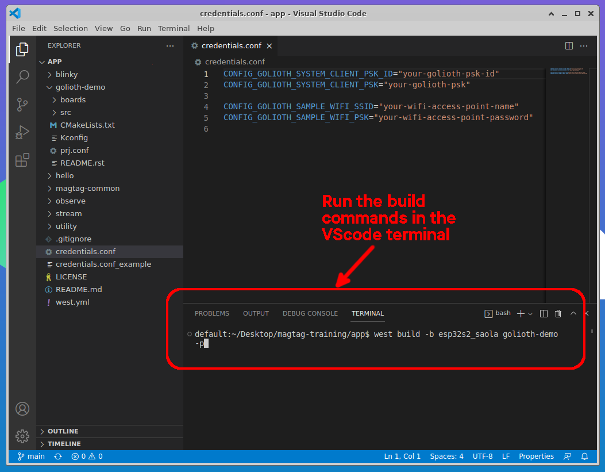

import HowToDownload from '/docs/\_partials/download-from-kasm.md'
import VerboseFlash from '/docs/\_partials/flash-the-example-kasm-verbose.md';

# Build the Golioth Demo

We begin with a full-featured demo! But for the MagTag to connect we must give
it one set of credentials to connect to your WiFi and another set of
credentials to connect to Golioth that you created in the [Golioth Signup and
Exploration](/docs/golioth-intro/signup) section.

## Learning objectives

We are building your muscles around compiling Zephyr binaries, by starting with
pre-configured code. All you need to do is add credentials, compile, and load
the binary onto your device.

We are doing this so you can use this hardware and firmware on the MagTag to
experiment with features on Golioth in the next section.

### Desired outcome(s)

* Create a customized file containing your credentials for Wi-Fi and Golioth.
* Build a binary containing those credentials.
* Download the built binary and load it onto the MagTag hardware.
* See the device connect to Golioth over WiFi

### Time Estimate

* This section will take 5-20 minutes
  * Depending on experience with Zephyr and the `west` meta tool.

## Workflow

:::tip Using VScode

In this exercise we detail how to use VScode when editing, building, and
flashing a Zephyr project. This process may also be reused with all other
exercises.

Of course, VScode is optional and you may choose to use any editor of your
choice and to build/flash from the command line.

:::

### Build in the Kasm container

1. In the Kasm container, open the magtag-training project in VScode

    * use the icon on the desktop to open vscode
    * Choose File&rarr;Open Folder
    * Navigate to `~/Desktop/magtag-training/app` and open it
    * Confirm that you trust the authors in the window that appears

    

2. Create a file for WiFi and Golioth credentials

    * Create `credentials.conf`
      * Right click on the credentials.conf_example in the Explorer sidebar and
        choose Copy
      * Right click on and empty space in the Explorer sidebar and choose Paste
      * Right click on the `credentials copy.conf_example` and choose Rename
      * Name the file `credentials.conf`. The file will now be open in an editor
        window
    * Edit this new file to include your WiFi credentials and the PSK-ID/PSK
      from the device page on your [Golioth
      console](https://console.golioth.io/)
    * Save the file
      * This file will be ignored by git, and may be reused in other examples.

    

3. Build the example, including the credentials file you just created

    * To open a terminal window in VScode click on Terminal&rarr;New Terminal
    * Run the following code in the terminal to build the `golioth-demo` app

    ```bash
    west build -b esp32s2_saola golioth-demo -p
    ```

    

    :::tip Use the app folder for builds

    We want to build all of the sample code from the `~/Desktop/magtag-training/app`
    folder. The VScode terminal should automatically begin in this folder
    because that is the folder we already opened in the Explorer sidebar

    :::

4. Download the binary

    * In the VScode terminal, run `west kasm download` to package the compiled
      code and make it available for download
    * Use the Download option in Kasm's left sidebar to download
      `merged_yymmdd_hhmmss.bin` to your local machine.

  <HowToDownload/>

### Update MagTag firmware from your local machine

<VerboseFlash/>

## Expected results


After flashing the example you need to press the Reset button to run the
program. Your MagTag may not visibly react for a few seconds as it initializes
the WiFi hardware. The two center LEDs will turn blue as the board attempts to
connect to the internet and establish a secure connection with Golioth. The
Golioth logo will be displayed on the ePaper screen during this time.

When a connection is established, the four LEDs will turn to yellow, blue,
green, and red and the MagTag show a "Connected to Golioth!"

