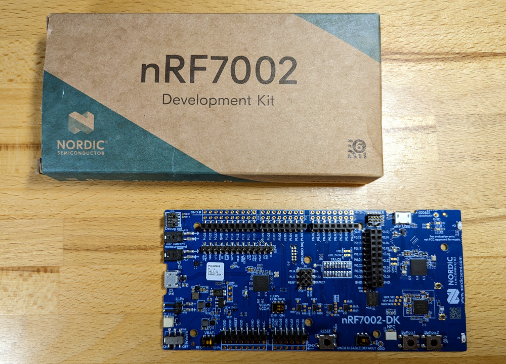
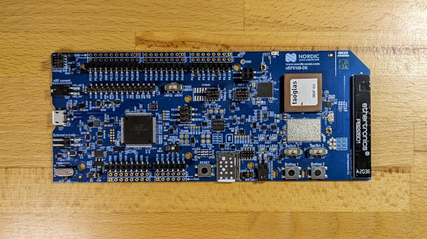
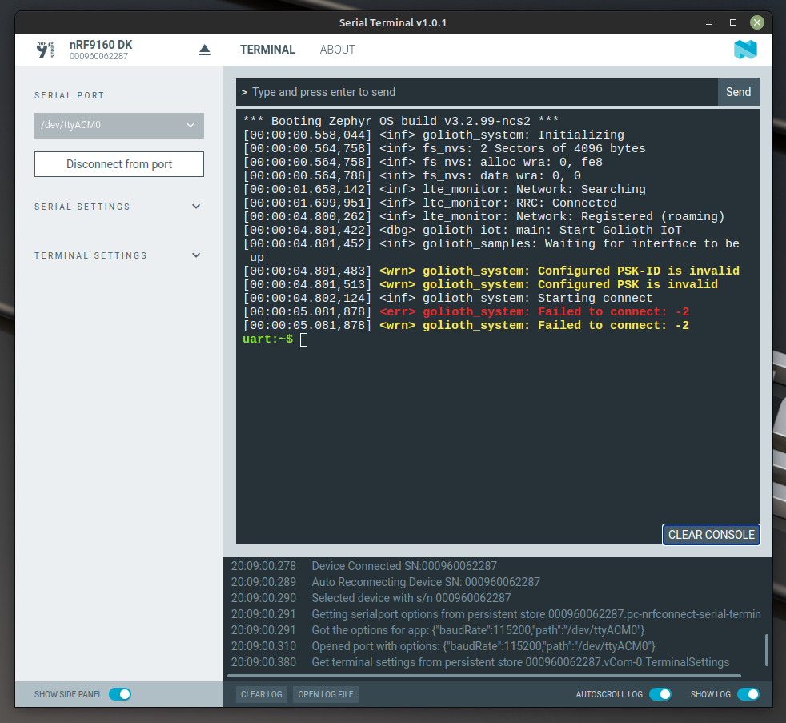

import InstallNrfConnect from './\_partials/install_nrf_connect.md'
import FlashWithNrfConnect from '/docs/\_partials/flash-the-example-nrf.md'
import ConnectToSerial from '/docs/\_partials/connect-to-serial.md'

import Tabs from '@theme/Tabs';
import TabItem from '@theme/TabItem';

# Connect Hardware to Golioth

This training currently supports the following hardware:

* Nordic nRF7002 Development Kit
* Nordic nRF9160 Development Kit

## Development Board

**Please choose which hardware you will be using:**

<Tabs
groupId="devboard"
defaultValue="nrf7002dk"
values={[
{label: 'nRF7002 DK', value: 'nrf7002dk'},
{label: 'nRF9160 DK', value: 'nrf9160dk'},
]}>

<TabItem value="nrf7002dk">

The [nRF7002
DK](https://www.nordicsemi.com/Products/Development-hardware/nRF7002-DK) is a
WiFi-based development board from Nordic Semiconductor. It includes an onboard
programmer/debugger via a USB connection.



</TabItem>
<TabItem value="nrf9160dk">

The [nRF9160
DK](https://www.nordicsemi.com/Products/Development-hardware/nRF9160-DK) is a
Cellular development board from Nordic Semiconductor. It includes an onboard
programmer/debugger via a USB connection.



</TabItem>
</Tabs>

### Programming the Binary

<InstallNrfConnect/>

3. [Visit the latest
   Release](https://github.com/golioth/zephyr-training/releases/latest) of our
   Zephyr Training repository. Download the `.hex` file that matches your device
   type.
4. In the nRF Connect for Desktop Programmer app, choose your device from the
   upper left `SELECT DEVICE` dialog.
5. Click `Add file`&rarr;`Browse` and choose
   `Golioth_<your_device>_kitchen_sink_v1.0.0.hex ` you previously downloaded
6. Click the "Erase & write" button

### Adding Credentials

<Tabs
groupId="devboard"
defaultValue="nrf7002dk"
values={[
{label: 'nRF7002 DK', value: 'nrf7002dk'},
{label: 'nRF9160 DK', value: 'nrf9160dk'},
]}>

<TabItem value="nrf7002dk">

WiFi and Golioth Device Credentials must be added to the device for it to
connect properly. This is accomplished over USB using the Shell built into
Zephyr.

<ConnectToSerial/>

3. You can now press the reset button on the nRF7002 DK to see the serial output
   as it runs. We expect that the device will not be able to connect as it does
   not yet have credentials.

    

4. Use the serial connection to assign WiFi and Golioth Device Credentials

    :::info
    Golioth Device Credentials were created during the [Console Signup and
    Exploration](./02-signup.md) step. You can return to the [Golioth
    Console](https://console.golioth.io/) to retrieve the PSK-ID/PSK.

    WiFi credentials come from your home or business WiFi. It is also possible
    to use your phone as a WiFi hotspot.

    The precompiled binary is only
    able to connect to hotspots using WPA2 authentication (which is very
    common). This limitation can be changed if you compile your own firmware.
    :::

    Use the following command syntax to assign your credentials.

    ```
    uart:~$ settings set wifi/ssid <my-wifi-ap-ssid>
    uart:~$ settings set wifi/psk <my-wifi-ap-password>
    uart:~$ settings set golioth/psk-id <my-psk-id@my-project>
    uart:~$ settings set golioth/psk <my-psk>
    uart:~$ kernel reboot cold
    ```

    :::tip

    By default the Nordic Serial Terminal has a bar along the top for all keyboard
    input. If you would like to type at the prompt in the terminal window, click on
    `Terminal Settings` in the left sidebar and choose `Shell`.

    :::

5. Observe the device connecting to Golioth

    After the nRF7002 DK reboots, the serial terminal will remain connected. You
    should see the device connect to WiFi, then Golioth, and begin streaming
    simulated temperature data:

    ```
    [00:00:07.398,437] <inf> net_dhcpv4: Received: 192.168.1.127
    [00:00:07.398,559] <inf> net_config: IPv4 address: 192.168.1.127
    [00:00:07.398,559] <inf> net_config: Lease time: 43200 seconds
    [00:00:07.398,590] <inf> net_config: Subnet: 255.255.255.0
    [00:00:07.398,651] <inf> net_config: Router: 192.168.1.1
    [00:00:07.399,414] <inf> golioth_iot: DHCP IP address: 192.168.1.127
    [00:00:11.973,388] <inf> golioth_system: Starting connect
    [00:00:12.249,023] <inf> golioth_iot: Sending hello! 0
    [00:00:12.250,213] <inf> golioth_iot: Streaming Temperature to Golioth: 26.450000
    [00:00:12.252,105] <inf> golioth_system: Client connected!
    [00:00:12.317,108] <dbg> golioth_iot: on_setting: Received setting: key = LOOP_DELAY_S, type = 4
    [00:00:12.317,138] <inf> golioth_iot: Set loop delay to 5 seconds
    [00:00:12.317,169] <inf> golioth_iot: Sending hello! 1
    [00:00:12.318,328] <inf> golioth_iot: Streaming Temperature to Golioth: 26.450000
    [00:00:12.318,572] <dbg> golioth_iot: on_setting: Received setting: key = BLINK_DELAY_MS, type = 4
    [00:00:12.318,603] <inf> golioth_iot: Set blink delay to 200 milliseconds
    [00:00:17.319,122] <inf> golioth_iot: Sending hello! 2
    [00:00:17.321,685] <inf> golioth_iot: Streaming Temperature to Golioth: 26.840000
    [00:00:22.321,929] <inf> golioth_iot: Sending hello! 3
    [00:00:22.338,562] <inf> golioth_iot: Streaming Temperature to Golioth: 26.940000
    [00:00:27.338,806] <inf> golioth_iot: Sending hello! 4
    [00:00:27.355,560] <inf> golioth_iot: Streaming Temperature to Golioth: 27.140000
    ```

</TabItem>
<TabItem value="nrf9160dk">

Golioth Device Credentials must be added to the device for it to connect
properly. This is accomplished over USB using the Shell built into Zephyr.

<ConnectToSerial/>

3. You can now press the reset button on the nRF9160 DK to see the serial output
   as it runs. We expect that the device will not be able to connect as it does
   not yet have credentials.

    

4. Use the serial connection to assign Golioth Device Credentials

    :::info

    Golioth Device Credentials were created during the [Console Signup and
    Exploration](./02-signup.md) step. You can return to the [Golioth
    Console](https://console.golioth.io/) to retrieve the PSK-ID/PSK.

    :::

    Use the following command syntax to assign your credentials.

    ```
    uart:~$ settings set golioth/psk-id <my-psk-id@my-project>
    uart:~$ settings set golioth/psk <my-psk>
    uart:~$ kernel reboot cold
    ```

5. Observe the device connecting to Golioth

    After the nRF9160 DK reboots, the serial terminal will remain connected. You
    should see the device connect to WiFi, then Golioth, and begin streaming
    simulated temperature data:

    ```
    *** Booting Zephyr OS build v3.2.99-ncs2 ***
    [00:00:00.502,471] <inf> golioth_system: Initializing
    [00:00:00.509,094] <inf> fs_nvs: 2 Sectors of 4096 bytes
    [00:00:00.509,094] <inf> fs_nvs: alloc wra: 0, fb8
    [00:00:00.509,094] <inf> fs_nvs: data wra: 0, 5c
    [00:00:01.819,915] <inf> lte_monitor: Network: Searching
    [00:00:01.887,420] <inf> lte_monitor: RRC: Connected
    [00:00:05.285,858] <inf> lte_monitor: Network: Registered (roaming)
    [00:00:05.287,017] <dbg> golioth_iot: main: Start Golioth IoT
    [00:00:05.287,048] <inf> golioth_samples: Waiting for interface to be up
    [00:00:05.287,689] <inf> golioth_system: Starting connect
    [00:00:07.209,106] <inf> golioth_iot: Sending hello! 0
    [00:00:07.211,425] <inf> golioth_iot: Streaming Temperature to Golioth: 27.370000
    [00:00:07.212,677] <inf> golioth_system: Client connected!
    [00:00:07.702,545] <dbg> golioth_iot: on_setting: Received setting: key = LOOP_DELAY_S, type = 4
    [00:00:07.702,575] <inf> golioth_iot: Set loop delay to 5 seconds
    [00:00:07.702,606] <inf> golioth_iot: Sending hello! 1
    [00:00:07.703,552] <dbg> golioth_iot: on_setting: Received setting: key = BLINK_DELAY_MS, type = 4
    [00:00:07.703,613] <inf> golioth_iot: Set blink delay to 200 milliseconds
    [00:00:07.703,857] <inf> golioth_iot: Streaming Temperature to Golioth: 27.170000
    [00:00:12.705,383] <inf> golioth_iot: Sending hello! 2
    [00:00:12.715,240] <inf> golioth_iot: Streaming Temperature to Golioth: 26.970000
    [00:00:17.715,942] <inf> golioth_iot: Sending hello! 3
    [00:00:17.717,346] <inf> golioth_iot: Streaming Temperature to Golioth: 27.520000
    ```

</TabItem>
</Tabs>

## Success!!

Your device is now running the application and connecting to Golioth.
Congratulations! In the next module we will use this device to illustrate
interaction with IoT devices from the cloud.
