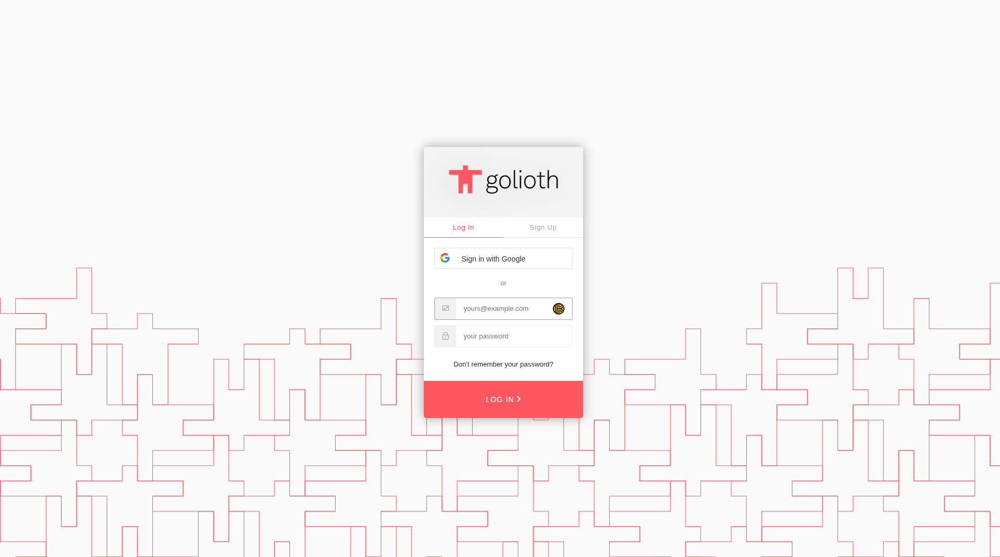
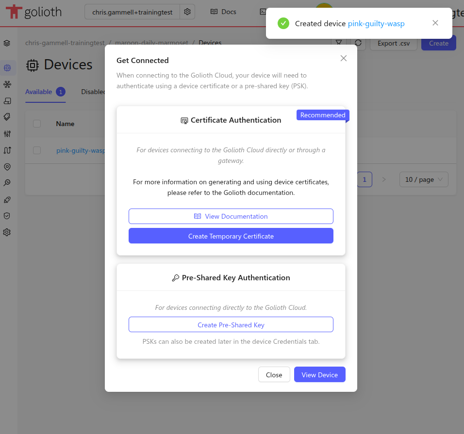

import FlexImage from '@site/src/components/FlexImage';
import GoliothConsoleOnboarding from './assets/console/console-onboarding.png';
import GoliothConsoleVerifyEmail from './assets/console/console-verify-email.png';

import GoliothWizard1 from './assets/console/console-quickstart-step1-wizard.png';
import GoliothProjectCreate from './assets/console/console-quickstart-step1-createproject.png';

import GoliothWizard2 from './assets/console/console-quickstart-step2-wizard.png';
import GoliothCreateDevice from './assets/console/console-quickstart-step2-createdevice.png';

## Creating your Golioth account

To begin using Golioth please register for an account at
[console.golioth.io](https://console.golioth.io/). Click "Sign up" to register
a new account with a email/password or a Google SSO account.

### Answering Questions, Verifying Email

<FlexImage column_count="2">
  
  
</FlexImage>

Once registered, you will be asked some onboarding questions and to review our
terms of service. You will need to verify your email address to continue. If
you don't see the email (from Auth0) within 5 minutes tell an instructor or
if you are taking this training asynchronously, email support@golioth.io

## Creating a new Project

<FlexImage column_count="2">
  
  
</FlexImage>

### Project name

Golioth organizes fleets into "Projects". When first logging into Golioth you
will be directed to create a project using the `Create` button in the upper
right. You may use the auto-generated project name, or create your own. Project
names cannot be changed after creation so pick a good one!

## Creating a new Device

<FlexImage column_count="3">
  
  
</FlexImage>

### Device name

Each project is made up of a number of devices. The next step will direct you to
create a device using the `Create` button in the upper right. Once again you may
use the auto-generated device name or create your own. Device names may be
changed at any time.

### Tags and Hardware IDs

Tags and Hardware IDs are a great tool for organizing your growing fleet. For
now we'll leave these blank.

### Device credentials

In our new flow, you can choose to user our certificate generator or to
choose a Pre-Shared Key (PSK) credential. The former is the more secure, but
for on-boarding, we choose PSK-ID and PSK for simplicity. These are the
credentials that will authenticate this device to the Golioth Cloud.

## That's it!

It really is that simple, you have provisioned your first device! Let's
look at what we just created.
