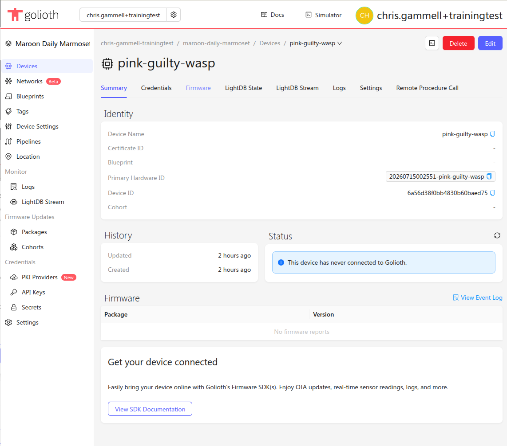
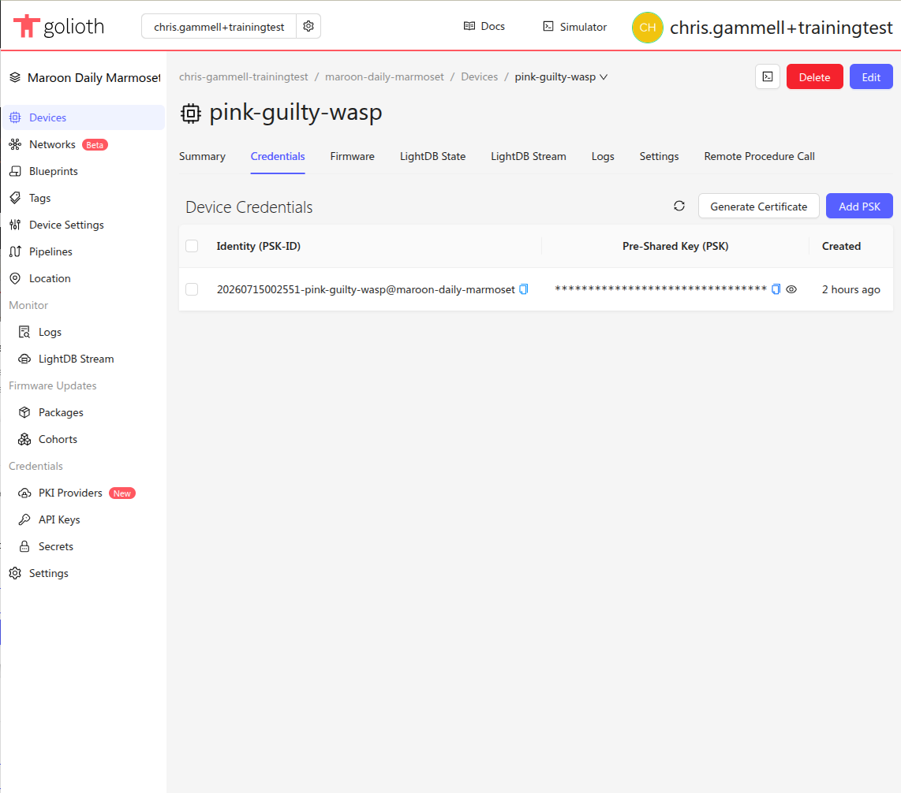

Let's use the Golioth Console to view our existing devices, which should only be
the device you just created.

In the center at the top of the console window the currently selected project is
shown. On the left sidebar we can use the Devices option to list this project's
devices. Here we see the device that was created by the quickstart wizard.

## New device summary

Clicking on your device, you can check out the "detail view" of your new device record

## Retrieving Device Credentials

To access device credentials, select the Credentials tab from the device view
in the Golioth Console. The PSK-ID and PSK (the Identity and the Pre Shared
Key) are what your device needs to authenticate and connect to the Golioth
Cloud. You can always return to this panel in the device details to retrieve
these values.

Congratulations, you're ready to move on to selecting hardware!
