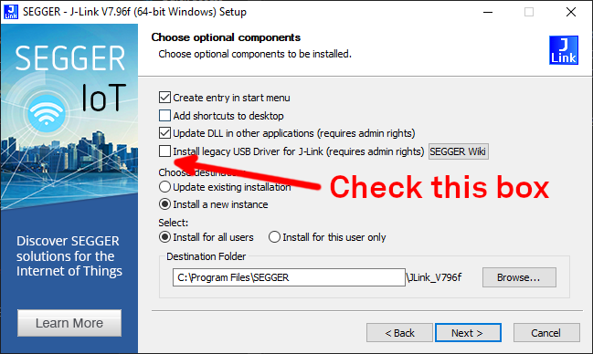

import Tabs from '@theme/Tabs';
import TabItem from '@theme/TabItem';

1. Download Nordic's [nRF Connect for
   Desktop](https://www.nordicsemi.com/Products/Development-tools/nRF-Connect-for-desktop)
   software.

   Choose your Operating System for tips on installation:

    <Tabs
    groupId="nrftoolsinstall"
    defaultValue="linux"
    values={[
    {label: 'Linux/Mac', value: 'linux'},
    {label: 'Windows', value: 'windows'},
    ]}>

    <TabItem value="linux">

    **Mac and Linux Users:** According to [the Nordic install
    instructions](https://infocenter.nordicsemi.com/index.jsp?topic=/struct_nrftools/struct/nrftools_nrfconnect.html)
    you also need to [install the SEGGER J-Link
    tools](https://www.segger.com/downloads/jlink/#J-LinkSoftwareAndDocumentationPack).

    **Mac users with Apple Silicon:** Our testing found that you must use the
    `Universal Installer` version of the SEGGER tools with nRF Connect for Desktop.

    </TabItem>
    <TabItem value="windows">

    1. Install newer SEGGER Tools

        **Windows Users** have reported that the version of the SEGGER tools
        included with nRF Connect for Desktop may be too old to offer the legacy
        driver installation option and suggest installing the [newest version
        available directly from
        SEGGER](https://www.segger.com/downloads/jlink/#J-LinkSoftwareAndDocumentationPack).

    2. Select legacy USB drivers during SEGGER install

        **Windows Users** have reported that you should select "Install legacy
        USB Driver for J-Link" during the Segger J-Link installation step of the
        wizard. Some users are unable to connect to the dev board when this
        driver is not installed.

        
    </TabItem>
    </Tabs>

2. Launch nRF Connect for Desktop. From that application, install and open the
   Programmer.

   

3. Plug in and turn on your board

    :::caution

    Plug a USB cable into the USB port closest to the power switch on your board.
    Make sure the power switch is in the `ON` position.

    :::
