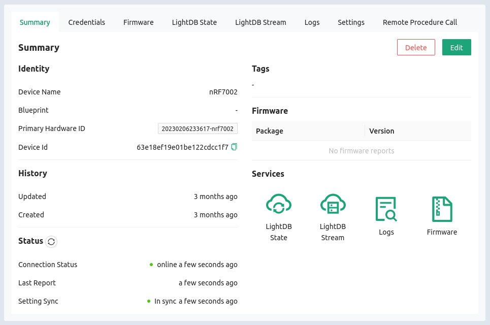
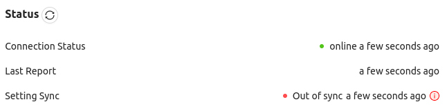

# Device Status

First and foremost, you need to know the state of your fleet. To view individual
device status:

1. Click the `Devices` option in the left sidebar of [the Golioth
   Console](https://console.golioth.io)
2. Click on the device `Name` in the resulting list

## Status page overview

On this page you can view the following information:

* `Device name`: Human readable name provided when virtual device was created
* `Blueprint`: (Optional) Used to group devices based on their hardware traits
* `Tags`: (Optional) Used to create device groups within your fleet
* `Primary Hardware ID`: Can be generated or customized for fleet organization
  (e.g. some customer use MAC address in this field)
* `Device Id`: Used by the Golioth API to identify this device
* `History`: Displays when this virtual device was created and last updated
* `Status`: Displays information on when device last checked in and if its
  Settings Service has confirmed lasted cloud-side settings
* `Firmware`: Displays current package and version of OTA firmware. (This
  precompiled example doesn't implement OTA, so no firmware has been reported to
  the cloud)

## Why is my device "Out of sync"?

You may have notices that the `Setting Sync` for your device reports `Out of
sync`:

This indicates that there is a mismatch between what settings the device expects
and those provided by the cloud. Hovering over the red `i` will provide further
information.

In this particular case, the application we are running expects two specific
keys to be available from the Settings Service. These have not yet been set up
on your Golioth project, but we will remedy that when we get to [the Settings
Service section](05-settings-service.md) of this training.

## Additional Exercises

* Edit your virtual device in this window to add a Blueprint and a Tag

