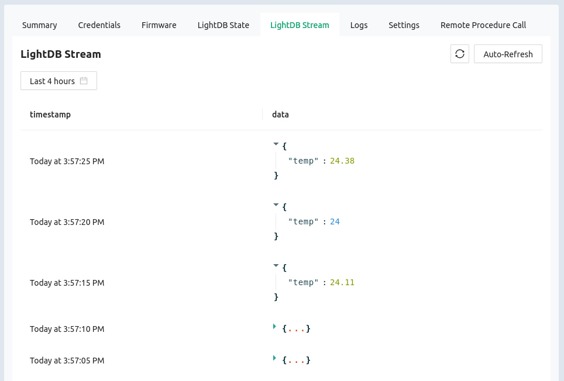

# LightDB Stream (Time-series)

:::info Golioth Pipelines

Golioth includes [a powerful tool called
**Pipelines**](https://docs.golioth.io/data-routing) for routing and optionally
transforming time-series data.

By default a new project will automatically route stream data to Golioth's own
time-series database called LightDB Stream. However, it is trivial for you to
update your pipeline to route data to a webhook, external DB services like
Influx and Mongo, your favorite cloud platform, to any combination of those, and
much more.

:::

The Golioth LightDB Stream is purpose built for collecting time-based data from
devices in the field. Every time data is received, the server records it along
with a timestamp. This is perfect for collecting sensor data as it creates a
historic record of all readings.

## View LightDB Stream in Device Summary

To view the LightDB Stream data for a device:

1. Click the `Devices` option in the left sidebar of [the Golioth
   Console](https://console.golioth.io)
2. Click on the device `Name` in the resulting list
3. Click on the `LightDB Stream` tab

### LightDB Stream page overview

On this page you can view the following information:

* `timestamp`: Time/Date at which the data was received (timestamps can also be
  set by adding them as [a member of the
  dataset](https://docs.golioth.io/application-services/lightdb-stream/sending-data/#timestamps))
* `data`: The data received, displayed in JSON format. This will be "folded" by
  default
* Time selector: historic data can be access by choosing time/date from the time
  selection box
* Refresh tools: both manual and automatic refresh buttons are available for
  updating the data being displayed

You may also view all LightDB Stream data for you fleet by clicking the
`Monitor` option in the left sidebar and selecting `LightDB Stream` from the
list that unfolds.

## Additional Exercises

* Click on the `Query Builder` button and the `path` and `alias` values as shown
  above
* Restore the view in the monitor windows by using `*` as the path value
* Return to the  `LightDB Stream` tab in the `Devices` view. Use the
  `Auto-Refresh` selector to choose `Real-time`
