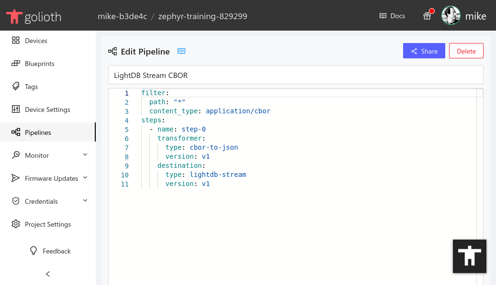
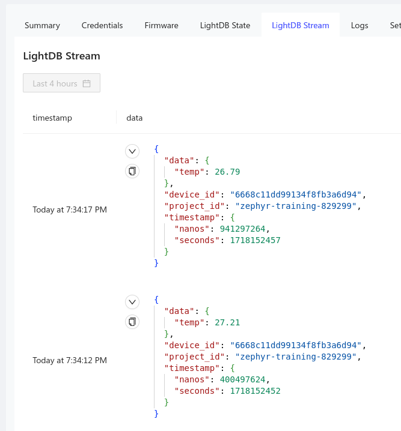

# LightDB Stream (Time-series)

:::info Golioth Pipelines

Golioth includes [a powerful tool called
**Pipelines**](https://docs.golioth.io/data-routing) for routing and optionally
transforming time-series data.

By default a new project will automatically route stream data to Golioth's own
time-series database called LightDB Stream. However, it is trivial for you to
update your pipeline to route data to a webhook, external DB services like
Influx and Mongo, your favorite cloud platform, to any combination of those, and
much more.

:::

The Golioth LightDB Stream is purpose built for collecting time-based data from
devices in the field. Every time data is received, the server records it along
with a timestamp. This is perfect for collecting sensor data as it creates a
historic record of all readings.

## View LightDB Stream in Device Summary

To view the LightDB Stream data for a device:

1. Click the `Devices` option in the left sidebar of [the Golioth
   Console](https://console.golioth.io)
2. Click on the device `Name` in the resulting list
3. Click on the `LightDB Stream` tab


### LightDB Stream page overview

On this page you can view the following information:

* `timestamp`: Time/Date at which the data was received (timestamps can also be
  set by adding them as [a member of the
  dataset](https://docs.golioth.io/application-services/lightdb-stream/sending-data/#timestamps))
* `data`: The data received, displayed in JSON format. This will be "folded" by
  default
* Time selector: historic data can be access by choosing time/date from the time
  selection box
* Refresh tools: both manual and automatic refresh buttons are available for
  updating the data being displayed


You may also view all LightDB Stream data for you fleet by clicking the
`Monitor` option in the left sidebar and selecting `LightDB Stream` from the
list that unfolds.

## Pipelines

View the data routing for your project by selecting `Pipelines` from the left
sidebar of the Golioth console. New projects will have one Pipeline called
`LightDB Stream CBOR`. Click on the name of the pipeline to open the edit
window.



Here you can see that the pipeline is targeting CBOR data on all paths (`*`). It
applies one step that transforms the data from CBOR to JSON, then routes it to
the Golioth LightDB stream.

### Exercise: add metadata

Let's make a small change to the pipeline to try it out. Let's tell Golioth to
add metadata to the stream. This is quite useful when routing to your own
database outside of Golioth.

1. Change the current `step-0` to `step-1`.
2. Add a new `step-0` that uses `cbor-to-json` as the `transformer` but don't
   add a `destination` to this step. (The next step will automatically be used
   as the destination.)
3. Update the `transformer` in `step-1` to use the `inject-metadata`
   transformer.
4. Save your pipeline.

Go back to the LightDB Stream view for your device and you will now see a
`device_id`, `project_id`, and `timestamp` alongside each newly received
temperature reading.

<details>
    <summary>Click to reveal solution</summary>

```yaml title="Customized LightDB Stream CBOR pipeline"
filter:
  path: "*"
  content_type: application/cbor
steps:
  - name: step-0
    transformer:
      type: cbor-to-json
      version: v1
  - name: step-1
    transformer:
      type: inject-metadata
      version: v1
    destination:
      type: lightdb-stream
      version: v1
```



</details>

## Additional Exercises

* Disable the pipeline by toggling the `Enable` slider. You should no longer see
  stream data arriving in LightDB Stream view.
* Add a second pipeline that doesn't inject metadata. Enable both pipelines at
  once and you should see two entries for data set on LightDB stream (one with
  metadata, one without)

:::tip Pipelines Documentation

All available transformers, destinations, and examples of how to use them are
available on [the Pipelines Documentation
page](https://docs.golioth.io/data-routing).

:::
