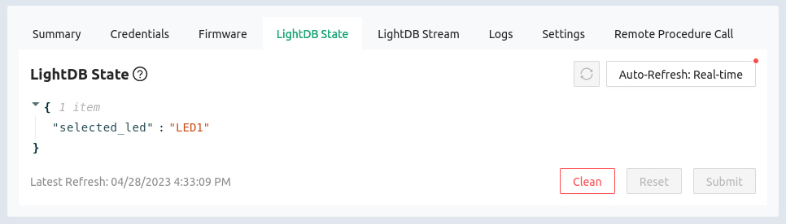

# LightDB State (Stateful)

The Golioth LightDB State provides an easy way for IoT devices to save, query,
and listen to data changes in the cloud. This bi-directional service has no
concept of time, but stores the most recently updated value for a given
endpoint. Devices registered to observe values will be notified every time there
is new state data available.

To view the LightDB State data for a device:

1. Click the `Devices` option in the left sidebar of [the Golioth
   Console](https://console.golioth.io)
2. Click on the device `Name` in the resulting list
3. Click on the `LightDB State` tab

:::info Press some buttons
Real-time update will be selected automatically for this view. Try pressing the
buttons on the development kit and observe how this value is updated.
:::

## LightDB State page overview

On this page you can view the following information:

* Key/Value pairs: all stateful data for this device, displayed in JSON format,
  will be shown on this page
* Refresh tools: both manual and automatic refresh buttons are available for
  updating the data being displayed
* Key/Value editing: hovering over the JSON data will reveal icons for
  editing/adding/deleting state data
* `Submit` button: manual changes are not committed until this button is clicked
* `Reset` button: abandon manual changes not yet submitted
* `Clean` button: remove all stateful data from this virtual device

:::tip LightDB State changes apply to one device at a time
LightDB State data is device-specific, changes here will not affect any other
devices in the fleet. To make changes fleet-wide (or to groups of devices), use
the Settings Service.

Data may be changed from both the device side and the cloud side.
:::

## Additional Exercises

* Turn off `Auto-refresh`, then click the `Clean` button. Press a button on the
  board and observe the state data being recreated.
