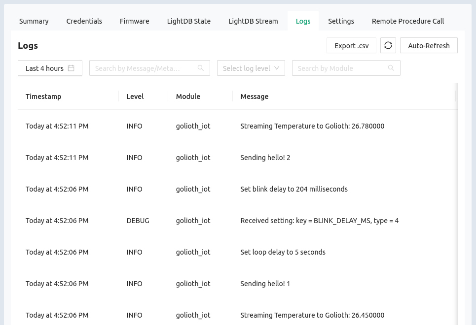
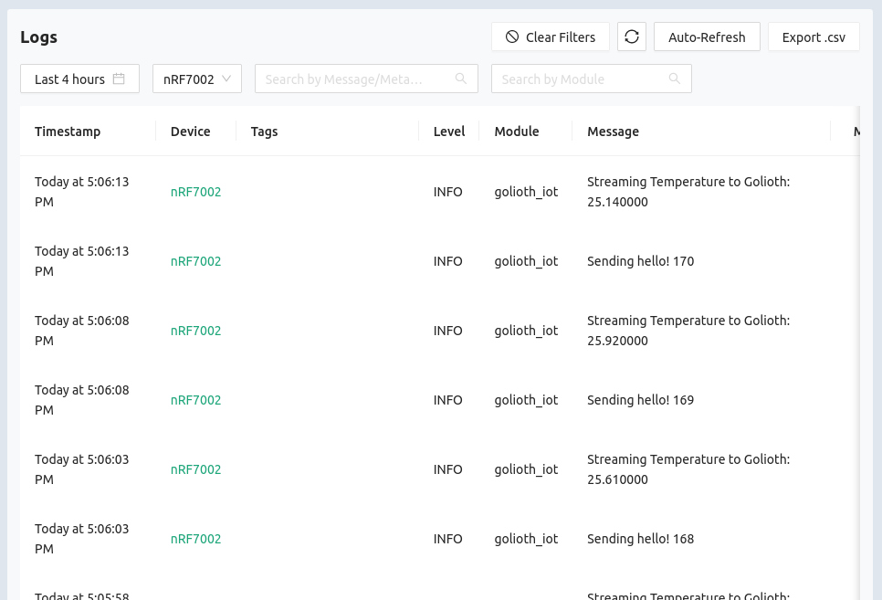

# Remote Logging

The Golioth Remote Logging service allows you to access logging message from
devices in your fleet.

To view the Remote Logging data for a device:

1. Click the `Devices` option in the left sidebar of [the Golioth
   Console](https://console.golioth.io)
2. Click on the device `Name` in the resulting list
3. Click on the `Logs` tab

## LightDB State page overview

On this page you can view the following information:

* `Timestamp`: Time/Date at which the log was received
* `Level`: standardized log level for this message (Error, Warning, Info, Debug)
* `Module`: the C file (or one of a group of C files) that generated the log message
* `Message`: the payload your code generated for this log
* Time selector: historic logs can be access by choosing time/date from the time
  selection box
* Log level selector: filter messages shown by log level
* Search tools: search by message/metadata or module
* Refresh tools: both manual and automatic refresh buttons are available for
  updating the logs being displayed

:::tip Controlling Log Traffic
Log messages are most useful when prototyping and troubleshooting. Customers
often choose to only send Error and Warning level messages by default, but
include a Remote Procedure Call (RPC) in their firmware to enable Debug level
messages when needed.
:::

## Viewing log messages from your fleet

The approach above shows log messages from a single device, but it is also
possible to view logs from your entire fleet:

1. Click the `Monitor` option in the left sidebar and select `LightDB Stream`
   from the list that unfolds

Notice that in this view the `Device` column has been added, and there is now
an additional selector box to filter by device(s). It is also possible to export
Logs as `.csv` files.

## Additional Exercises

* Use the search box to find log messages issued by the Golioth SDK. These will
  be issued from the `golioth_system` module.
