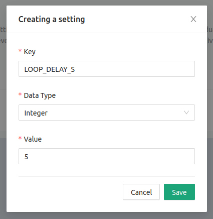
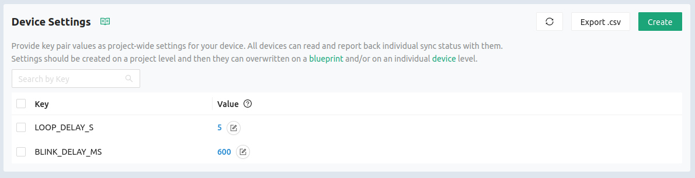
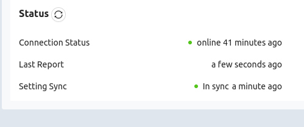
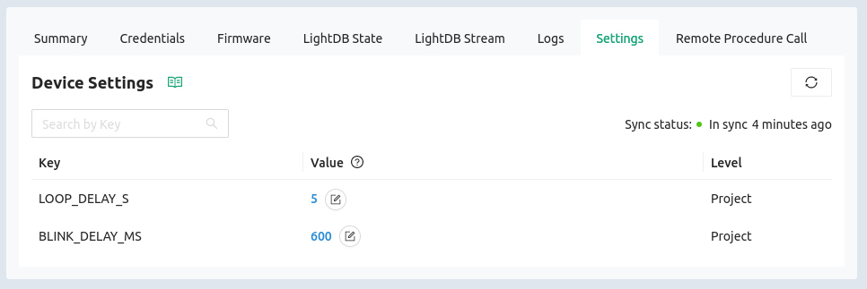

# Device Settings

The Golioth Settings Service enables you to adjust device settings for your
entire fleet with a single click. The full-featured service includes the ability
to make changes to groups of devices and of course single devices. It also
collects synchronization information so you can know which devices are
up-to-date with the latest settings changes.

## Configure Settings for this fleet

The sample application running on your development kit expects two device
settings to be present on the cloud. Let's set those up now.

1. Click the `Device Settings` option in the left sidebar of [the Golioth
   Console](https://console.golioth.io)
2. Click on the `Create` button
3. Enter the following values and click `Save`:

    ```
    LOOP_DELAY_S
    Integer
    5
    ```

    

4. Now add a second setting with the following values:

    ```
    BLINK_DELAY_MS
    Integer
    600
    ```

    

## Settings synchronization

1. Click the `Device Settings` option in the left sidebar
2. Notice that the settings are now in sync on the status view

    

3. Click on the `Settings` tab. Notice the configured value and "Level" from
   which that value is being drawn (Valid levels include `Project`, `Blueprint`,
   and `Device`)

    

## Additional Exercises

* Change the settings at the device level and notice the frequency of
  temperature readings and blink rate change on the device itself
* View the device logs to see Debug messages acknowledging the new values
