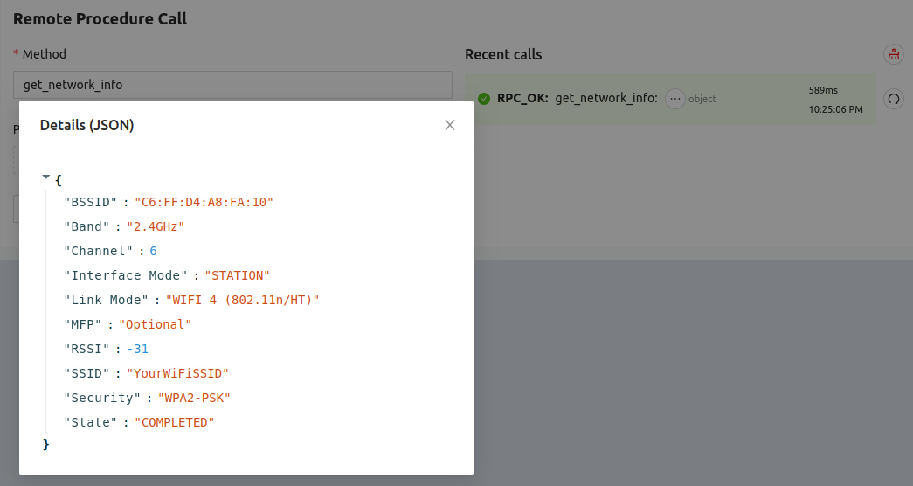
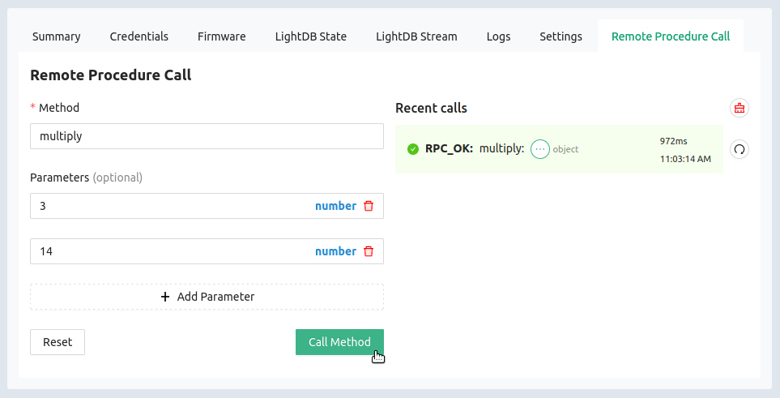
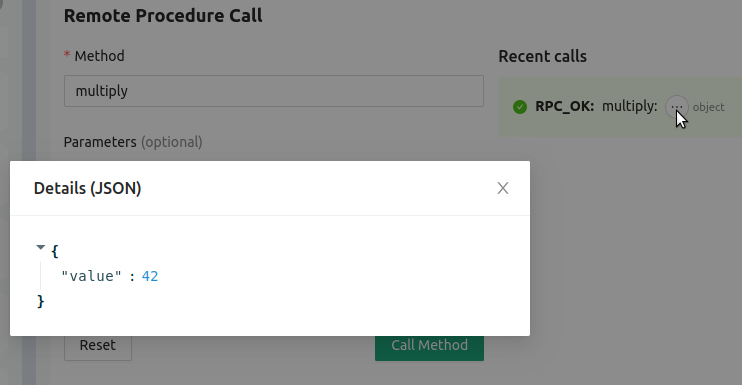

# Remote Procedure Call (RPC)

With Golioth's Remote Procedure Call (RPC) you can execute a function on a
device in the field, including input parameters and return data. Our customers
find this useful for a wide range of uses, including remote reboot, adjusting
device-specific calibration, retrieving a site survey of WiFi access points,
returning network quality data, and adjusting logging levels remotely.

:::info

RPC is only available for functions explicitly added for this purpose in your
firmware.

:::

## Retrieve Network Information

The sample application includes an RPC to return network information. Let's run
that now.

1. In the [Golioth Web Console](https://console.golioth.io), select `Devices`
   and choose your device from the resulting list
2. Click on the `Remote Procedure Call` tab
3. Type `get_network_info` in the `Method` box
4. Click `Call Method`
5. The RPC status will appear in the `Recent Calls` list. Click the three-dot
   menu button to view the returned data.

    

## Multiply Two Numbers

Call a second RPC to multiply two numbers together. (While IoT calculators may
not seem like *the future*, this is an easy way to illustrate parameter input.)

1. Type `multiply` in the `Method` box
2. Click `+ Add Parameter`
3. Add a number to the `Parameters` box that has appeared
4. Repeat steps 2 and 3 for a second number

    

5. Click `Call Method` and view the data that is returned

    

## Additional Exercises

* Submit the `multiply` RPC without any parameters
* Submit the `non-existent-rpc` RPC
* Turn off your IoT device and submit the `multiply` RPC

:::tip Benefits of Remote Procedure Calls

The Golioth RPC implementation includes some interesting benefits:

* Parameters that didn't exist at compile time may be supplied (eg: WiFi
  credentials for an additional network)
* Receive real-time feedback on whether the device executed the command

:::
