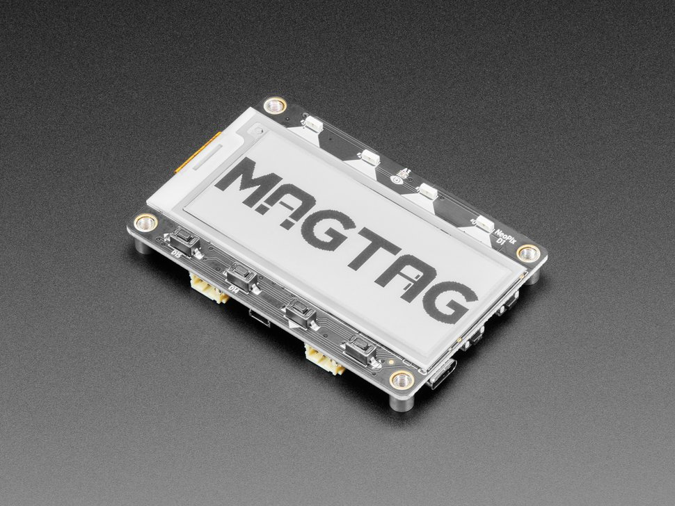

# Training Requirements

## Hardware requirements

This is a hardware centric training, so you will need to pre-purchase some hardware to properly follow along. 

### Development Board

This training is based around the [Adafruit MagTag board](https://www.adafruit.com/product/4800). It has the following features we think make it a good fit for this training:

* ESP32-S2
* USB C cable programming
* $35 retail (location dependent)
* Inputs: 
  * Accelerometer
  * Light Sensor
  * 4 user buttons
  * Stemma / Qwiic header
* Outputs: 
  * 4 NeoPixel side launch LEDs (multicolor programmables)
  * Speaker
  * eInk Display

  

### USB C Cable

It will require a USB C cable, not included with the board. If your team doesn't happen to have one in their setup, they can purchase [a USB C Cable directly from Adafruit](https://www.adafruit.com/product/4473). Any USB C cable with D+/D- (no charge-only cables!) will work for this board.

### Optional add-on hardware 

This hardware will work great on its own but will be enhanced by the following:

* [USB to Serial cable](https://www.adafruit.com/product/954)
  * There are serial pins on the MagTag board that are the easiest debug output, but we also are working on getting USB debug output to work
* [Lithium Battery](https://www.adafruit.com/product/4237)
  * Will allow the device to function without any cables (this is not part of the demo).
* [Magnetic standoffs](https://www.adafruit.com/product/4631)
  * This allows users to attach the device to a fridge after the training (as is the point of a MagTag)
* [DPS310 Sensor Board](https://www.adafruit.com/product/4494)
  * This is an optional board to be used in the [sensor section](/docs/category/sensor-exercises) of the training.

### Computer

You will also need a computer for running all of the code. In this training, we will be using Kasm as a virtual instance for compiling firmware. Kasm works best with Google Chrome as a browser, but might work on other browsers as well. 

When you're ready to install the toolchain locally, we support Windows / Mac / Linux, but the "happiest path" will be using a friendly Linux distro such as Ubuntu.

## Software requirements

### Toolchain

After the initial portion of the training, you will get directions to install the Zephyr toolchain on your local machine. As stated above, this will work best on Ubuntu, but we will try to accommodate all systems.

### Firmware programming

Programming the MagTag requires you to install ESPtool on your local machine. 