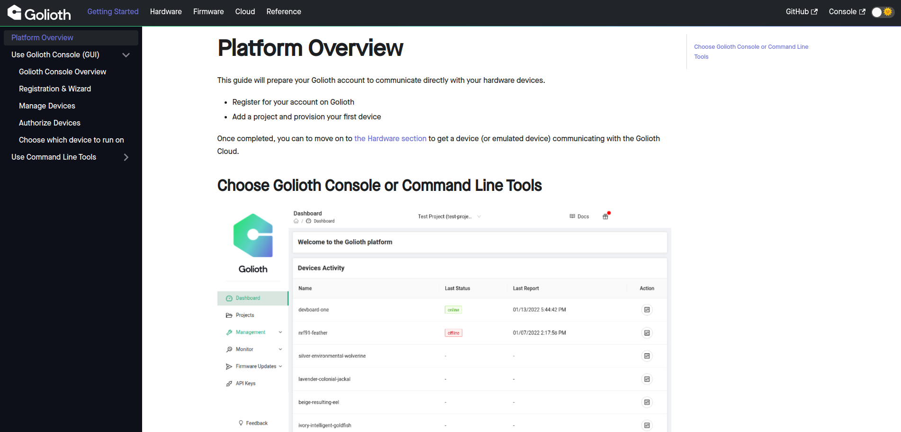
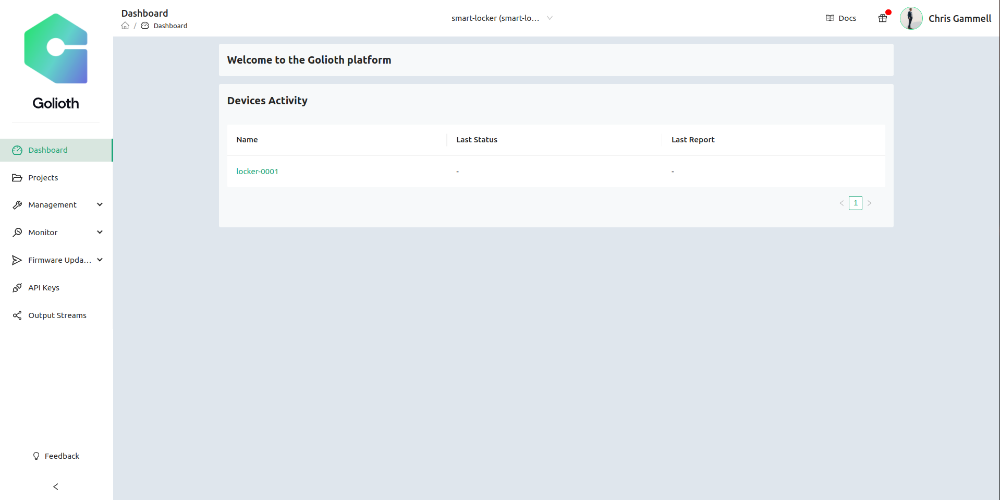

# Console Signup and Exploration

This section includes references to [the Golioth docs site](https://docs.golioth.io/). We are linking you there so you have the most up-to-date directions on getting started with the Golioth Cloud. Once you have completed a section, you will come back to this page for further instructions.

## Overview

* **Summary:** Sign up for the Console to get your Golioth account. Go through the wizard steps outlined on the Docs page and on the Console itself in order to provision your first device. The credentials created here allow your device (MagTag for these examples) to authenticate on the Golioth Cloud.
* **Desired Outcome:** By the end of this section you should understand how to add a single device to the console and access the credentials for use on your device.
* **Approximate time:** 5 minutes

## Signup and Provision your first device

### Where you should start

Begin by following the [Golioth Getting Started Docs](https://docs.golioth.io/getting-started) which will walk you through registering an account and creating a name and credentials for your first device.

|  |
|:--:|
| A screenshot from the [Golioth Docs](https://docs.golioth.io/getting-started/) site. |

### Where you should finish

Once you have a single device provisioned on [the Golioth Console](https://console.golioth.io) this part of the guide is complete.

|  |
|:--:|
| A screenshot from the [Golioth Console](https://console.golioth.io). |

### Additional exercise

Create a "fleet" of 5 devices with unique credentials for each.

## Exploring features on the sidebar

* **Summary:** See how the menus are set up and what features exist on the Golioth console.
* **Desired Outcome:** Understand how to navigate to the various locations of the Golioth console.
* **Approximate time:** 5 minutes (includes Q&A)
* **Where you should start:** Start from the [Golioth Console](https://console.golioth.io) and try out the various paths on the sidebar.
* **Additional exercise:** Attempt to add a "tag" and a "blueprint" to your Console.
