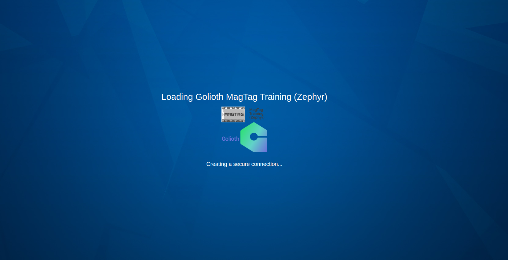

# Developer Training Overview

## What is this training all about?

This is a place where you're going to learn about Golioth features by programming real hardware using the Golioth Zephyr SDK.

Plan to spend about 120 minutes to get through the majority of these demos and associated content. There are optional exercises for basic I/O and sensors when you have more time available. This is mainly meant as a guided training (either over video conference or in-person), but there will eventually be links to watch some of the presentation content asynchronously. 

Instructors are here to offer a guiding hand and to answer questions live. In the event you're taking this training asynchronously, utilize [our forum](https://forum.golioth.io) and [our Discord channel](https://golioth.io/discord) for wherever you get stuck.

## How can you use this information in your work?

Developers who successfully complete this training should be able to program and deploy a simple IoT system to the field in their application. Future training modules around more in-depth Zephyr RTOS utilization will better prepare them for creating even more custom embedded applications.

## What is Zephyr RTOS? Why are we learning it?

[Zephyr](https://zephyrproject.org/) is an open source Real Time Operating System (RTOS) with wide support among industry leading chip vendors. At Golioth, we build [the Golioth Zephyr SDK](https://github.com/golioth/golioth-zephyr-sdk) on top of the Zephyr SDK in order to take advantage of the wide hardware support. What's amazing about the project is that you can switch between different hardware platforms with a command line switch and a file that tells the application which pins are assigned to which function.

Golioth lives at the top of the Zephyr stack, meaning that we take advantage of all of the networking capabilities built into Zephyr. When Golioth needs to talk to the internet, it simply communicates with the networking layer's APIs. From this perspective, we can switch between Cellular, WiFi, Ethernet, and Thread implementations easily. The main thing for you to know, as the Developer, is that you have maximum flexibility when trying out or deploying new systems.

## What is Kasm?

Kasm is a virtual desktop workspace in a browser. For this training we have preconfigured a Kasm instance with Golioth tools and the Zephyr toolchain so that you can build Zephyr projects without first installing the tools on your local machine.

We believe this is the fastest way to get new developers building Zephyr projects and interacting with Golioth. You should be able to build a Zephyr + Golioth project almost immediate after entering the development environment.

Because this training uses a virtual build environment, to continue working with Zephyr after this training is over you will need to [install the Zephyr toolchain on your local machine](./magtag-training/after-training/local-toolchain-install). Golioth staff is available to help make this process smoother. Documentation for installing the toolchain is included in [the Golioth Getting Started Guides](https://docs.golioth.io).

## Command Line

Golioth training expects that commands will be run from the command line. In Kasm, we will be using VScode as a code editor, running these commands from the terminal inside of VScode.
