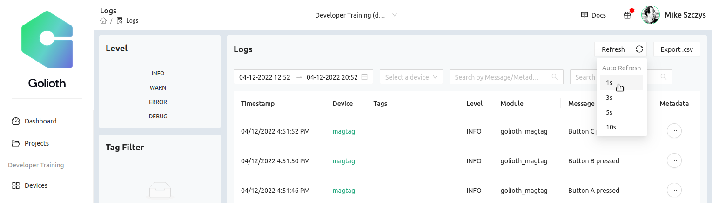
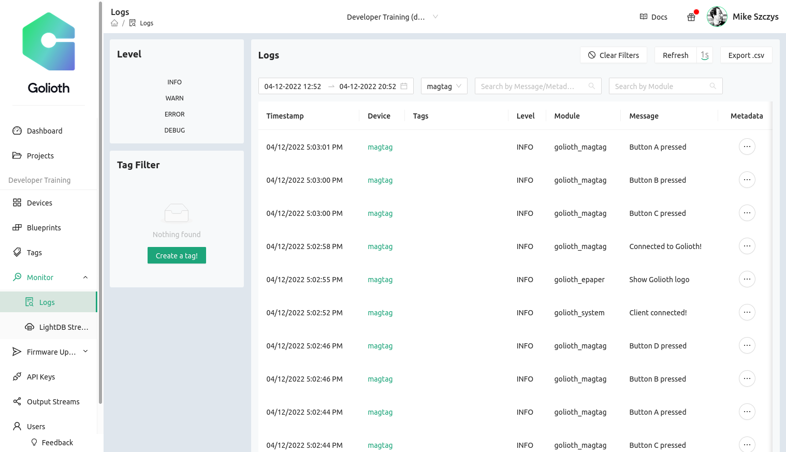
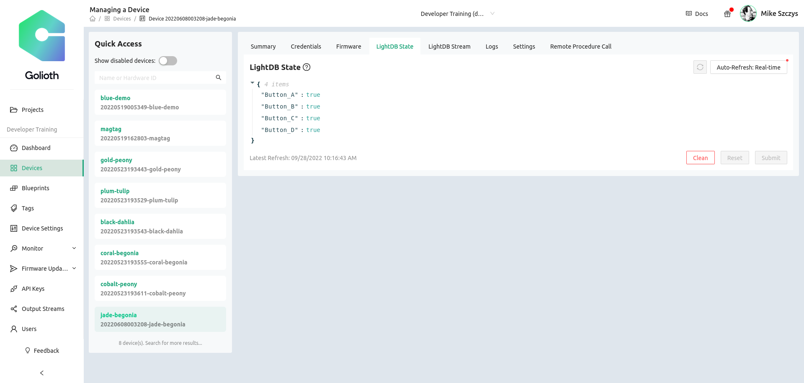
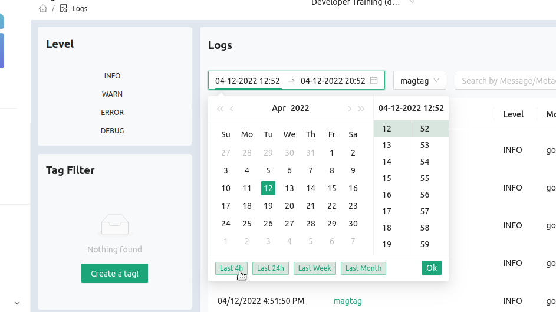
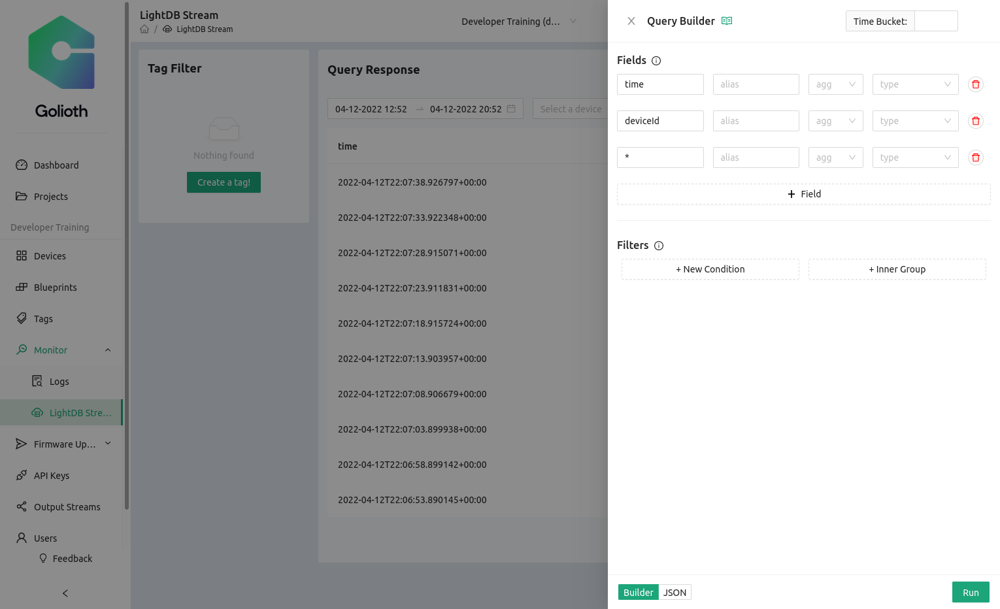
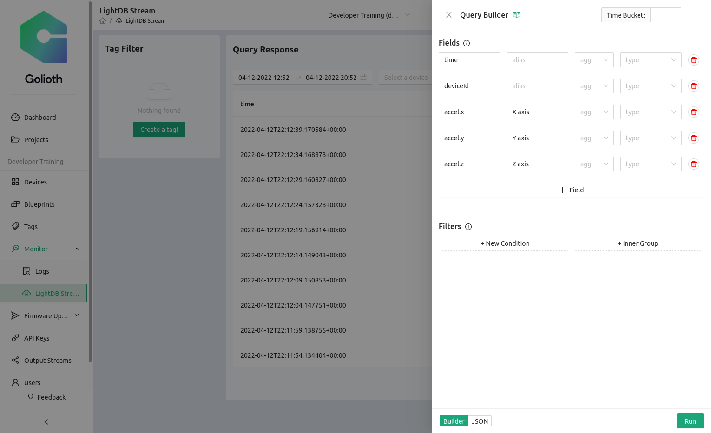
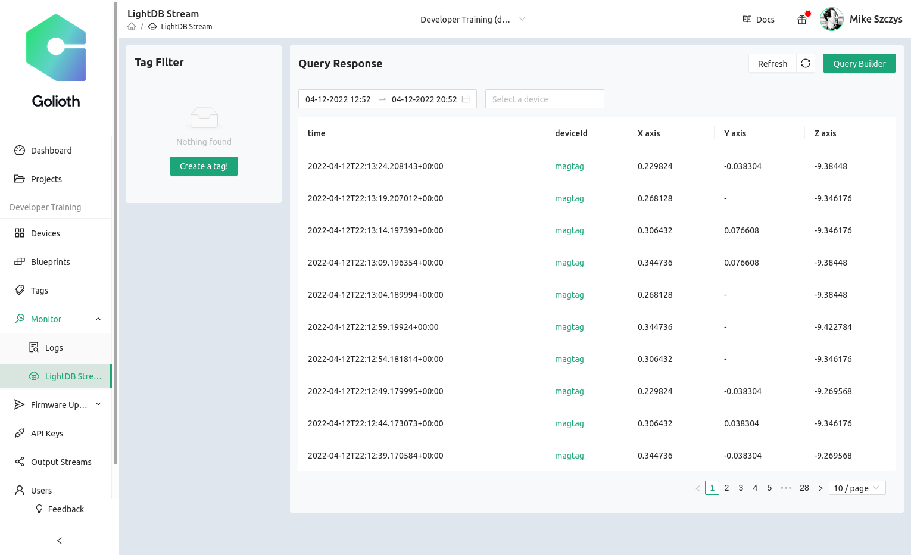

# Exploring Golioth using the MagTag

## Learning Objectives
Now that we have a piece of hardware/firmware that can connect to Golioth, we are going to use it to explore the differences between features on the [Golioth Console](https://console.golioth.io). 

### Desired outcome(s)
* Understand different ways of sending a chunk of data back to Golioth.
* Understand how to simplify streaming data views using the Query builder.

### Time Estimate

* This section will take 5-10 minutes

## LightDB State vs Stream: A brief overview

"LightDB" is a generic term we use for the database capabilities on the Golioth cloud. The two functionalities and use cases are somewhat different:

* **State**
  * A database that tracks the current status of particular variables. 
  * No time-stamping
  * Often used for "command and control"
  * If the status for "LED0" can be true or false, we can set up the local device to change it or for the cloud to change it
  * Variables can be changed via the REST API
* **Stream**
  * A time-series database for tracking variables that are expected to change
  * Almost always uni-directional going from the device up to the cloud
  * Often these are sensor readings 
  * Works well with charting capabilities on external platforms

## One button, 3 outputs

The light and sound aren't the only things happening when you press a button on the MagTag. There are three things we're looking at when you press a button:

* Logging message
* LightDB State Change
* LightDB Stream Event

### 1. Logging Message

1. Check the logging messages on your device page. Is it connecting?
2. Refresh the log display by clicking the circular arrow icon in the upper
   right
3. Auto-Refresh can also be used. Selecting "Real-time" will hide all existing
   logs and display new ones as soon as they arrive

    

3. Continue to press buttons on the device to see new logging messages come through.

#### Expected outcome

Click to reveal expected outcome for Logging

* On successful boot, you should see a message like `INFO   golioth_system   Client connected!`
* Every time you press the button on the MagTag, you should see INFO messages like "Button A pressed"

    

### 2. LightDB State

1. Navigate to your device page
2. Click on the "LightDB State" tab along the top
    * Note: the "Auto-Refresh: Real-time" option is selected by default
3. Press some buttons and observe the behavior

#### Expected outcome

Click to reveal expected outcome for LightDB State

* Variables will be set to 'true' or 'false' based on the on/off state of the LEDs
* When the button is pressed, the variable should change to match the new LED state

    

### 3. LightDB Stream

1. Navigate to the LightDB stream page
    * In the right sidebar, choose Monitor&rarr;LightDB Stream
    * Notice the 'Select a device' box can be used to filter data by device
2. Set the time frame to be the last 4 hours

    

3. Look at the output, including the format
    * Notice how the data is formatted
    * Click to expand each piece of data
    * Why do you think it's set up like that?
4. Set up Query Builder
    * The data you saw in step 2 has the default query builder settings

        

    * We want to have a better way to visualize the time series data that is coming through

        

    * Change the fields of the Query Builder to match the image shown above.
      Click 'Run' to execute the new changes. How does the data look different
      now?

#### Expected outcome

Click to reveal expected outcome for LightDB Stream

* After setting up the Query Builder, you should see data in columns, tagged for each axis of the accelerometer data

    

## Discussion around the difference between these 3 data types

As a discussion among Developers, what are some of the differences you see in how this data is being processed. How might it be useful for your projects?
