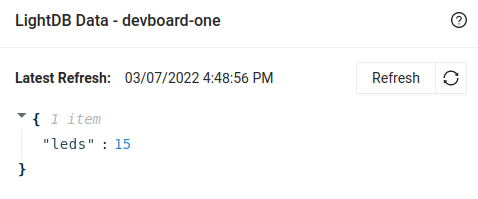
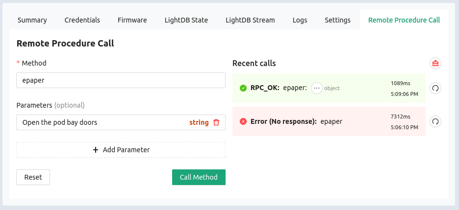

import Tabs from '@theme/Tabs';
import TabItem from '@theme/TabItem';
import CreateCredentials from '/docs/\_partials/create-credentials.md';
import HowToDownload from '/docs/\_partials/download-from-kasm.md'
import HowToFlash from '/docs/\_partials/flash-the-example-kasm.md'

# Golioth Observe Example

The Observe example configures the MagTag to watch a LightDB state endpoint on
the Golioth servers for changes. When data is updated on the cloud, the device
recognizes this quickly and a callback is executed. For this example, a LightDB
State endpoint called `leds` will monitor a value from 0 to 15 to control the
on/off state of the LEDs on the MagTag.

## Learning Objectives

We are learning to use the "state" version of Golioth's database services
(LightDB state), because it represents another way to send data down to devices
in the field. This is part of a broader "command and control" (C&C) need for IoT
devices. Golioth services that fall under the heading of C&C are:

* LightDB State - part of this Observe Example
* Remote Procedure Call (RPC)- part of this Observe Example
* Settings Service- part of [the Stream
  Example](/docs/magtag-training/zephyr-intro/zephyr-examples/golioth-stream)

### Desired outcome(s)

* Understand how to create LightDB State variables
* Understand what an "endpoint" is
* Understand how to use Callbacks in Zephyr

### Time Estimate

* 15 minutes

## Workflow

### Build in the Kasm container

1. In the Kasm container, go to your local copy of [the magtag-demo
   repository](https://github.com/golioth/magtag-demo).

    ```bash
    cd ~/Desktop/magtag-training/app
    ```
2. Create a file for WiFi and Golioth credentials

  <CreateCredentials/>

3. Build the example, including the credentials file you just created

    ```bash
    west build -b esp32s2_saola observe -p
    ```

4. Download the binary

    * Run `west kasm download` to package the compiled code and make it
      available for download
    * Use the Download option in Kasm's left sidebar to download
      `merged_<appfolder>_<hhmmss>.bin` to your local machine.

  <HowToDownload/>

### Update MagTag firmware from your local machine

<HowToFlash/>

## Setup the LightDB State endpoint

1. Go to the Golioth Console and choose Management&rarr;Devices from the sidebar
   menu
2. Click on the name of your device to enter the device view, then click the
   LightDB State icon which opens up LightDB State tab
3. Hover your mouse over the empty JSON object and click the green plus sign
   that is revealed

    * If the JSON object is not empty (e.g. data from previous examples are
      shown), use the "Clean" button to delete all items

4. Type in `leds` as the key name (no quotes)
5. Hover over `NULL` and click the green pencil icon to edit the value, replace
   `NULL` with `15` and click the lower green check mark to save it as an
   integer value. If successful you will not see quotation marks around this
   value.

    * Only integers between 0 and 15 (inclusive) are valid for this example

6. **Important**: Click the "Submit" button at the bottom right of this dialog
   to save your changes.

  

## Expected Results

The Observe example will begin running after pressing the Reset button. You will
see the center LEDs turn blue when the board is trying to connect to Golioth.
When successful, all four LEDs will turn green, and a connected message will be
shown on the ePaper display.

The LEDs will remain green until a change to the `leds` endpoint is detected,
including the first time it subscribes to observe this data at power up. The
color of LEDs 0..3 will be set to red/green/blue/red. The on/off state of each
LED is controlled by the value of the `leds` endpoint. This value is a binary
mask, so changing that value to 0 will switch all LEDs off, changing it to 8
will turn on LED3 and turn all others off. Each time a new value is observed, it
will be displayed on the ePaper screen. Try changing this number and observing
the behavior, noting that values outside of the 0..15 range will be ignored.

### Remote Procedure Call: Write to ePaper display

Remote Precedure Call (RPC) is a Golioth feature that allows you to remotely
execute a function, including sending parameters to the device and receiving
data back from it.

We've implemented a simple RPC that reads a string as a parameter and writes it
to the ePaper display.

Navigate to your device on [the Golioth Console](https://console.golioth.io/)

1. Select Remote Procedure Call from the table along the top of the device view
2. Input "epaper" as the Method name
3. Click on Add Parameter and type your message
4. Click the Call Method button to execute the RPC



In the above example, I executed the RPC once when the MagTag was powered off,
and again when it was powered on. What happens if you try to send a number
instead of a string?

### Continued Learning

Of course the device can also write to the LightDB State endpoint. One example
of this is when the endpoint doesn't exist, the MagTag will set the `leds`
endpoint to 15 as the default. Look in the `src/main.c` and find the following
code:

```c
snprintk(str, 6, "%d", LEDS_DEFAULT_MASK);

/* Use async set because you cannot call a synchronous set from inside
 * of a callback */
err = golioth_lightdb_set_cb(client,
       LEDS_ENDPOINT,
       GOLIOTH_CONTENT_FORMAT_APP_JSON,
       str, strlen(str),
       lightdb_set_handler, NULL);
```

With this code we use `snprintk()` to convert an integer value
(`LEDS_DEFAULT_MASK`) to a string so that we can send it over the CoAP protocol
as text. The  `LEDS_ENDPOINT` is defined as `leds`, the string that will be used
as the JSON key for this value. The `golioth_lightdb_set_cb()` function is an
asynchronous call to the Golioth SDK which registers a callback
function (`lightdb_set_handler()`) that will run once a response is received
from the Golioth servers. The callback can be used to log errors or for more
complex work.

Compare this to the code that was [used to write accelerometer
data](https://github.com/golioth/magtag-demo/blob/6f59c1b83c06fbf156a297555c8464b838c7bb12/stream/src/main.c#L88-L110)
to LightDB Stream in the Stream example and you will see a more complex payload
string built using `snprintk()`, and a different API call. The
`golioth_stream_push_cb()` function is formatted in a similar way but is used to
send time-series data to Golioth where the example above sends stateful data.

