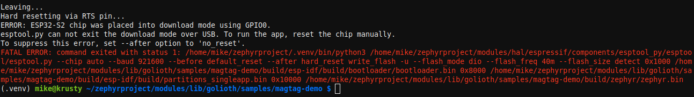

import Tabs from '@theme/Tabs';
import TabItem from '@theme/TabItem';

# Zephyr Tips and Gotchas

Use this page as a reference for reminders and common gotchas.

## The MagTag has a power switch

The MagTag has a toggle switch for power. When in the `on` position, a green LED will be illuminated on the underside of the board.

## You must press the reset button after flashing firmware

Currently, it is not possible for the `west flash` command to automatically reset the MagTag after successfully programming the firmware. 

It can be confusing when you expect the program to begin running right away and it does not. Because of this, the default behavior is to display an error message to the user.



This error is expected and serves as a helpful reminder that you need to hit the reset button after every flash.

## Errors with `west build`: Zephyr tree and virtual environment

There are a few common gotchas to calling `west build`.

* You need to be in a subdirectory of the Zephyr tree
* If you followed our recommendations during install, you need to enable your Python Virtual Environment

<Tabs
groupId="os"
defaultValue="linux"
values={[
{label: 'Linux/MacOS', value: 'linux'},
{label: 'Windows', value: 'windows'},
]}>

<TabItem value="linux">

1. Navigate to the magtag-demo directory which is inside the Zephyr tree

    ```bash
    cd ~/golioth-zephyr-workspace/modules/lib/golioth/samples/magtag-demo
    ```

2. Activate your virtual environment

    ```bash
    source ~/golioth-zephyr-workspace/.venv/bin/activate
    ```

</TabItem>
<TabItem value="windows">

1. Navigate to the magtag-demo directory which is inside the Zephyr tree

    ```bash
    cd C:\golioth-zephyr-workspace\modules\lib\golioth\samples\magtag-demo
    ```

2. Activate your virtual environment

    ```bash
    C:\golioth-zephyr-workspace\.venv\Scripts\activate.bat
    ```

</TabItem>
</Tabs>

## Errors when flashing the MagTag

* You may encounter `OSError: [Errno 71] Protocol error` when flashing. Most often this is caused by a timeout and can usually be fixed by starting the `west flash` process very quickly (one second or less) after putting the device into DFU bootloader mode.
* If your flash command is trying to program the wrong device (e.g. `/dev/ttyUSB0` instad of `/dev/ttyACM0`) you can specify the device endpoint with this command: `west flash --esp-device /dev/ttyACM0`
