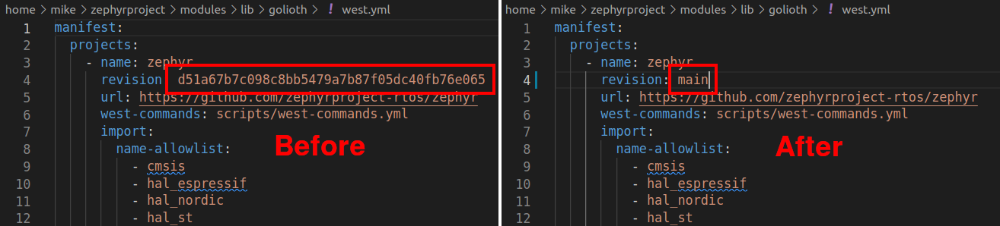

# Zephyr Toolchain Installation

This section includes references to [the Golioth docs site](https://docs.golioth.io/). We are linking you there so you have the most up-to-date directions to install the Zephyr toolchain and ESP32 compiler. Once you have completed that section, you will come back to this page for further instructions.

## Overview

* **Summary:**
  1. Follow Golioth Docs to install `west` (the Zephyr meta tool), the Golioth Zephyr SDK, and the Espressif (ESP32) toolchain.
  2. Update the Zephyr version to ensure we have support fo the ESP32s2
  3. Clone the code repository that will be used for this training
* **Desired Outcome:** By the end of this section you will have the software tools you need to build Zephyr projects and flash binaries to the MagTag board.
* **Approximate time:** 15-20 minutes

## Follow Golioth Docs to install the toolchain

### Where you should start

Begin by following the [*Set up Zephyr for ESP32* docs page](https://docs.golioth.io/hardware/esp32/quickstart/set-up-zephyr) which will walk you through installing the Zephyr toolchain.

| [](https://docs.golioth.io/hardware/esp32/quickstart/set-up-zephyr) |
|:--:|
| A screenshot from the [Golioth Docs](https://docs.golioth.io/hardware/esp32/quickstart/set-up-zephyr) site. |

### Where you should finish

We're using just one page from the Golioth Docs for this set. When you reach the bottom of that page you will be able to compile ESP32 sample code.

| [](https://docs.golioth.io/hardware/esp32/quickstart/set-up-zephyr) |
|:--:|
| A screenshot from the bottom of the [Set up Zephyr for ESP32 Docs](https://docs.golioth.io/hardware/esp32/quickstart/set-up-zephyr) page. |

## Configure the toolchain for the MagTag

The MagTag uses the ESP32s2, a newer variant of the chip. We need to make sure we're using a very recent version of the Zephyr toolchain to include the features for this chip. We do so by changing the `revision` value in the west manifest file to `main`.

|  |
|:--:|
| Changing the Zephyr revision to `main` in the ~/zephyrproject/modules/lib/golioth/west.yml file. |

1. Open the `~/zephyrproject/modules/lib/golioth/west.yml` file in your preferred editor
2. Change the Zephyr revision line to `main`. This should be line 4 in your file and is shown in the screenshots above
3. To incorporate this change, run `west update` from the `~/zephyrproject/modules/lib/golioth/` directory.

## Clone the magtag-demo repository

For the rest of this tutorial we will use the [magtag-demo](https://github.com/golioth/magtag-demo) code repository. Let's clone a local copy of it into the Golioth samples folder.

```bash
cd ~/zephyrproject/modules/lib/golioth/samples
git clone git@github.com:golioth/magtag-demo.git
cd magtag-demo
```

## Conclusion

That was a lot of steps, thank you for your patience! With the toolchain now installed, we are ready to run some example code on the hardware.
