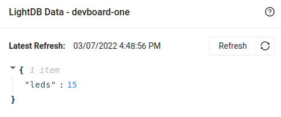

import Tabs from '@theme/Tabs';
import TabItem from '@theme/TabItem';

# Golioth Observe Example

The Observe example configures the MagTag to watch a LightDB state endpoint on the Golioth servers for changes. When data is updated on the could, the device recognizes this quickly and a callback is executed. For this example, a LightDB State endpoint called `leds` will monitor a value from 0 to 15 to control the on/off state of the LEDs on the MagTag.

## Program the MagTag

1. Go to your local copy of [the magtag-demo repository](https://github.com/golioth/magtag-demo) and checkout the `observe` example:

    ```bash
    cd ~/magtag-training/app
    git checkout observe
    ```

2. Create a file for WiFi and Golioth credentials

    * Make a copy of `credentials.conf_example` and name it `credentials.conf`

        ```
        cp credentials.conf_example credentials.conf
        ```

    * Edit this new file to include your WiFi credentials and the PSK-ID/PSK from the device page on your Golioth console
    * This file will be ignored by git, and may be reused in other examples.

3. Build the example, including the credentials file you just created

    ```bash
    west build -b esp32s2_saola . -D OVERLAY_CONFIG=credentials.conf -p
    ```

import HowToFlash from '/docs/partials/flash-the-example-kasm.md'

<HowToFlash/>

## Setup the LightDB State endpoint

1. Go to the Golioth Console and choose Management&rarr;Devices from the sidebar menu
2. Click on the name of your device to enter the device view, then click the LightDB State icon to open up the right sidebar dialog
3. Hover your mouse over the empty JSON object and click the green plus sign that is revealed
    * If the JSON object is not empty (e.g. data from previous examples are shown), use the red X icon to delete each item before adding a new entry
4. Type in `leds` as the key name (no quotes)
5. Hover over `NULL` and click the green pencil icon to edit the value, replace `NULL` with `15` and click the lower green check mark to save it as an integer value. If successful you will not see quotation marks around this value.
    * Only integers between 0 and 15 (inclusive) are valid for this example
6. **Important**: Click the "Submit" button at the bottom right of this dialog to save your changes.

    

## Expected Results

The Observe example will begin running after pressing the Reset button. You will see the center LEDs turn blue when the board is trying to connect to Golioth. When successful, all four LEDs will turn green, and a connected message will be shown on the ePaper display.

The LEDs will remain green until a change to the `leds` endpoint is detected, including the first time it subscribes to observe this data at power up. The color of LEDs 0..3 will be set to red/green/blue/red. The on/off state of each LED is controlled by the value of the `leds` endpoint. This value is a binary mask, so changing that value to 0 will switch all LEDs off, changing it to 8 will turn on LED3 and turn all others off. Each time a new value is observed, it will be displayed on the ePaper screen. Try changing this number and observing the behavior, noting that values outside of the 0..15 range will be ignored.

## Continued Learning

Of course the device can also write to the LightDB State endpoint. One example of this is to have the MagTag set the `leds` endpoint to 15 at power up. Edit the `src/main.c` file and insert this code block just before the `while(true)` line of this example:

```c
uint8_t endpoint_value[3];
snprintk(endpoint_value, 3, "%d", 15);
err = golioth_lightdb_set(
        client,
        GOLIOTH_LIGHTDB_PATH("leds"),
        COAP_CONTENT_FORMAT_TEXT_PLAIN,
        endpoint_value,
        strlen(endpoint_value));
LOG_INF("Set endpoint return code: %d", err);
```

With this code we are converting an integer value (15) to a string so that we can send it over the CoAP protocol as text. The `leds` endpoint is selected using the `GOLIOTH_LIGHTDB_PATH("leds")` helper macro, and it's all taken care of by the `golioth_lightdb_set()` function from the Golioth SDK. If everything went according to plan, you should see a log message in the Golioth Console that shows an endpoint return code of 0, which means no errors.

Compare this to the code that was [used to write accelerometer data](https://github.com/golioth/magtag-demo/blob/a168bcea548edcdf8e5102ded2d295dea2aa2b94/src/main.c#L25-L50) to LightDB Stream in the Stream example and you will see a more complex payload string built using `snprintk()`, and a different endpoint helper macro: `GOLIOTH_LIGHTDB_STREAM_PATH()`.

The endpoints that send data to either LightDB State or LightDB stream differ by just one letter. While we use macros in the above example, those simply add a prefix of `.d/` for State or `.s/` for Stream.

```c
/* These two lines evaluate to the same string */
uint8_t* state_endpoint_1 = GOLIOTH_LIGHTDB_PATH("leds");
uint8_t* state_endpoint_2 = ".d/leds";

/* These two lines also evaluate to the same string */
uint8_t* stream_endpoint_1 = GOLIOTH_LIGHTDB_STREAM_PATH("accel");
uint8_t* stream_endpoint_2 = ".s/accel";
```
