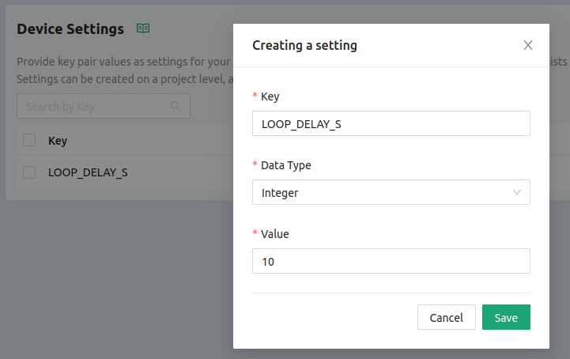

import Tabs from '@theme/Tabs';
import TabItem from '@theme/TabItem';

# Golioth Stream Example

The Stream example sends accelerometer sensor data to the Golioth Cloud every few seconds. Each JSON object receives a timestamp and is stored in a database we refer to as LightDB stream.

1. Go to your local copy of [the magtag-demo repository](https://github.com/golioth/magtag-demo) and checkout the `stream` example:

    ```bash
    cd ~/magtag-training/app
    git checkout stream
    ```

2. Create a file for WiFi and Golioth credentials

    * Make a copy of `credentials.conf_example` and name it `credentials.conf`

        ```
        cp credentials.conf_example credentials.conf
        ```

    * Edit this new file to include your WiFi credentials and the PSK-ID/PSK from the device page on your Golioth console
    * This file will be ignored by git, and may be reused in other examples.

3. Build the example, including the credentials file you just created

    ```bash
    west build -b esp32s2_saola . -D OVERLAY_CONFIG=credentials.conf -p
    ```

import HowToFlash from '/docs/\_partials/flash-the-example-kasm.md'

<HowToFlash/>

## Expected Results

The Stream example will begin running after pressing the Reset button. You will see the center LEDs turn blue when the board is trying to connect to Golioth. When successful, all four LEDs will turn green, a connected message will be shown on the ePaper display, and sensor data will begin streaming to Golioth each time the screen displays "sent accel data".

Sensor data can be viewed on [the Golioth Console](https://console.golioth.io/)

1. Select Monitor&rarr;Stream from the sidebar menu
2. Under "Query Response" use the time/date box and choose the `Last 4h` setting
3. To the right of the time/date box, choose the name of your device from the list
4. Click the circle arrow icon next to the Refresh button in the upper right to auto-refresh every 1 second
5. Use the green arrows in the "data" column to unfold the nested JSON objects for viewing


This streaming data can be queried using the [Golioth REST API](https://docs.golioth.io/reference/rest-api/overview), or accessed on a number of different external platforms/services using our [Output Streams](https://docs.golioth.io/cloud/output-streams). This allows timestamped stream data to be graphed and visualized to meet your needs.

Golioth also includes a LightDB State for persistent, mutable data. We will look at that feature in the next example.

## Device Services: Change the frequency of readings

Imagine you have 100 sensors in the field and wanted to update the rate at which
they take their readings. This demo is set up to take advantage of the Golioth
Settings Service, which can update a setting for all devices in the fleet with a
single click, or target them individually or in groups.

Navigate to your device on [the Golioth Console](https://console.golioth.io/)

1. Select Device Settings from the left sidebar
2. Click the Create button and set the key as `LOOP_DELAY_S`
3. Choose Integer for data type
4. Enter the desired delay between sensor readings (in seconds)



Your MagTag will immediately recognize the change and display a message.

Settings can be adjusted from the project, blueprint, or device level. Try
adjusting this value from the device-view Settings tab. Also notice that the state of
the settings synchronization is reported in the summary page for your device.

## Continued Learning

The Query Builder found in the LightDB Stream view of the Golioth Console is a powerful tool for visualizing your incoming data and for testing how the data you collect will be used. You can see [our post on Query Builder](https://blog.golioth.io/prototype-your-data-outputs-with-the-golioth-query-builder/) to learn more about this feature.
