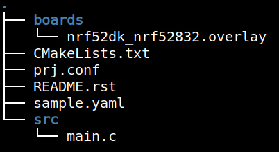

# CMake Overview

Zephyr uses CMake to manage which C files will be built, and which header files
are available for inclusion.

## CMakeLists.txt

Files are added to the build process using a CMakeLists.txt file. There will be
one at the root of your Zephyr application, as shown in this file tree listing
from a typical application:



The contents of the CMakeLists.txt file will look similar to this:

```
# SPDX-License-Identifier: Apache-2.0

cmake_minimum_required(VERSION 3.20.0)
find_package(Zephyr REQUIRED HINTS $ENV{ZEPHYR_BASE})
project(blinky)

target_sources(app PRIVATE src/main.c)
```

This tells the build system where to find the Zephyr tree, what the name of the
project is, and that we want to build the `main.c` file as part of the project.

## CMake and multiple folders

Subfolders containing C code usually have their own `CMakeLists.txt` file in
them that specifies header files and C files to include in the build. This
allows code to be conditionally included in a build.

:::tip Examples of conditional file inclusion

The `01_IOT` application you loaded as a precompiled binary during the [Intro to
Golioth](/docs/golioth-exploration) section demonstrates two approaches to
conditional inclusion of files:

* only include a WiFi helper file if we're building for the nRF7002
* include a subdirectory that has its own `CMakeLists.txt` file for gathering
  board-specific implementation of the network connection information function

```
zephyr_library_sources_ifdef(CONFIG_BOARD_NRF7002DK_NRF5340_CPUAPP src/wifi_util.c)
add_subdirectory(src/network_info)
```

:::

:::note More on CMake

We won't do any hands-on work with CMake today. For more info, check out [the
official Zephyr docs for
CMake](https://docs.zephyrproject.org/latest/build/zephyr_cmake_package.html).
