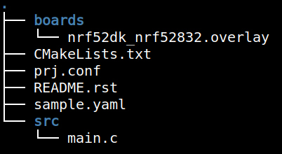

# Kconfig Overview

[Kconfig](https://docs.zephyrproject.org/latest/build/kconfig/index.html) is the
configuration system Zephyr uses to set up the kernel and subsystems at build
time. Kconfig files from a dizzying number of locations are combined together
into one file (`build/zephyr/.config`) and converted to macro definitions
available to the C code (`build/zephyr/include/generated/autoconf.h`).
Internally, the symbols add C files to the build for the features they are
enabling.

## Where do Kconfig symbols come from?

Kconfig assigns key/value pairs, with the keys often being referred to as
"Kconfig symbols". Today we will briefly work with the most obvious location for
setting these symbols: the `prj.conf` file in the root directory of a Zephyr
application.



For example, here is the `prj.conf` file from the `01_IOT` application that you
ran as a precompiled binary in the [Intro to Golioth](/docs/golioth-exploration)
section.

```
#
# Copyright (c) 2023 Golioth, Inc.
#
# SPDX-License-Identifier: Apache-2.0
#

CONFIG_GOLIOTH_SAMPLES_COMMON=y

CONFIG_NETWORKING=y
CONFIG_NET_IPV4=y

CONFIG_NET_LOG=y

CONFIG_MAIN_STACK_SIZE=4096

CONFIG_GOLIOTH=y
CONFIG_GOLIOTH_SYSTEM_CLIENT=y
CONFIG_GOLIOTH_SYSTEM_CLIENT_STACK_SIZE=4096
CONFIG_LOG_BACKEND_GOLIOTH=y
CONFIG_LOG_PROCESS_THREAD_STACK_SIZE=2048
CONFIG_GOLIOTH_RPC=y
CONFIG_GOLIOTH_SETTINGS=y
CONFIG_NET_SHELL=y

CONFIG_GOLIOTH_SAMPLE_SETTINGS_AUTOLOAD=y
CONFIG_GOLIOTH_SAMPLE_SETTINGS_SHELL=y
CONFIG_GOLIOTH_SETTINGS=y

CONFIG_SETTINGS=y
CONFIG_SETTINGS_RUNTIME=y

CONFIG_FLASH=y
CONFIG_FLASH_MAP=y
CONFIG_NVS=y

CONFIG_SHELL=y

# Logging
CONFIG_LOG=y
CONFIG_LOG_BUFFER_SIZE=2048
```

There is a lot in this one file, but this is just one small part of the Kconfig
chain. Symbols are pulled from `.conf` files in the `boards` directory of a
project, from files named `Kconfig` in different folders in your project, from
the board and chip specific files in the Zephyr tree, and from numerous modules,
subsystems, and device drivers included in the build.

## menuconfig

To aid in untangling the vast web of Kconfig symbols, Zephyr uses the
`menuconfig` tool which presents each symbol in a graphical menu that includes
help and dependency information.

|  |
|:--:|
| Later, we'll use `menuconfig` to enable logging in the [Build Your First Zephyr App](../helloworld) training module. |

In this training we will delve into using `menuconfig` for a taste of what it's
all about. Part of leveling up your skills in Zephyr will include gaining a
better understanding of how to use and how to troubleshoot Kconfig issues.

:::note More on Kconfig

For more info, check out [the official Zephyr docs for
Kconfig](https://docs.zephyrproject.org/latest/build/kconfig/index.html).
