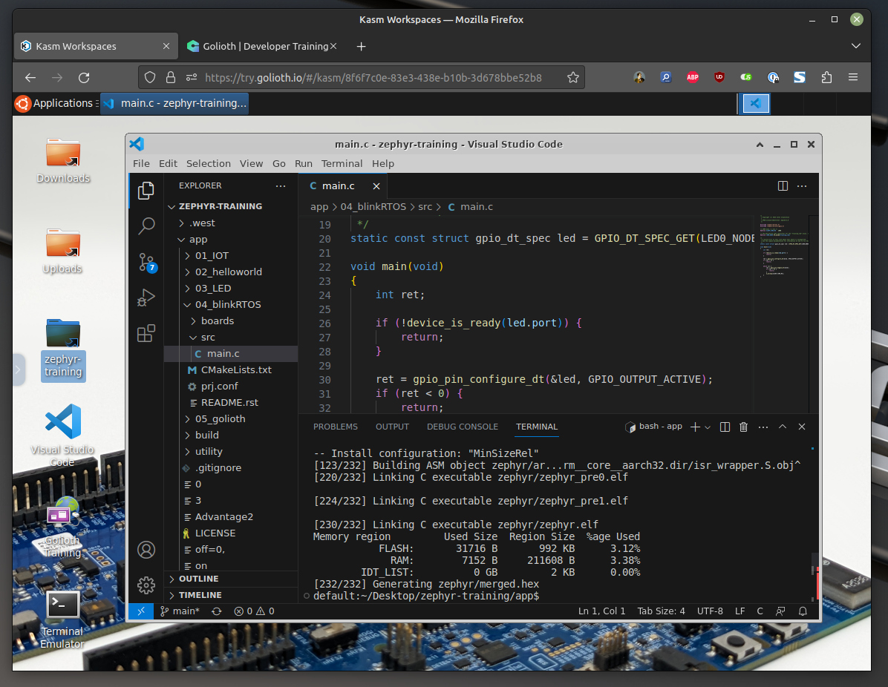

# About the Zephyr Dev Environment

We will not be setting up the Zephyr development environment today. Due to
differences in operating systems (and quirks between different installs of the
same OS), setting up the development tools takes a bit of time. Instead, we have
set up pre-configured build environment you can access in your browser called
Kasm.

:::tip Setup after training

After training is over you will need a local install to continue working with
Zephyr. You can follow [Golioth's Zephyr setup guide for the
nRF9160](https://docs.golioth.io/hardware/nrf91/zephyr-quickstart/set-up-zephyr)
which will work for all Nordic devices.

:::

## What is Kasm?

[Kasm is a virtual desktop workspace in a browser](https://www.kasmweb.com/). For this training we have
preconfigured a Kasm instance with Golioth tools and the Zephyr toolchain so
that you can build Zephyr projects without first installing the tools on your
local machine.

We believe this is the fastest way to get new developers building Zephyr
projects and interacting with Golioth. You should be able to build a Zephyr +
Golioth project almost immediately after entering the development environment.

|  |
|:--:|
| We use Kasm to load a Linux-based build environment in your browser, complete with VScode and all the Zephyr tools you needs. |

## Using the Command Line

Golioth training expects that commands will be run from the command line. In
Kasm, we will be using VScode as a code editor, running these commands from the
terminal inside of VScode.

:::tip

While Nordic includes tools for building Zephyr projects in VScode, they miss
out on some of the benefits of the `west` meta tool. To explore this part of
Zephyr, its worth using command line today.

:::
