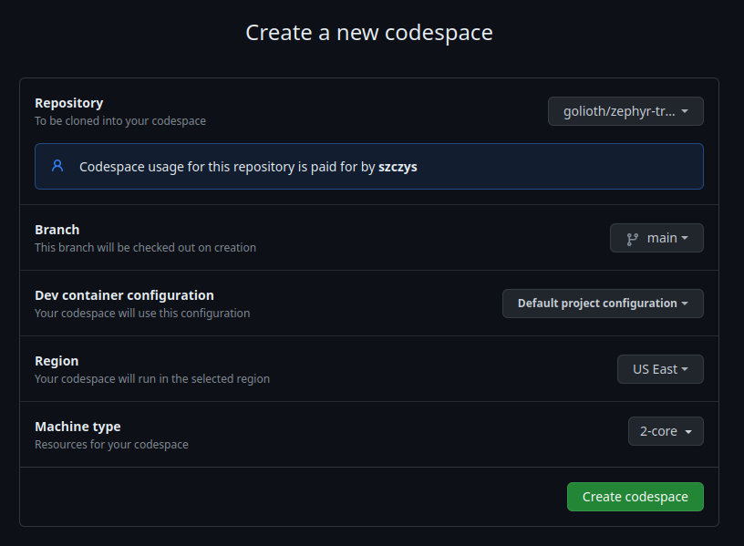
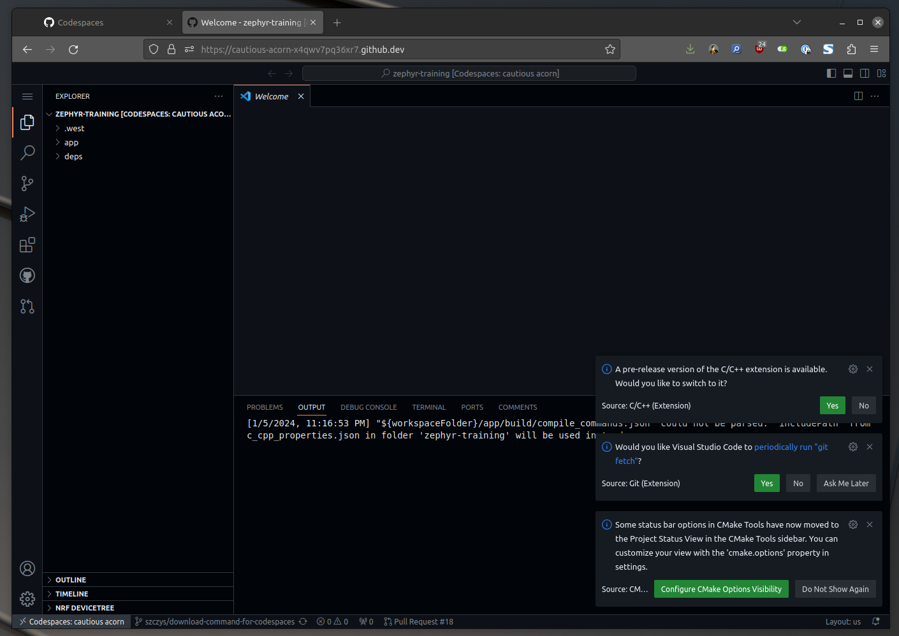
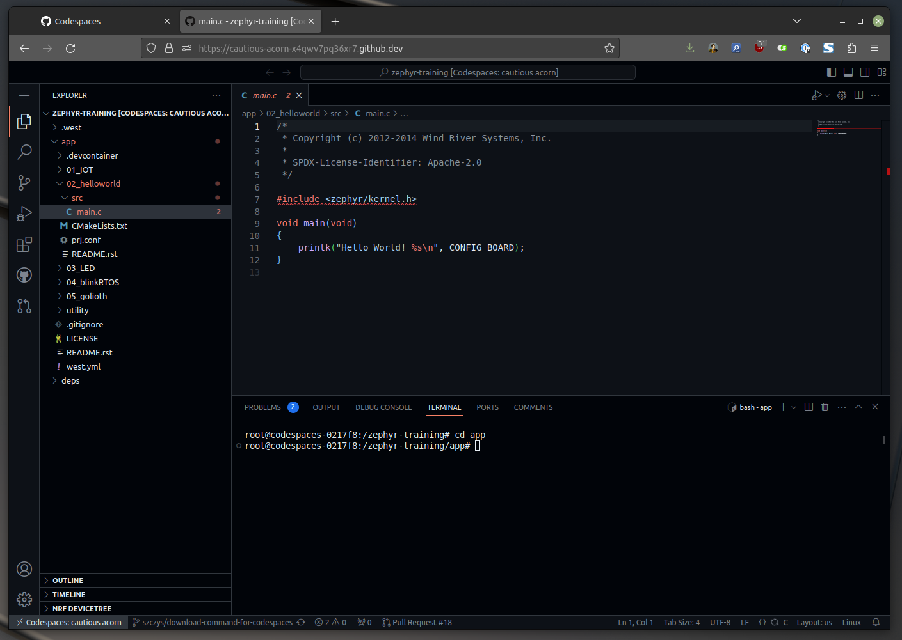
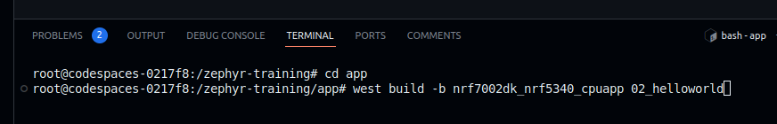
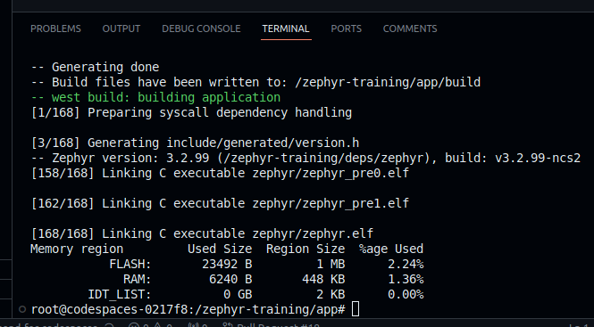

import HowToDownload from '/docs/\_partials/download-from-codespaces.md'
import FirmwareFlash from '/docs/\_partials/flash-the-example-nrf.md'
import ConnectSerial from '/docs/\_partials/connect-to-serial.md'

import Tabs from '@theme/Tabs';
import TabItem from '@theme/TabItem';

# Build Hello World

Engineering tradition dictates we must begin with Hello World!

## Learning objectives

We are building your muscles around compiling Zephyr binaries. The code is
pre-configured, so all you need to do is build, flash, and view the output over
serial. These steps will be used constantly in your Zephyr development process.
Now is a great time to get comfortable with the workflow.

* **Desired outcome(s)**
  1. Understand how to use the `west` metatool to build an application
  2. Learn the process of downloading a compiled binary from the Codespaces
     development environment used in this training
  3. Know how to use Nordic's graphical programmer and serial terminal tools
* **Time Estimate:** 15 minutes

## Workflow

:::tip Using VS Code and `west`

In this training we will use VS Code when editing and building Zephyr projects.
Of course, when you set up your own local development environment, VS Code is
optional and you may choose to use any editor of your choice.

While Nordic maintains VS Code tools that can build/flash at the click of a
mouse, we will build/flash from the command line to get comfortable with how the
`west` meta tool is used.

:::

### Build in the Codespaces container

1. Create your codespace for Golioth's zephyr-training repository

    * [Use this direct](https://codespaces.new/golioth/zephyr-training) link to
      open our prebuilt Codespaces image for this training.

      

    * Leave all settings at their defaults and click "Create codespace".
    * Give it a few seconds to finish loading.

      [](./assets/codespaces-vscode-first-open.png)

      :::tip We expect VS Code to complain a little bit

      * Use the 'x' to dismiss the two dialogs on the bottom right
      * There will be a message about failing to parse `compile_commands.json`
        because that file will not exist until we build an app in this workspace.

      :::

      :::note Codespaces Pricing

      Codespaces is free to use for individuals up to certain limits. At the
      time of writing this is 15 GB of storage and 120 core hours per month.
      This is more than enough for today's training.

      - Please see [the GitHub Docs pricing
        page](https://docs.github.com/en/billing/managing-billing-for-github-codespaces/about-billing-for-github-codespaces#monthly-included-storage-and-core-hours-for-personal-accounts)
        for full details.
      - [View Codespaces
        usage](https://docs.github.com/en/billing/managing-billing-for-github-codespaces/viewing-your-github-codespaces-usage)
        in the Settings section of your GitHub user profile.
      - Codespaces instances may be deleted from the [`Your
        codespaces`](https://github.com/codespaces) dashboard

      :::


2. Open main.c and start the VS Code terminal

    * In the VS Code "EXPLORER" side bar, click on `app` to unfold it
    * Unfold the `02_helloworld` and `src` folders
    * Double click on `main.c` to open it in the editor
    * In the bottom pane, click "TERMINAL". We start in the `zephyr-training` folder
      so be sure to move into the `app` folder:

        ```
        cd app
        ```

      [](./assets/codespaces_vscode_ready_to_build.png)

3. Build the example

    :::tip Use the app folder for builds

    We want to build all of the sample code from the `/zephyr-training/app` folder.
    The build process will create a `build` subfolder inside any folder where
    the `west build` command is used. This contains all prepocessor and compiler
    output (including our firmware binary which will be located at either
    `build/zephyr/zephyr.hex` or `build/zephyr/merged.hex` depending on the
    board you are using).

    Running all builds from the same location helps reduce the risk of human
    error when looking at or copying from the wrong build folder.

    :::

    * Run the following code in the VS Code terminal pane to build the
      `02_helloworld` app

        <Tabs
        groupId="devboard"
        defaultValue="nrf7002dk"
        values={[
        {label: 'nRF7002 DK', value: 'nrf7002dk'},
        {label: 'nRF9160 DK', value: 'nrf9160dk'},
        ]}>

        <TabItem value="nrf7002dk">

            ```bash
            west build -b nrf7002dk/nrf5340/cpuapp 02_helloworld
            ```

        </TabItem>
        <TabItem value="nrf9160dk">

            ```bash
            west build -b nrf9160dk/nrf9160/ns 02_helloworld
            ```

        </TabItem>
        </Tabs>

        

    * Upon a successful build you will see device resource usage information

       

4. Download the binary

    <HowToDownload/>

    :::tip `west download` is a custom command

    The `west` metatool allows you to add custom commands called
    [Extensions](https://docs.zephyrproject.org/latest/develop/west/extensions.html).
    We added this command in the repository to make downloading from Codespaces
    easier. You can see how this was accomplished in the
    `zephyr-training/app/utility/west-commands` folder.

    :::

### Update device firmware from your local machine

<FirmwareFlash/>

## Expected results

This app will show the following output on the serial console (the name of your
board may be different):

```
*** Booting Zephyr OS build v3.2.99-ncs2 ***
Hello World! nrf7002dk_nrf5340_cpuapp
```

* To see this output, connect to the device via serial and then press the reset
button on the board.

  <details>
    <summary>Show me how to connect via serial</summary>
  <ConnectSerial/>
  </details>

Congratulations, you've built and flashed your first Zephyr application! Next
we'll dig into the Zephyr internals to change the behavior of this
demonstration.
