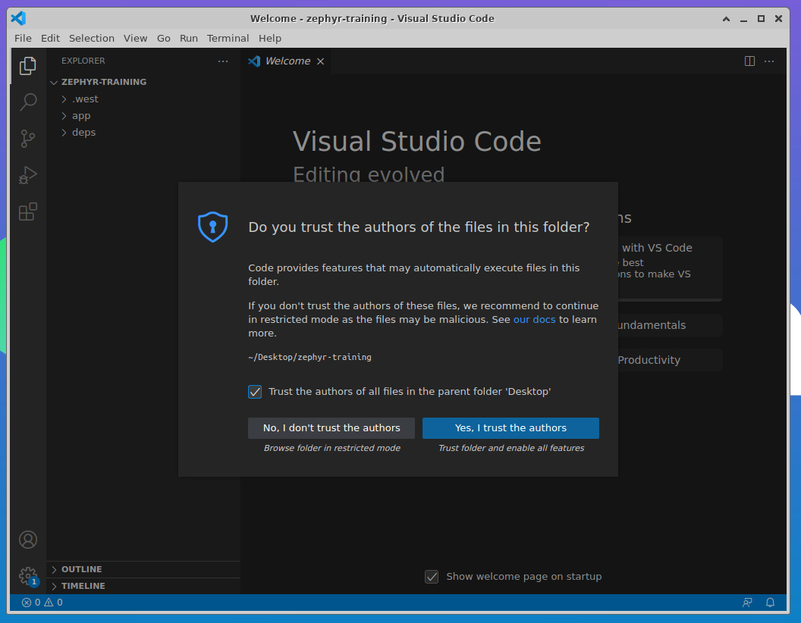
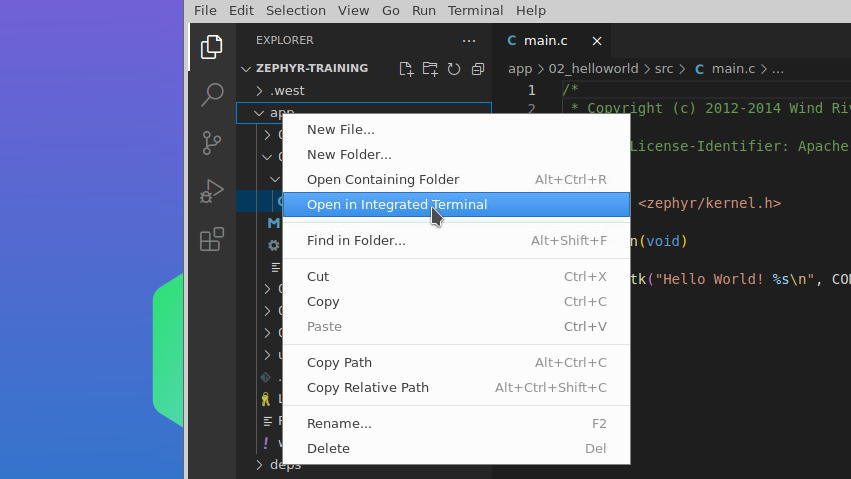
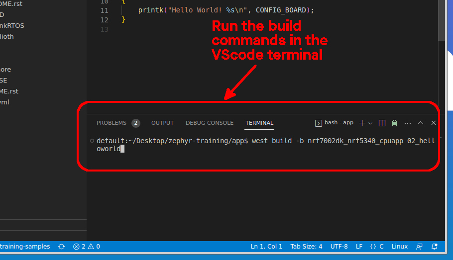
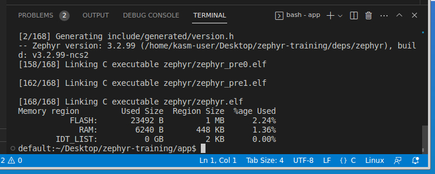

import HowToDownload from '/docs/\_partials/download-from-kasm.md'
import FirmwareFlash from '/docs/\_partials/flash-the-example-nrf.md'
import ConnectSerial from '/docs/\_partials/connect-to-serial.md'

# Build Hello World

Engineering tradition dictates we must begin with Hello World!

## Learning objectives

We are building your muscles around compiling Zephyr binaries. The code is
pre-configured, so all you need to do is build, flash, and view the output over
serial. These step will be used constantly in your Zephyr development process.
Now is a great time to get comfortable with the workflow.

### Desired outcome(s)

* Understand how to use the `west` metatool to build an application
* Learn the process of downloading a compiled binary from the Kasm build
  environment used in this training
* Know how to use Nordic's graphical programmer and serial terminal tools

### Time Estimate

* This section will take 15 minutes

## Workflow

:::tip Using VScode and `west`

In this training we will use VScode when editing and building Zephyr projects.
Of course, VScode is optional and you may choose to use any editor of your
choice.

While Nordic maintains VScode tools that can build/flash at the click of a
mouse, we will build/flash from the command line to get comfortable with how the
`west` meta tool is used.

:::

### Build in the Kasm container

1. In the Kasm container, open the `zephyr-training` project in VScode

    * use the icon on the desktop to open VScode
    * Choose File&rarr;Open Folder
    * Navigate to `~/Desktop/zephyr-training/` and open it
    * Confirm that you trust the authors in the window that appears

    

2. Open main.c and start the VScode terminal

    * In the VScode Explore, click on `app` to unfold it
    * Unfold the `02_helloworld` and `src` folders
    * Double click on `main.c` to open it in the editor
    * Open a terminal by right-clicking on `app` and selecting `Open in
      Integrated Terminal`

    

3. Build the example

    :::tip Use the app folder for builds

    We want to build all of the sample code from the
    `~/Desktop/zephyr-training/app` folder. The build process will create a
    `build` subfolder inside any folder where the `west build` command is used.
    This contains all prepocessor and compiler output (including our firmware
    binary which will be locate at `build/zephyr/zephyr.hex`).

    Running all builds from the same location helps reduce the risk of human
    error when looking at or copying from the wrong build folder.

    :::

    * The terminal at the bottom of the VScode window will open in the `app`
      folder
    * Run the following code to build the `02_helloworld` app

        ```bash
        # for nRF7002
        west build -b nrf7002dk_nrf5340_cpuapp 02_helloworld

        # for nRF9160
        west build -b nrf9160dk_nrf9160_ns 02_helloworld
        ```

       

    * Upon successful build you will see device resource usage information

       

4. Download the binary

    * In the VScode terminal, run `west kasm download` to package the compiled
      code and make it available for download

    * Use the Download option in Kasm's left sidebar to download
      `<devicename>_<appfolder>_<hhmmss>.hex` to your local machine.

    <HowToDownload/>

    :::tip `west kasm download` is a custom command

    The `west` metatool allows you to add custom commands called
    [Extensions](https://docs.zephyrproject.org/latest/develop/west/extensions.html).
    We added this command in the repository to make downloading from Kasm
    easier. You can see how this was accomplished in the
    `zephyr-training/utility/west-commands` folder.

    :::

### Update device firmware from your local machine

<FirmwareFlash/>

## Expected results

This app will show the following output on the serial console (the name of your
board may be different):

```
*** Booting Zephyr OS build v3.2.99-ncs2 ***
Hello World! nrf7002dk_nrf5340_cpuapp
```

* To see this output, connect to the device via serial and then press the reset
button on the board.

  <details><summary>Show me how to connect via serial</summary>
  <ConnectSerial/>
  </details>

Congratulations, you've built and flashed your first Zephyr application! Next
we'll dig into the Zephyr internals to change the behavior of this
demonstration.
