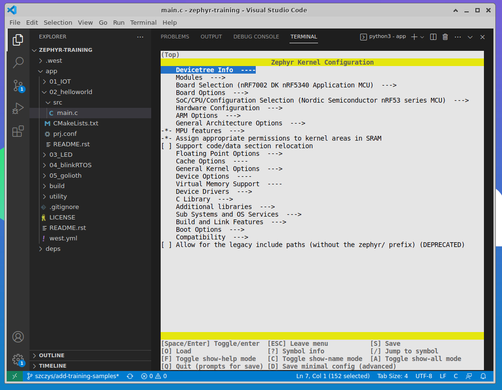
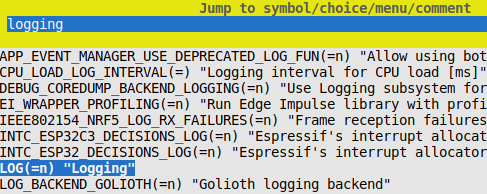
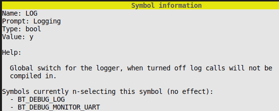
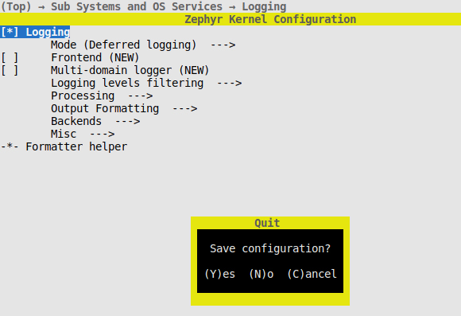

import FirmwareFlash from '/docs/\_partials/flash-the-example-nrf.md'

# Convert Hello World to use Logging

Explore Zephyr by converting from `printf()` style output to using Zephyr's
Logging system.

## Learning objectives

This section will demonstrate how to turn on and use the Zephyr Logging system using
`menuconfig`. Along the way we'll touch on kernel functions.

* **Desired outcome(s)**
    1. Gain exposure to `menuconfig` for adjusting Kconfig symbols
    2. Understand how project-wide Kconfig is merged into a single file at build
       time
    3. Understand how to register and send logging messages
    4. Learn about kernel functions
* **Time Estimate:** 15 minutes

## Exercise: Add a loop and counter

The Hello World application is pretty boring. Let's start spicing it up by
adding a loop and a counter.

1. Open the `main.c` file from your `02_helloworld` application
2. In `main()` create an integer called `counter` and set it to zero
3. Create an infinite loop around the `printk()` statement

    1. Make `printk()` use the counter instead of the board name
    2. Increment the counter after printing the message
    3. Use [Zephyr's `k_msleep()`
       function](https://docs.zephyrproject.org/latest/kernel/services/threads/index.html#c.k_msleep)
       to pause the loop for 1000 milliseconds

4. Be sure to save the changes you made to `main.c`

<details><summary>Click to reveal solution</summary>

```c
#include <zephyr/kernel.h>

void main(void)
{
	int counter = 0;

	while(1) {
		printk("Hello World! %d\n", counter);
		++counter;
		k_msleep(1000);
	}
}
```

</details>

If you were to build and run this program you will see repeating Hello World
messages along with our counter value:

```
*** Booting Zephyr OS build v3.2.99-ncs2 ***
Hello World! 0
Hello World! 1
Hello World! 2
Hello World! 3
```

:::info Zephyr kernel functions

We used `k_msleep()` for the delay. This is a kernel function (denoted by the
`k_` prefix) and is made available by the `<zephyr/kernel.h>` include.

It is important to use these functions when your code needs to delay. While it
acts as a blocking function in the loop above, `k_msleep` (and others like
`k_sleep()`) yield time back to the Zephyr Scheduler. This way, operations on
other threads may be executed while our code is not doing anything.

:::

## Exercise: Convert to Logging

### Why use logging?

It is a good practice to use the Zephyr Logging system instead of `printk()`
style messages. Logging provides timestamps, levels for filtering, and
indications of where the logging message came from in your code tree.

Logging is also slightly delayed in favor of operations with greater importance.
While your timestamps will be correct, the actual printout to serial will happen
when the scheduler deems there is available time. This way printing to the
serial terminal will not upset important timing in your firmware project.

To use logging, we will need to do four things:

* Enable the Logging library using Kconfig
* Include the Logging header file
* Register a Logging module
* Use the Logging API call for our messages

### Enable Logging using menuconfig

Zephyr includes a configuration tool called `menuconfig` for navigating the
massive web of Kconfig options. Let's use this to turn on Logging.

1. Maximize the terminal window in your VScode
2. From the `~/zephyr-training/app` folder, launch menuconfig:

    ```shell
    $ west build -t menuconfig
    ```
    

    :::note

    `menuconfig` uses your existing `build` folder from the previous step. If it cannot
    find a build folder it will not run. If you have this problem, just re-run
    the project build command to generate that folder.

    :::

3. Search for the Logging library

    1. Use the `/` to open a search box and type `logging`
    2. Use the down arrow to highlight `LOG(=n) "Logging"` and press enter

      

    3. Use the space bar to select `Logging`
    4. Use the `?` to see the help info for this symbol

      

      :::tip

      Note that we see the actual symbol name here (`LOG`). But don't miss the
      wealth of other information available, like what symbols are selecting (or
      n-selecting) it, what its dependencies are, etc. This will be helpful in
      the future for debugging!

      :::

    5. Press `q` to close help, then `q` to quit and be sure to use `y` to
       save!

      

      :::warning Menuconfig changes are saved in the build folder

      Changes made in `menuconfig` are rather fleeting. The are saved to the
      `build/zephyr/.config` file which is automatically generated. If you run a
      pristine build (`-p` when running `west build`) or delete the build folder, the
      changes you just saved will be lost.

      :::

4. Make your `menuconfig` change permanent

    It is possible to test the change by building your project, but we're fairly
    confident this will work so let's make it permanent.

    When you looked at the help for Logging in `menuconfig` you saw the name was
    `LOG`. Kconfig symbols from every possible source are gathered together
    during a build and stored in the `build/zephyr/.config` file. If we `grep`
    this file we see something interesting:

    ```shell
    $ grep "LOG=y" build/zephyr/.config
    CONFIG_LOG=y
    ```

    Our Kconfig symbol is prepended with `CONFIG_`. This paradigm keeps
    configuration symbols straight in the namespace. (All symbols are available
    at build-time, which is why Zephyr's `helloworld` sample is able to print
    out the board name using `CONFIG_BOARD`).

    To make our change permanent, add it to the `prj.conf` file in the `02_helloworld`
    directory:

    1. Edit the `prj.conf` file and add the following

      ```
      CONFIG_LOG=y
      ```

    2. Save your `prj.conf` file

    :::tip Persistent Project Configuration

    The `prj.conf` is the default application configuration file that Zephyr
    will automatically look for in the project root directory during each build.
    This file will take [precedence over other Kconfig
    files](https://docs.zephyrproject.org/latest/build/kconfig/setting.html#the-initial-configuration)
    that have already been added to the build.

    All project-level configuraiton should be placed in `prj.conf`, which is
    persistent across build operations and should be added to your Git
    repository. Any board-level configuration should be placed in the
    `boards/<boardname>.conf` files to be included in the build.
    :::

### Include header and register the module

We've told Zephyr to build the Logging library, so now we can include the APIs.
We also need to register any C file from which we want to make logging calls.

1. Include the Logging headers at the top of `main.c`

    ```c
    #include <zephyr/logging/log.h>
    ```

2. Register for logging

    ```c
    LOG_MODULE_REGISTER(log_demo, LOG_LEVEL_DBG);
    ```

    You supply a unique token (`log_demo`) to this macro that will be reported
    with each logging message, and a max logging level to process. Logging
    levels are available from 0 (no logging) to 5 (debug logging) and use the
    following short hand names: `ERR`, `WRN`, `INF`, `DBG`.

    :::tip

    There are ways to reuse the module tokens and change the log levels at run
    time (and much more) but that is beyond the scope of this training so please
    see the [Zephyr Logging
    Docs](https://docs.zephyrproject.org/latest/services/logging/index.html) for
    more.

    :::
3. Save your `main.c` file

### Convert `printk()` to `LOG_INF()`

We're all set up and can start making logging calls. Let's change the `printk()`
message over to use Logging.

1. Replace `printk` with `LOG_INF`
2. Remove the `\n` from the end of the string (the Logging library will take
   care of adding newline characters)

<details><summary>Click to reveal the solution</summary>

```c
#include <zephyr/logging/log.h>
LOG_MODULE_REGISTER(log_demo, LOG_LEVEL_DBG);

#include <zephyr/kernel.h>


void main(void)
{
	int counter = 0;

	while(1) {
		LOG_INF("Hello World! %d", counter);
		++counter;
		k_msleep(1000);
	}
}
```

</details>

### Build in the Kasm container

1. Build the example

    * In the terminal at the bottom of the VScode window, verify you are in the
      `app` folder
    * Build app

        ```bash
        west build -b nrf7002dk_nrf5340_cpuapp 02_helloworld
        ```

2. Download the binary

    :::note

    The normal workflow when using a development environment installed locally
    is to use `west flash` to program the board. We are using a different
    approach here because the Kasm container doesn't have access to your local
    USB port.

    :::

    * In the VScode terminal, run `west kasm download` to package the compiled
      code and make it available for download

    * Use the Download option in Kasm's left sidebar to download
      `<devicename>_<appfolder>_<hhmmss>.hex` to your local machine.

      :::caution

      Verify the filename you're downloading matches the one output by the `west
      kasm download` command.

      :::

### Update device firmware from your local machine

<FirmwareFlash/>

## Expected results

This app will show the following output on the serial console:

```
*** Booting Zephyr OS build v3.2.99-ncs2 ***
[00:00:00.417,266] <inf> log_demo: Hello World! 0
[00:00:01.417,327] <inf> log_demo: Hello World! 1
[00:00:02.417,419] <inf> log_demo: Hello World! 2
[00:00:03.417,480] <inf> log_demo: Hello World! 3
```

You can immediately see some of the benefits provided by logging:

* Accurate timestamps
* Log level reported (here `inf` indicates an info log)
* Source module indicated (`log_demo`)

:::tip Example of Golioth Remote Logging

In the precompiled binary we loaded during the [Intro to
Golioth](/docs/golioth-exploration) we observed logs being sent to the Golioth
servers.

The Golioth Zephyr SDK implements a backend for the Zephyr Logging system to
make remote logging possible. If you have Zephyr Logging turned on, and have
added the Golioth System Client to your project ([we'll get to that](../golioth)
in a little while) you can automatically send your logs to the cloud by enabling
the backend logging Kconfig symbol:

```
CONFIG_LOG_BACKEND_GOLIOTH=y
```

:::

## Additional Exercises

1. Add other log messages that use different log levels
2. Explore the `Logging levels filtering` options in `menuconfig`

