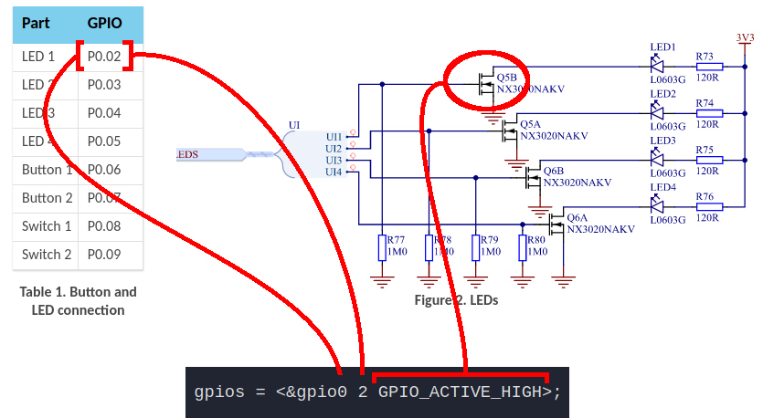

import HowToDownload from '/docs/\_partials/download-from-kasm.md'
import FirmwareFlash from '/docs/\_partials/flash-the-example-nrf.md'
import ConnectSerial from '/docs/\_partials/connect-to-serial.md'

# Add an LED Using Devicetree

Let's take our first steps into writing Devicetree (DT) overlay files by adding
an LED node. Along the way we'll discuss how each part of the syntax works.

## Learning objectives

Write your own DT nodes in the overlay file for your board to access an LED from
`main.c`. Learn about overlay files and gain a better understanding of how DT
nodes are addressed from C code.

* **Desired outcome(s)**
  1. Your board blinks LED2 at 1 Hz (but this time, you mapped that LED!!)
* **Time Estimate:** 15 minutes

## Anatomy of an Overlay File

### What is an overlay file?

Zephyr applications can make Devicetree changes using overlay files. By default,
overlay files are named for the board and stored in a `boards` folder of your
app.

Look inside the `03_LED/boards` folder and you will find overlay files for the
boards supported by this training:

* nrf7002dk_nrf5340_cpuapp.overlay
* nrf9160dk_nrf9160_ns.overlay

Currently the contents of these files hold meaningless placeholder nodes.
However, they are valid DT syntax or the app would not build. Let's replace
everything in the file for your board with nodes for a new LED.

### What Our Overlay Needs

Here is the general structure of an overlay file:

```js
/ {
    child-node {
        subnode_nodelabel: a-sub-node {
            foo = <3>;
        };
    };
};
```

As with Linux, the `/` indicates a root node. Inside the root node we see one
child node, which contains one subnode. To add an LED to an overlay file you
will need:

* One root node that contains two child nodes: `aliases` and `trainingleds`
* The `trainingleds` child node needs a subnode that declares the LED
* The aliases child node needs a subnode that associates an alias called
  `training-led` with your LED subnode

## Exercise: Add `training-led` to your DeviceTree Overlay

Starting from this placeholder overlay, let's implement an actual overlay for
LED2.

```
/ {
        aliases {
                alias-name = &subnode_nodelabel;
        };


        child-node-path {
                compatible = "zephyr,fake-eeprom";

                size = <0>; /* property required by zephyr,fake-eprom binding */

                subnode_nodelabel: subnode-path {
                        foo = <3>;
                };
        };
};
```

1. Open the `03_LED/boards/<yourboard>.overlay` file for your board in the
   VScode editor
2. Try it for yourself: Replace the `child-node-path` placeholder node

    :::tip

    We choose our own [names for nodelabels and
    nodepaths](https://docs.zephyrproject.org/latest/build/dts/intro-syntax-structure.html#nodes).
    However, there are some predefined keys like `soc`, `aliases`, and `chosen`
    that are special)

    :::

    1. We will not use a nodelabel for this child-node
    2. Use `led_childnode_path` for the nodepath
    3. Use the `gpio-leds` binding as the compatible
    4. Remove `size` from this child node as it is not a required parameter for
       this compatible

    <br /><details><summary>Click to reveal solution if you need help</summary>

    ```
            led_childnode_path {
                    compatible = "gpio-leds";

            };
    ```

    </details>

3. Add a sub-node inside `child-node-path`
    1. Use `led2_subnode_label` as the nodelabel
    2. Use `led2_path` as the nodepath

    <br /><details><summary>Click to reveal solution if you need help</summary>

    ```
            led_childnode_path {
                    compatible = "gpio-leds";

                    led2_subnode_label: led2_path {

                    };
            };
    ```

    </details>

4. Add the `gpios` property inside the `led2_subnode_label` node

    So far we've just been creating names for things, but this property is where
    the actual assignment happens. Here's an example of how the nRF9160dk maps
    Zephyr's `led0` alias in DT (confusingly, the label printed on the PCB for
    this LED is called LED1):

    |  |
    |:--:|
    | How the nRF9160dk maps to devicetree `led0` |

    Now look up the schematic and LED pinout for your board and use this
    information to add the `gpios` property for what Nordic calls LED2.

    * nRF7002dk: [Buttons and
      LEDs](https://infocenter.nordicsemi.com/index.jsp?topic=%2Fug_nrf91_dk%2FUG%2Fnrf91_DK%2Fintro.html&cp=2_0_4)
    * nRF9160dk: [Buttons, slide switches, and
      LEDs](https://infocenter.nordicsemi.com/index.jsp?topic=%2Fug_nrf91_dk%2FUG%2Fnrf91_DK%2Fintro.html&cp=2_0_4)

    <br /><details><summary>Click to reveal solution if you need help</summary>

    ```
            /* for nRF7002dk LED2 */
            led_childnode_path {
                    compatible = "gpio-leds";

                    led2_subnode_label: led2_path {
                            gpios = <&gpio1 7 GPIO_ACTIVE_HIGH>;
                    };
            };

            /* for nRF9160dk LED2 */
            led_childnode_path {
                    compatible = "gpio-leds";

                    led2_subnode_label: led2_path {
                            gpios = <&gpio0 3 GPIO_ACTIVE_HIGH>;
                    };
            };
    ```

    </details>

5. Finally, add an alias to this new LED

    1. Create `training-led` alias and set it to the address of the LED
       nodelabel you created in step 3

    <br /><details><summary>Click to reveal solution if you need help</summary>

    ```
            aliases {
                    training-led: &led2_subnode_label;
            };
    ```

    </details>

### Update `main.c`

1. Update `main.c` to use our new `training-led` alias.

    <details><summary>Click to reveal solution if you need help</summary>

    ```c
    #define LED0_NODE DT_ALIAS(training_led)
    ```

    </details>

### Build in the Kasm container

1. Build the example

    * Make sure the terminal at the bottom of the VScode window is in the
      `~/zephyr-training/app` folder
    * Run the following code to build the `03_LED` app

        ```bash
        # for nRF7002
        west build -b nrf7002dk_nrf5340_cpuapp 03_LED

        # for nRF9160
        west build -b nrf9160dk_nrf9160_ns 03_LED
        ```

2. Download the binary

    :::note

    The normal workflow when using a development environment installed locally
    is to use `west flash` to program the board. We are using a different
    approach here because the Kasm container doesn't have access to your local
    USB port.

    :::

    * In the VScode terminal, run `west kasm download` to package the compiled
      code and make it available for download

    * Use the Download option in Kasm's left sidebar to download
      `<devicename>_<appfolder>_<hhmmss>.hex` to your local machine.

    <HowToDownload/>

### Update device firmware from your local machine

<FirmwareFlash/>

## Expected results

It is now LED2 that is blinking (previously it was LED1)

## Challenge: Use `DT_NODELABEL` instead of `DT_ALIAS`

In the Zephyr [Node Identifiers and
Helpers](https://docs.zephyrproject.org/latest/build/dts/api/api.html#node-identifiers-and-helpers)
documentation you can see there are multiple macros for accessing DT nodes.
While it is very common to use an alias, try updating `main.c` to use the
nodelabel to access your LED.

<details><summary>Click to reveal solution if you need help</summary>

```c
#define LED0_NODE DT_NODELABEL(led2_subnode_label)
```

</details>
