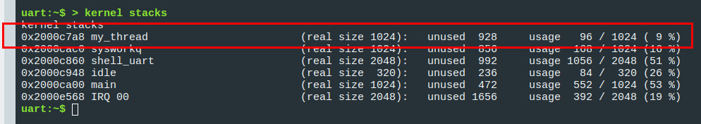

import HowToDownload from '/docs/\_partials/download-from-kasm.md'
import FirmwareFlash from '/docs/\_partials/flash-the-example-nrf.md'

# Blink Using Threads

## Learning Objectives

Now we take on the real power of an RTOS: the ability to run multiple threads on
a single processor. Simply put, each thread is like its own `main()` loop which
shares CPU time with all other threads. Each has its own dedicated stack, as well. The "scheduler" of an RTOS determines which thread will run next. 

* **Desired outcome(s)**
    1. LED blinking moved to a dedicated thread
* **Time Estimate:** 15 minutes

## Exercise: Blink Using a Thread

You can blink the LED by giving it its own thread. Once started, the scheduler
will monitor the thread, servicing it when needed, and returning to other tasks
in between blinks. To use a thread, there are just three (or maybe two) things
we need to do:

* Make a function that will run as its own thread
* Define the thread
* Start the thread (depending on how the thread is defined)

### Set up a Thread

:::tip

We want to remove the timer code we added in the previous exercise. If you are
unsure which code goes and which stays, you can use `git` to return to the
original format:

```shell
git restore 04_blinkRTOS/src/main.c
```

:::

In the `04_blinkRTOS/src/main.c` file:

1. Create a new function just above `main` to run as its own thread
    * Function should be marked `static` and return `void`
    * Function should have three void pointers as parameters: `void *dummy1,
      void *dummy2, void *dummy3`
    * Place the LED initialization inside the new function
    * Place the LED toggle function inside of your new function
      * This works just like a `while` loop in `main` and needs to include a
        sleep command

2. Define the thread just after your new function:

    ```c
    K_THREAD_DEFINE(my_thread, 1024,
                    my_thread_handler, NULL, NULL, NULL,
                    K_LOWEST_APPLICATION_THREAD_PRIO, 0, 0);
    ```

  See [the K_THREAD_DEFINE API docs](https://docs.zephyrproject.org/apidoc/latest/group__thread__apis.html#gab3ced58648ca35788a40676e8478ecd2) to see what each of the passed parameters represent.

3. This thread will start automatically

    :::tip

    Because we have defined the thread using the `K_THREAD_DEFINE` macro, it
    will start automatically at boot time. If you want more control over when
    the thread starts, [define it using
    `k_thread_create()`](https://docs.zephyrproject.org/latest/kernel/services/threads/index.html#c.k_thread_create),
    then use the following API to start it when needed:

    ```c
    k_thread_start(my_thread);
    ```

    :::

<details><summary>Click to reveal the expected main.c file</summary>

```c excerpts from main.c
static void my_thread_handler(void *dummy1, void *dummy2, void *dummy3) {
	int ret;

	if (!device_is_ready(led.port)) {
		return;
	}

	ret = gpio_pin_configure_dt(&led, GPIO_OUTPUT_ACTIVE);
	if (ret < 0) {
		return;
	}

	while (1) {
		gpio_pin_toggle_dt(&led);
		k_sleep(K_SECONDS(1));
	}
}

K_THREAD_DEFINE(my_thread, 1024,
                my_thread_handler, NULL, NULL, NULL,
                K_LOWEST_APPLICATION_THREAD_PRIO, 0, 0);

/* Main function */
void main(void)
{
	while (1) {
		k_msleep(SLEEP_TIME_MS);
	}
}
```

When defining the thread, we told Zephyr the name we want to assign to the
thread, the number of bytes to use for the thread's stack, the function to run
whenever the thread is serviced, and the priority level.

</details>

### Build in the Kasm container

1. Build the example

    * Make sure the terminal at the bottom of the VS Code window is in the
      `~/Desktop/zephyr-training/app` folder
    * Run the following code to build the `04_blinkRTOS` app

        ```bash
        # for nRF7002
        west build -b nrf7002dk_nrf5340_cpuapp 04_blinkRTOS

        # for nRF9160
        west build -b nrf9160dk_nrf9160_ns 04_blinkRTOS
        ```

2. Download the binary

    :::note

    The normal workflow when using a development environment installed locally
    is to use `west flash` to program the board. We are using a different
    approach here because the Kasm container doesn't have access to your local
    USB port.

    :::

    * In the VS Code terminal, run `west kasm download` to package the compiled
      code and make it available for download

    * Use the Download option in Kasm's left sidebar to download
      `<devicename>_<appfolder>_<hhmmss>.hex` to your local machine.

    <HowToDownload/>

### Update device firmware from your local machine

<FirmwareFlash/>

## Expected outcome

Make sure the LED blinks as expected.

:::note

Delving deeply into how these threads work is beyond the scope of this session.
But an important lesson is that you **must** yield time to the scheduler. This
means calling `k_sleep()` or `k_yield()` from the main loop.

Without it, the main thread will never yield time for your thread to run.
Equally important is that your thread do something that yields back (usually
`k_sleep()`) so that the scheduler can take over once again.

:::

:::tip Example of Threads and resource control

The `01_IOT` precompiled binary you tested during the [Intro to
Golioth](/docs/golioth-exploration) section uses a thread to blink the LED. One
thing to keep in mind when accessing system resources from different threads is
that only one thread at a time should be operating on that resource. The example
code [uses a
mutex](https://docs.zephyrproject.org/latest/kernel/services/synchronization/mutexes.html)
to test for GPIO availability.

```c
extern void led_blink(void) {
	gpio_pin_configure_dt(&led0, GPIO_OUTPUT_INACTIVE);
	gpio_pin_configure_dt(&led1, GPIO_OUTPUT_INACTIVE);

	led_set_selected(1);

	while (1) {
		if (k_mutex_lock(&led_mutex, K_MSEC(5)) == 0) {
			gpio_pin_toggle_dt(_selected_led);
			k_mutex_unlock(&led_mutex);
		}
		k_sleep(K_MSEC(_blink_delay_ms));
	}
}
K_THREAD_DEFINE(blink_thread_id, 1024, led_blink, NULL, NULL, NULL, 5, 0, 0);
```

:::

For more information on Zephyr Threads, consult [the Threads
documentation](https://docs.zephyrproject.org/latest/kernel/services/threads/index.html).

## Challenge: Use the Shell to Check Stack Usage

When we defined our Thread, we allocated 1024 bytes to dedicate as a stack just
for that thread. Was that the right amount? One way you can fine-tune the stack
sizes is by viewing usage on the running device.

1. Turn on the shell by adding `CONFIG_SHELL=y` to the prj.conf file (or just use
   `menuconfig`!)
2. Rebuild and flash the firmware to your device
3. Connect to your board use the Serial Terminal
4. Run the `kernel stacks` command in the shell to print out the largest stack
   usage seen since power-on

<details><summary>Click to show example stack usage</summary>



It looks like we're only using 96 bytes out of the 1024 bytes we allocated.

* What happens if you allocate 96 bytes?
* What happens if you allocate 64 bytes?

</details>

## Conclusion

We're moving on to the next section where we'll discuss how to add the Golioth
Zephyr SDK to an existing Zephyr project. Just for fun, we've combined the timer
and thread based approaches to blinking two LEDs on your board, while also using
`printk()` in the main loop. Take a look at `05_golioth/src/main.c` to see how
it all works.
