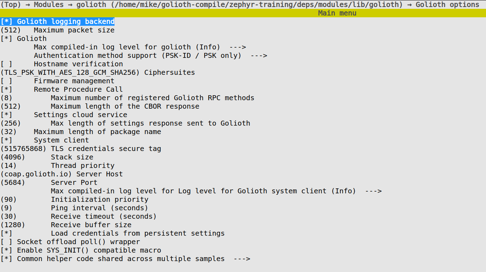

# Golioth Kconfig Options and Client Creation

## Learning objectives

Now that the Golioth Zephyr SDK has been added to your Zephyr installation we
are ready to start using it. As with all Zephyr libraries, we need to first
enable Golioth using some Kconfig symbols. Then we create the Golioth System
Client to handle all things Golioth.

* **Desired outcome(s)**
  1. Understand how to enable Kconfig symbols required by the Golioth SDK
  2. Add a Golioth client to main.c
* **Time Estimate:** 5 minutes

:::note

Your application is responsible for establishing a network connection before
trying to connect to Golioth. This is already set up in the `05_golioth`
example.

:::

## Kconfig symbols required by Golioth

There are two Kconfig symbols that are always required to use the Golioth Zephyr
SDK:

```kconfig
CONFIG_GOLIOTH=y
CONFIG_GOLIOTH_SYSTEM_CLIENT=y
```

These will immediately allow you to connect to Golioth to send and receive data
on LightDB Stream and LightDB state. The logging and RPC services are similarly
easy to enable:

```
# Enable remote logging
CONFIG_LOG_BACKEND_GOLIOTH=y

# Enable remote procedure call
CONFIG_GOLIOTH_RPC=y
```

More setup is required for the settings service and for OTA firmware updates.
Generally speaking, see [the Golioth Zephyr
samples](https://github.com/golioth/golioth-zephyr-sdk/tree/main/samples) for
information on enabling services.

:::note

Golioth Kconfig symbols are already enabled in the `prj.conf` file of the
`05_golioth` application we're working with in this module. If you're curious,
you may use `menuconfig` and navigate to `modules`&rarr;`golioth` to see the
full configuration for Golioth.



:::

## Exercise: Create a Golioth Client in main.c

With the Kconfig symbols selected, it's time to start using some Golioth device
API calls in our C code.

### Set up the client and callback

Add the following code to the `05_golioth/src/main.c` file:

```c
#include <net/golioth/system_client.h>

static struct golioth_client *client = GOLIOTH_SYSTEM_CLIENT_GET();

static K_SEM_DEFINE(connected, 0, 1);

static void golioth_on_connect(struct golioth_client *client)
{
	k_sem_give(&connected);
}
```

Here's what's happening in this block:

1. Include the Golioth System Client at the top of the file
2. Create a pointer to a `golioth_client` singleton
3. Create a semaphore to block until a connection with Golioth is established
4. Create a callback that will be used when we connect to Golioth
    * This callback will unblock the semaphore, allowing program execution to
      continue

### Register callback and start client

Finally, add this code in your `main()` function, after the network connection
function calls, but before the loop:

```c
	client->on_connect = golioth_on_connect;
	golioth_system_client_start();

	k_sem_take(&connected, K_FOREVER);
```

This block serves the following purpose:

1. Register the callback to be used when the Golioth System Client connects
2. Start the Golioth System Client
3. Block program execution until the connection is established

:::tip

The Golioth System Client runs on its own thread. Since we cannot send or
receive anything from Golioth until a connection is established it makes sense
for simple demo code to block program flow until that point. In production, you
may want to adopt a different approach that allows other parts of your
application to run while waiting for a connection.

:::

## Expected results

You have added Golioth to your application. The code will build and attempt to
establish a connection to Golioth, but beyond that we haven't used any of the
Golioth services. In the next section we'll send data to Golioth using the
LightDB Steam.

<details><summary>Click to reveal solution</summary>

Here is an excerpt from `main.c` that includes the added code from this section:
```c
#include <net/golioth/system_client.h> /* already included in earlier */

static struct golioth_client *client = GOLIOTH_SYSTEM_CLIENT_GET();

static K_SEM_DEFINE(connected, 0, 1);

static void golioth_on_connect(struct golioth_client *client)
{
	k_sem_give(&connected);
}

/* Main function */
void main(void)
{
	int ret;

	if (!device_is_ready(led1.port)) {
		return;
	}

	ret = gpio_pin_configure_dt(&led1, GPIO_OUTPUT_ACTIVE);
	if (ret < 0) {
		return;
	}

	/* Start timer-based LED blinker */
	k_timer_start(&my_timer, K_MSEC(200), K_MSEC(200));

	/* Start network connection (if necessary) */
#ifdef CONFIG_BOARD_NRF7002DK_NRF5340_CPUAPP
	wifi_connect();
#else
	if (IS_ENABLED(CONFIG_GOLIOTH_SAMPLES_COMMON)) {
		net_connect();
	}
#endif

	client->on_connect = golioth_on_connect;
	golioth_system_client_start();

	k_sem_take(&connected, K_FOREVER);

	int counter = 0;

	while (1) {
		printk("This is the main loop: %d\n", counter);
		++counter;
		k_msleep(SLEEP_TIME_MS);
	}
}
```

</details>
