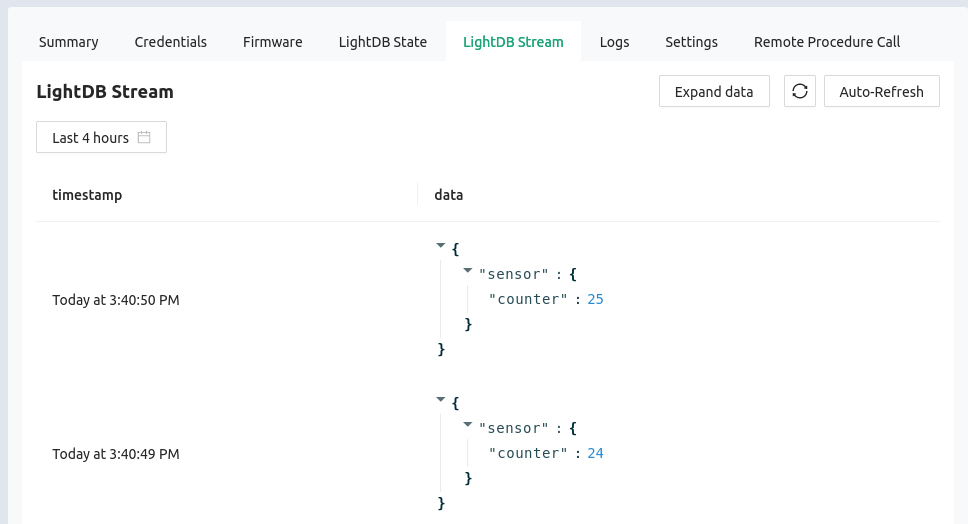

import HowToDownload from '/docs/\_partials/download-from-kasm.md'
import FirmwareFlash from '/docs/\_partials/flash-the-example-nrf.md'

# Use Golioth LightDB Stream to Send Data

## Learning objectives

With a Golioth System Client added to our C code, we can send data using the
LightDB Stream API calls.

* **Desired outcome(s)**
  1. Send time-series data to Golioth
* **Time Estimate:** 10 minutes

## Exercise: Send the counter value to LightDB Stream

The sample code includes a counter in the main loop that is printing out
messages every second. Let's pretend this counter is sensor data and report it
to Golioth using LightDB Stream. This is a time-series database that will record
each reading along with a timestamp for when it was received.

### Format the data to send to Golioth

Golioth offers a couple of options for data formatting. The most efficient is
CBOR, however that is not human-readable. So to keep things simple, let's send
the counter data using JSON.

In the `main()` function of `05_golioth/src/main.c`:

1. Outside of the loop, create a `char` array as a buffer to hold our JSON
   string
2. Inside the loop, use the `snprintk()` function to format the string using
   substitution
    1. Use the string `"counter"` as the key
    2. Use the existing `counter` variable as the value

<details><summary>Click to reveal the solution</summary>

Excerpts from `main.c`:
* Note the quotes in JSON strings are escaped in C
* This JSON formatting is a pattern that gets used often. Don't worry if it
  wasn't obvious this time, but keep it in your bag of tricks!

```c
	int counter = 0;
	char sbuf[32];

	while (1) {
		printk("This is the main loop: %d\n", counter);
		
		snprintk(sbuf, sizeof(sbuf), "{\"counter\":%d}", counter);
```

</details>

### Send data buffer to LightDB Stream

Now that we have a valid JSON string that contains our "sensor" data, let's send
it to Golioth. We'll use an asynchronous call so it doesn't block our main
function.

:::tip

You may want to use either the Doxygen or LightDB Sample code as reference for
this exercise:

* [Golioth Zephyr SDK
  Doxygen](https://zephyr-sdk-docs.golioth.io/group__golioth__stream.html)
* [Golioth LightDB Stream
  Sample](https://github.com/golioth/golioth-zephyr-sdk/blob/main/samples/lightdb_stream/src/main.c)

:::

In the `main()` function of `05_golioth/src/main.c`:

1. Add an `golioth_stream_push_cb()` to the main loop
2. Use `"sensor"` as the endpoint
3. Use the `char` array from the previous step as the payload

<details><summary>Click to reveal the solution</summary>

Excerpts from `main.c`:

```c
	int counter = 0;
	char sbuf[32];

	while (1) {
		printk("This is the main loop: %d\n", counter);
		
		snprintk(sbuf, sizeof(sbuf), "{\"counter\":%d}", counter);

		golioth_stream_push_cb(client, "sensor",
				       GOLIOTH_CONTENT_FORMAT_APP_JSON,
				       sbuf, strlen(sbuf),
				       NULL, NULL);

		++counter;
		k_msleep(SLEEP_TIME_MS);
	}
```

:::tip

This code ignores some best practices in favor of reduced complexity. When using
this function call in production, we recommend the following:

* Check the `int` returned by all Golioth function calls for a non-zero error
  number
* Use a callback function to handle errors and timeouts

Both of these are demonstrated in the [Golioth LightDB Stream
Sample](https://github.com/golioth/golioth-zephyr-sdk/blob/main/samples/lightdb_stream/src/main.c)

:::

</details>

### Build in the Kasm container

1. Build the example

    * Make sure the terminal at the bottom of the VS Code window is in the
      `~/Desktop/zephyr-training/app` folder
    * Run the following code to build the `05_golioth` app

        ```bash
        # for nRF7002
        west build -b nrf7002dk_nrf5340_cpuapp 05_golioth

        # for nRF9160
        west build -b nrf9160dk_nrf9160_ns 05_golioth
        ```

2. Download the binary

    :::note

    The normal workflow when using a development environment installed locally
    is to use `west flash` to program the board. We are using a different
    approach here because the Kasm container doesn't have access to your local
    USB port.

    :::

    * In the VS Code terminal, run `west kasm download` to package the compiled
      code and make it available for download

    * Use the Download option in Kasm's left sidebar to download
      `<devicename>_<appfolder>_<hhmmss>.hex` to your local machine.

    <HowToDownload/>

### Update device firmware from your local machine

<FirmwareFlash/>

## Expected results

Counter data from your device should now be streaming to Golioth. To see it,
select your device in the [Golioth web console](https://console.golioth.io), and
click on the `LightDB Stream` tab.



:::tip

Your device should still have Golioth credentials from earlier exercises saved
on the settings partition that allows it to connect to the servers. You may
check to be sure by issuing the `settings get golioth/psk-id` command in the
serial shell.

Instructions for setting device credentials are available in the [Connect
Hardware to
Golioth](/docs/golioth-exploration/01-golioth-intro/03-hardware-setup.md)
section.

:::

## Additional Exercises

1. Convert the `printk()` messages in the main loop to logging messages
2. Golioth remote logging is already turned on for this app. Use `menuconfig` to
   turn it off
    * Rebuild and flash the firmware to verify logs are no longer sent
   to the servers

